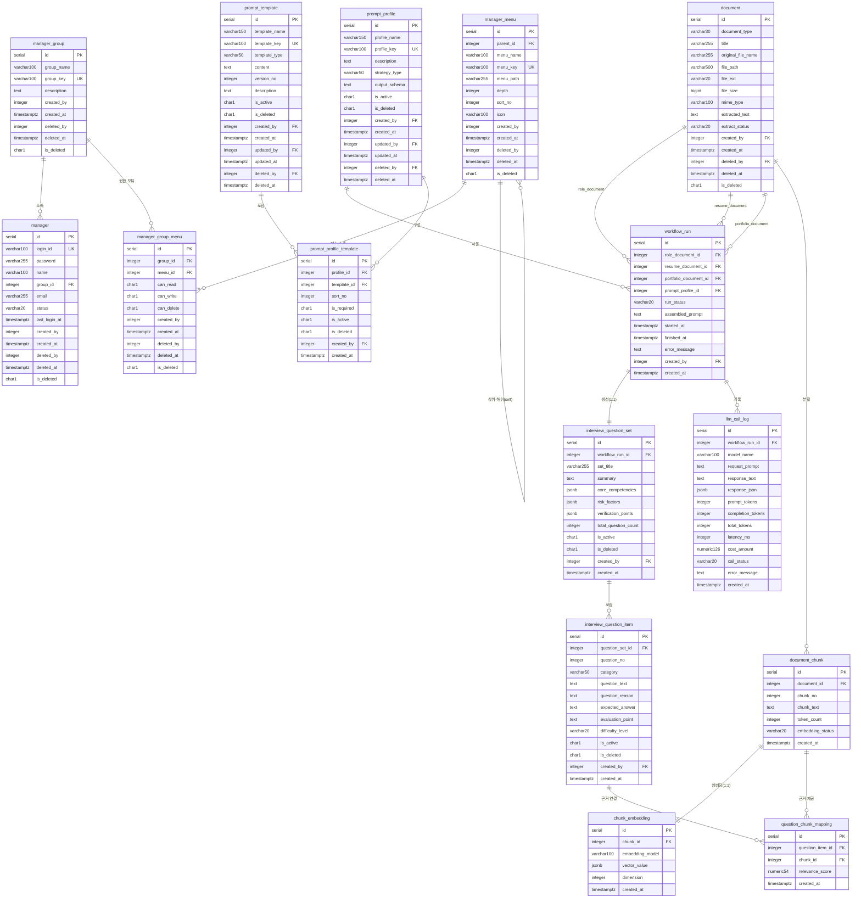
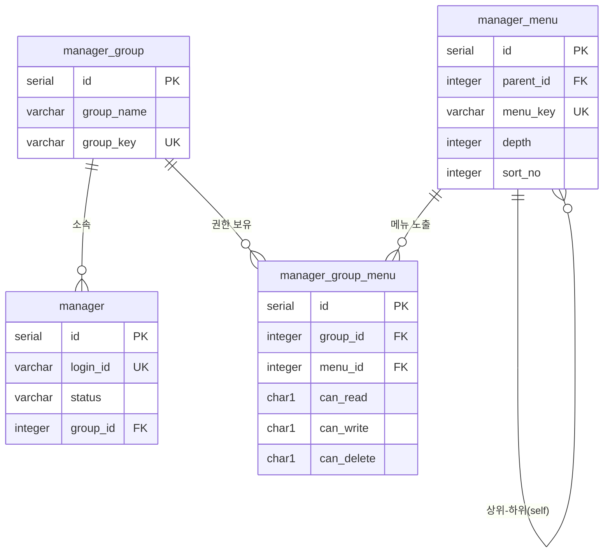
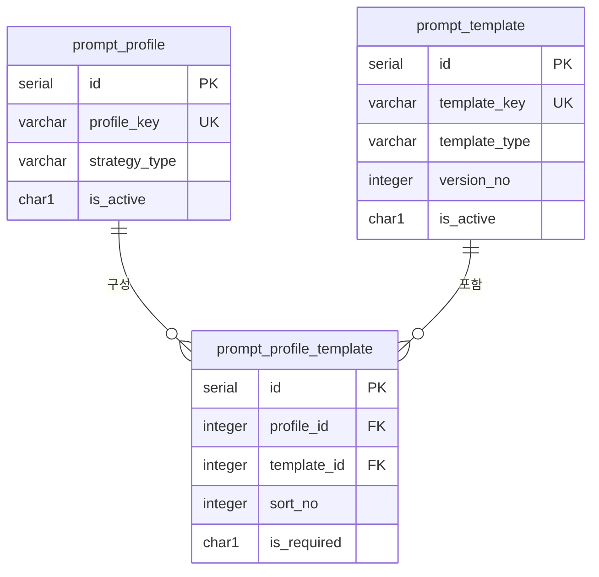
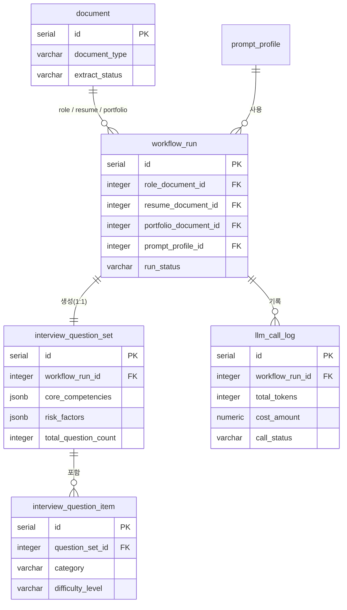
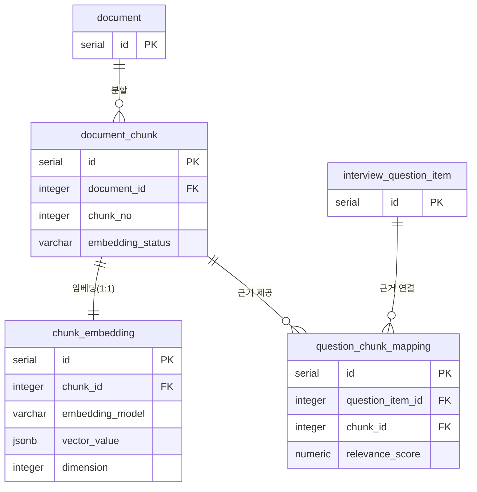

# HR Copilot BS — ERD

> PostgreSQL 15+ 기준 | 네이밍 표준 v2 적용  
> Mermaid `erDiagram` — GitHub / GitLab / Notion / Obsidian 에서 바로 렌더링

---

## 전체 ERD

---

## 영역별 관계 상세

---

### A. 관리자 CMS 공통

---

### B. 프롬프트 조립 구조

---

### C. LLM 실행 및 결과 흐름

---

### D. RAG 확장 구조

---

## 테이블 목록 및 용도 요약

| 영역 | 테이블 | 용도 |
|:---|:---|:---|
| CMS 공통 | `manager_group` | 권한 그룹 정의 |
| CMS 공통 | `manager` | 관리자 계정 |
| CMS 공통 | `manager_menu` | CMS 메뉴 트리 |
| CMS 공통 | `manager_group_menu` | 그룹별 메뉴 권한 (N:M 해소) |
| 문서 | `document` | 업로드 문서 원본 (Role/Resume/Portfolio) |
| 프롬프트 | `prompt_template` | 프롬프트 원문 + 버전 관리 |
| 프롬프트 | `prompt_profile` | 실행 전략 프로파일 |
| 프롬프트 | `prompt_profile_template` | 프로파일-템플릿 조립 매핑 |
| 실행/결과 | `workflow_run` | LLM 분석 실행 단위 |
| 실행/결과 | `interview_question_set` | 면접 질문 세트 (실행 결과 헤더) |
| 실행/결과 | `interview_question_item` | 면접 질문 개별 항목 |
| 실행/결과 | `llm_call_log` | LLM API 호출 로그 |
| RAG 확장 | `document_chunk` | 문서 텍스트 분할 청크 |
| RAG 확장 | `chunk_embedding` | 청크 임베딩 벡터 |
| RAG 확장 | `question_chunk_mapping` | 질문-청크 근거 연결 |
