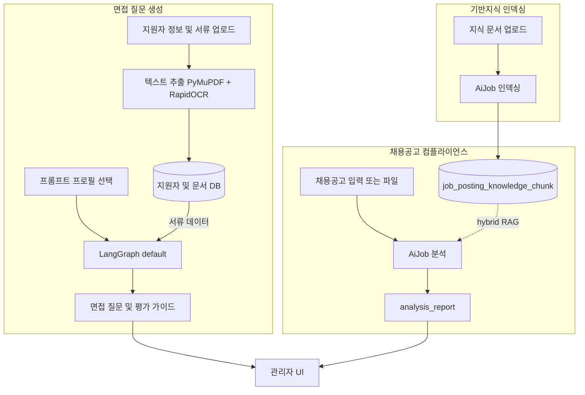
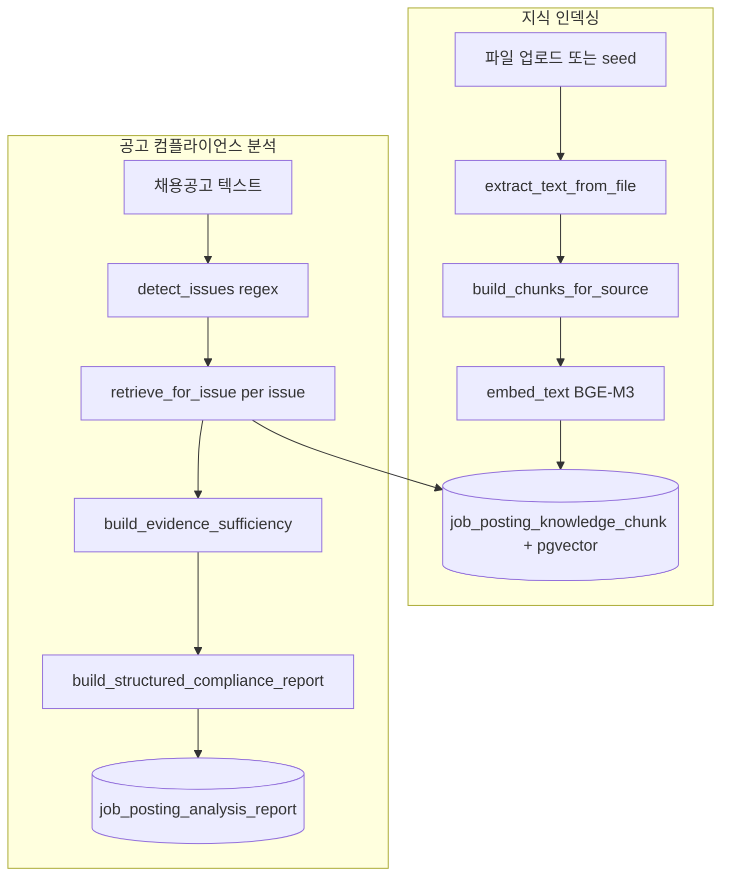
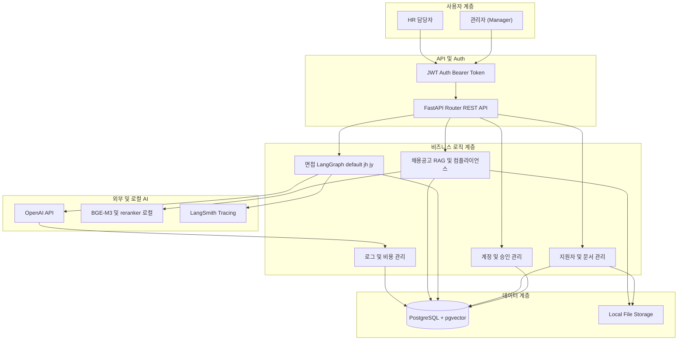

# HR Copilot BS

> **채용 인재상과 지원자 서류 데이터를 다각도로 분석하여, 근거 중심의 맞춤형 면접 가이드와 질문을 생성하는 HR 맞춤 전문 AI Agent 플랫폼**

## 1. 프로젝트 개요

### 1.1 기본 정보

- **프로젝트명**: HR Copilot BS (LLM 기반 채용 면접 질문 자동생성 시스템)
- **팀명**: BAMTI95 (개발 4명)
- **진행 기간**: 2026.04.10 ~ 2026.05.19
- **서비스 유형**: 웹 애플리케이션 / REST API / AI Agent
- **한 줄 소개**: 채용공고(JD)와 지원자 서류를 AI가 분석하여 성과·역량 검증 중심의 면접 가이드를 자동 생성하고, 채용공고 컴플라이언스는 법률 기반지식 RAG로 검증하는 HR 맞춤 AI 에이전트

### 1.2 프로젝트 목적

채용공고(JD)와 지원자 서류(이력서/포트폴리오)를 AI가 분석하여 핵심 역량, 검증 포인트, 리스크 요소, 맞춤형 면접 질문과 평가 가이드를 자동 생성하는 시스템 구축. 동시에 채용공고의 공정채용·컴플라이언스 위험 문구를 Rule 탐지와 법률 기반지식 RAG 검색으로 근거 있는 리포트를 제공한다.

## 2. 배경 및 문제 정의

채용 현장에서 발생하는 비효율을 **LLM 기반 문서 분석 시스템**으로 해결합니다.

- **서류 검토 병목**: 지원자 서류를 일일이 검토하는 데 과도한 시간 소요
- **면접 품질 편차**: 면접관 개인 역량에 따라 질문의 질과 평가 기준이 상이함
- **적합도 판단 어려움**: JD와 지원자 경험 간의 일치 여부를 즉각 파악하기 어려움
- **근거 부족**: 생성된 질문이 왜 필요한지에 대한 객관적 근거 정리의 한계
- **공고 컴플라이언스**: 채용공고 문구의 법령·가이드 위반 여부를 일관되게 점검하기 어려움

## 3. 핵심 기능

### 3.1 지원자 및 문서 관리

- **지원자 일괄 등록**: CSV 기반 지원자 일괄 등록 및 사전 선별 결과 확인
- **문서 일괄 업로드**: 이력서/포트폴리오(PDF, DOCX) 일괄 업로드 및 자동 텍스트 추출
- **문서 일괄등록(미리보기)**: `POST /api/v1/candidates/document-bulk/preview`* → `AiJob(DOCUMENT_BULK_IMPORT)` 폴링 후 확정 등록
- **지능형 문서 추출**: PyMuPDF + RapidOCR(이미지 기반 PDF) 복합 처리로 정확도 향상 (BackgroundTasks, 문서별 비동기 추출)
- **지원자 상태 추적**: 지원 완료 → 분석 중 → 준비 완료까지 실시간 상태 관리

### 3.2 프롬프트 프로필 관리

- **프로필 CRUD**: 부서 및 직무별 AI 분석 전략을 프로필로 생성·관리
- **커스텀 인재상 설정**: 부서 현실, 핵심 역량, 우대 조건 등 세부 항목 설정 가능
- **출력 스키마 정의**: 분석 결과의 JSON 출력 포맷을 프로필별로 정의

### 3.3 AI 면접 세션 분석 (LangGraph)

면접 질문 생성은 **지원자 서류 + 프롬프트 프로필**을 입력으로 LangGraph가 실행됩니다. **채용공고 RAG 지식베이스는 이 파이프라인에서 직접 호출하지 않습니다** (컴플라이언스 RAG는 §5 별도 도메인).

- **기본 파이프라인** (`ai/interview_graph`, `graph_impl=default`):

```text
build_state → analyzer → questioner → selector_lite → predictor
→ driller → reviewer → scorer
→ (retry_questioner | retry_driller | selector) → final_formatter
```

- **파이프라인 변형 API**:
  - `POST /api/v1/interview-sessions` — `default`
  - `POST /api/v1/interview-sessions/pipeline/jh` — `jh` (실험용 별도 그래프)
  - `POST /api/v1/interview-sessions/pipeline/jy` — `jy` (JY 멀티에이전트)
  - `POST /api/v1/interview-sessions/pipeline/hy` — `hy` (내부적으로 default와 동일 실행)
  - `POST /api/v1/interview-sessions/{id}/generate-questions` — body의 `graph_impl` 지정 가능
- **비동기 실행**: `interview_sessions.question_generation_`* 필드 + FastAPI `BackgroundTasks` (`AiJob` 미사용)
- **면접 가이드 패키지 생성**: 직무 적합도, 질문 의도, 평가 기준, 예상 답변, 꼬리 질문 세트
- **종합 평가 리포트**: 역량 적합성, 리스크 요소, 보완 필요 역량 종합 의견 제시
- **LLM 로그**: `llm_call_log` 저장 + LangSmith (`LANGCHAIN_`*) 트레이싱

### 3.4 채용공고 컴플라이언스 & RAG

- **공고 분석**: 텍스트/파일 입력 → Rule 기반 위험 문구 탐지 → 이슈별 hybrid RAG 검색 → 구조화 컴플라이언스 리포트
- **지식베이스 관리**: 법령·가이드·점검 사례 PDF/DOCX 업로드, `sample_data` 시드, 청킹·임베딩·pgvector 저장
- **관리자 검색 테스트**: HYBRID / KEYWORD / VECTOR 모드로 chunk 검색 검증
- **RAG 실험실**: 배치 평가 (`/manager/job-posting-experiments`)
- **비동기 작업**: `AiJob` — `JOB_POSTING_COMPLIANCE_ANALYSIS`, `JOB_POSTING_KNOWLEDGE_INDEXING`, `JOB_POSTING_EXPERIMENT_RUN`

상세 아키텍처는 [5 채용공고 RAG 시스템](#5-채용공고-rag-시스템) 참고.

### 3.5 워크플로우 대시보드 및 LLM 로그 관리

- **워크플로우 시각화**: `frontend/src/features/workflowDashboard/` — 세션별 LangGraph 노드 실행 흐름 및 상세 로그 조회
- **LLM 비용 추적**: 모델별 토큰 사용량 실시간 추적 및 자동 비용 계산
- **LangSmith 연동**: AI 에이전트 호출 추적 및 트러블슈팅 데이터 확보
- **채용공고 분석 로그**: `GET /api/v1/llm-logs/job-posting-analysis-reports/{report_id}` 등

## 4. 데이터 흐름 (Data Flow)

플랫폼은 **면접 질문 생성**, **채용공고 컴플라이언스 분석**, **법률 기반지식 인덱싱** 세 트랙으로 동작합니다.

```text
[면접] 지원자·서류 등록 → 텍스트 추출 → 세션 생성 → LangGraph(default) → interview_questions 저장

[채용공고] 공고 입력/업로드 → AiJob 분석 → detect_issues(rule) → hybrid RAG → analysis_report 저장

[지식] PDF/문서 업로드 → AiJob 인덱싱 → chunk + BGE 임베딩 → pgvector 저장
```




## 5. 채용공고 RAG 시스템

채용공고 컴플라이언스는 **Rule 탐지 + 법률·가이드·점검사례 기반지식 검색(RAG)** 으로 동작합니다. 파이프라인 버전: `job-posting-compliance-rag-v1`.

### 5.1 전체 구조




### 5.2 지식 인덱싱 (Ingest)


| 항목      | 내용                                                                                                                   |
| ------- | -------------------------------------------------------------------------------------------------------------------- |
| 서비스     | `backend/services/job_posting_knowledge_service.py`                                                                  |
| 청킹      | `LAW_TEXT` → 조항 단위, `INSPECTION_CASE` → 사례 블록, 기타 → 제목/윈도우 (`MAX_CHUNK_CHARS=1000`)                                  |
| 임베딩     | `backend/services/job_posting_embedding_service.py` — `BAAI/bge-m3`, 1536차원; 실패 시 `local-hash-embedding-v1` fallback |
| 저장      | `job_posting_knowledge_source`, `job_posting_knowledge_chunk` (`Vector(1536)`)                                       |
| 비동기 API | `POST /api/v1/job-postings/knowledge-sources/{id}/index/jobs`, `.../seed-source-data/jobs`                           |


### 5.3 Hybrid Retrieval (이슈당 검색)


| 단계    | 구현 (`job_posting_retrieval_service.py`)                                                           |
| ----- | ------------------------------------------------------------------------------------------------- |
| 쿼리 생성 | `build_query_candidates(issue)` — issue_type, flagged_text, why_risky, query_terms                |
| 1차 검색 | metadata exact → pgvector cosine → (실패 시) Python vector fallback                                  |
| 2차 검색 | PostgreSQL FTS (`websearch_to_tsquery`, `ts_rank_cd`) — `JOB_POSTING_BM25_MODE=fallback_only` 조건부 |
| 병합    | `merge_retrieval_rows` — 문서 유형별 text/vector 가중치 (법령 text 0.6, 가이드·사례 vector 0.6 등)                |
| 재정렬   | heuristic slot (법령 2 / 가이드·매뉴얼 2 / 사례 1) + `BAAI/bge-reranker-v2-m3` CrossEncoder                 |
| 반환    | `retrieve_for_issue(limit=12)` → 분석 시 상위 evidence payload                                         |


`retrieval_mode`: `hybrid_full_text_pgvector` · `rerank_mode`: `three_axis_slot_rerank`

### 5.4 분석 파이프라인

진입: `backend/services/job_posting_service.py` → `run_rule_rag_analysis()`

```text
채용공고 텍스트
  → detect_issues() [RISK_PATTERNS 정규식]
  → (이슈별) JobPostingRetrievalService.retrieve_for_issue()
  → build_evidence_sufficiency()
  → build_structured_compliance_report() [heuristic, LLM 최종 리포트 없음]
  → calculate_risk_level_with_evidence()
  → JobPostingAnalysisReport 저장
```

- **동기**: 텍스트/파일 분석 API
- **비동기**: `POST .../analyze-text/jobs`, `analyze-file/jobs`, `/{id}/analysis-reports/jobs` → `run_analysis_job()`
- **Trace**: `job_posting_trace_service.py` — `detect_risk_phrases`, `vector_retrieve`, `bm25_retrieve`, `rerank_evidence` 등

### 5.5 RAG 관련 환경 변수


| 변수                                                              | 기본값                       | 용도                     |
| --------------------------------------------------------------- | ------------------------- | ---------------------- |
| `JOB_POSTING_EMBEDDING_MODEL`                                   | `BAAI/bge-m3`             | 임베딩 모델                 |
| `JOB_POSTING_EMBEDDING_DIM`                                     | `1536`                    | 벡터 차원                  |
| `JOB_POSTING_RERANKER_MODEL`                                    | `BAAI/bge-reranker-v2-m3` | Cross-encoder rerank   |
| `JOB_POSTING_DISABLE_EMBEDDING_MODEL`                           | —                         | `1` 시 hash fallback 강제 |
| `JOB_POSTING_DISABLE_RERANKER` / `JOB_POSTING_RERANKER_ENABLED` | —                         | reranker on/off        |
| `JOB_POSTING_BM25_ENABLED`                                      | `true`                    | FTS 검색 사용              |
| `JOB_POSTING_BM25_MODE`                                         | `fallback_only`           | hybrid 부족 시 BM25 보강    |
| `JOB_POSTING_BM25_TIMEOUT_SECONDS`                              | `3`                       | BM25 타임아웃(초)           |
| `JOB_POSTING_VECTOR_TOP_K`                                      | `12`                      | 벡터 검색 상한               |
| `JOB_POSTING_FINAL_EVIDENCE_LIMIT`                              | `5`                       | 이슈당 최종 근거 수            |


### 5.6 구현 범위 및 로드맵

**구현됨**

- BGE-M3 임베딩 + pgvector cosine 검색
- PostgreSQL FTS 기반 hybrid 검색 (BM25 대체)
- metadata exact, hybrid merge, BGE rerank, 근거 충분성 heuristic
- `AiJob` 비동기 분석·인덱싱·실험
- 관리자 UI: 공고 분석, 리포트, 지식베이스, 검색 테스트, 실험실

**로드맵 (미구현)**

- Agentic 재검색 루프 (query rewrite 후 재검색)
- LLM structured output 기반 최종 컴플라이언스 리포트

상세 설계·API 흐름: [docs/job-posting-analysis-data-flow.md](docs/job-posting-analysis-data-flow.md) · [docs/채용공고_RAG_baseline_및_Agentic_고도화_가이드.md](docs/채용공고_RAG_baseline_및_Agentic_고도화_가이드.md)

### 5.7 프론트엔드 RAG UI


| 경로                                        | 기능                   |
| ----------------------------------------- | -------------------- |
| `/manager/job-postings`                   | 채용공고 목록              |
| `/manager/job-postings/new`               | 분석 제출 + AiJob 폴링     |
| `/manager/job-postings/:postingId`        | 공고 상세·분석 이력          |
| `/manager/job-postings/:postingId/report` | 리스크·매칭 근거·개선안 리포트    |
| `/manager/job-postings/knowledge-sources` | 지식베이스 업로드·인덱싱·검색 테스트 |
| `/manager/job-posting-experiments`        | RAG 배치 실험            |


## 6. 기술 스택 (Tech Stack)


| 구분             | 기술 스택                                                       | 비고                            |
| -------------- | ----------------------------------------------------------- | ----------------------------- |
| **Front-End**  | React 19, TypeScript, Zustand, TanStack Query, TailwindCSS  | 고성능 상태 관리 및 UI 구현             |
| **Back-End**   | Python 3.12, FastAPI                                        | Async/Await 기반 비동기 처리         |
| **Database**   | PostgreSQL + pgvector, SQLAlchemy, Alembic                  | RAG 벡터 저장 및 관계형 데이터 관리        |
| **AI / Agent** | LangGraph, OpenAI API, LangSmith                            | 면접 질문 에이전트 워크플로우 제어 및 추적      |
| **RAG**        | sentence-transformers, BAAI/bge-m3, BAAI/bge-reranker-v2-m3 | 채용공고 기반지식 임베딩·rerank (로컬)     |
| **검색**         | PostgreSQL FTS (`ts_rank_cd`)                               | hybrid 검색 시 BM25 대체 full-text |
| **비동기 작업**     | FastAPI BackgroundTasks + `ai_job` 테이블                      | Celery 없이 장시간 작업 추적           |
| **문서 처리**      | PyMuPDF, RapidOCR, python-docx                              | PDF/DOCX 텍스트 추출 및 OCR         |
| **인증**         | JWT (Bearer Token), Bcrypt                                  | 관리자 계정 인증 및 보안                |


## 7. 시스템 아키텍처




## 8. 주요 데이터 모델


| 모델                             | 설명                                                |
| ------------------------------ | ------------------------------------------------- |
| `manager`                      | 관리자 계정 및 권한                                       |
| `candidate`                    | 지원자 정보 및 상태                                       |
| `document`                     | 업로드 문서 및 추출 텍스트                                   |
| `prompt_profile`               | 부서/직무별 AI 분석 전략 프로필                               |
| `interview_session`            | 면접 분석 세션 및 `question_generation_*` 상태             |
| `interview_question`           | 생성된 면접 질문 세트                                      |
| `job_posting`                  | 채용공고 정보                                           |
| `job_posting_analysis_report`  | 컴플라이언스 분석 결과, matched_evidence, retrieval_summary |
| `job_posting_knowledge_source` | RAG 기반지식 원본 및 인덱스 상태                              |
| `job_posting_knowledge_chunk`  | RAG 지식 청크 및 pgvector embedding                    |
| `ai_job`                       | 비동기 작업 (공고 분석, 지식 인덱싱, 실험, 문서 bulk preview 등)     |
| `llm_call_log`                 | 면접·채용공고 분석 LLM 호출 및 토큰/비용 기록                      |


## 9. 프로젝트 구조

```
hr-copilot/
├── backend/                          # FastAPI 백엔드
│   ├── main.py                       # 애플리케이션 진입점
│   ├── ai/
│   │   ├── interview_graph/          # HS 에이전트 워크플로우
│   │   ├── interview_graph_JH/       # JH 에이전트 워크플로우
│   │   ├── interview_graph_JY/       # JY 에이전트 워크플로우
│   │   ├── interview_graph_HY/       # HY 에이전트 워크플로우
│   │   ├── graph_usage.py            # LangGraph 노드별 LLM usage 수집 유틸
│   │   └── llm_client.py             # OpenAI 클라이언트
│   ├── api/v1/routers/
│   │   ├── job_posting_router.py     # 채용공고·RAG·실험 API
│   │   ├── sessions_router.py        # 면접 세션·질문 생성 API
│   │   └── ...
│   ├── services/
│   │   ├── job_posting_service.py           # 공고 분석·AiJob
│   │   ├── job_posting_knowledge_service.py   # 지식 인덱싱
│   │   ├── job_posting_embedding_service.py   # BGE 임베딩·rerank
│   │   ├── job_posting_retrieval_service.py   # hybrid RAG 검색
│   │   ├── job_posting_report_service.py      # 리포트·근거 충분성
│   │   ├── job_posting_trace_service.py       # 분석 trace
│   │   ├── question_generation_service.py     # 면접 그래프 실행
│   │   └── document_bulk_import_service.py    # 문서 일괄등록
│   ├── models/
│   ├── schemas/
│   ├── repositories/
│   ├── common/                       # 문서 추출, 파일 처리
│   ├── core/                         # DB, config, security
│   └── alembic/
│
├── frontend/                         # React 프론트엔드
│   └── src/
│       ├── features/
│       │   ├── manager/
│       │   │   ├── Candidate/            # 지원자·일괄등록
│       │   │   ├── Document/
│       │   │   ├── InterviewSession/     # 면접 세션
│       │   │   ├── InterviewQuestion/
│       │   │   ├── PromptProfile/
│       │   │   ├── JobPosting/           # 채용공고·RAG·실험실
│       │   │   ├── LlmUsageDashboard/
│       │   │   ├── Dashboard/
│       │   │   └── Manager/
│       │   └── workflowDashboard/        # LangGraph 워크플로우 시각화
│       └── app/router/
│
└── docs/                             # 상세 설계 문서
    ├── job-posting-analysis-data-flow.md
    ├── 채용공고_RAG_baseline_및_Agentic_고도화_가이드.md
    └── api-docs/
```

## 10. 로컬 실행

### 10.1 사전 요구 사항

- Python 3.12+, Node.js 18+
- PostgreSQL (pgvector 확장)
- [uv](https://github.com/astral-sh/uv) (백엔드 패키지 관리 권장)

### 10.2 환경 변수

`backend/.env_example`을 `backend/.env`로 복사 후 설정합니다.


| 변수                                                        | 필수  | 설명                    |
| --------------------------------------------------------- | --- | --------------------- |
| `DB_HOST`, `DB_PORT`, `DB_NAME`, `DB_USER`, `DB_PASSWORD` | O   | PostgreSQL            |
| `JWT_SECRET_KEY`                                          | O   | JWT 서명                |
| `OPENAI_API_KEY`                                          | O   | 면접 LangGraph LLM      |
| `UPLOAD_PATH`                                             | 권장  | 업로드 파일 루트             |
| `LANGCHAIN_API_KEY`                                       | 선택  | LangSmith             |
| `CORS_ORIGINS`                                            | 선택  | 추가 프론트 origin (쉼표 구분) |
| `JOB_POSTING_*`                                           | 선택  | RAG 임베딩·검색 튜닝 (§5.5)  |


RAG 기능 최초 실행 시 `BAAI/bge-m3` 모델 다운로드에 시간이 걸릴 수 있습니다.

### 10.3 백엔드

```bash
cd backend
uv sync
uv run alembic upgrade head
uv run fastapi dev main.py --host 0.0.0.0 --port 8000
```

### 10.4 프론트엔드

```bash
cd frontend
npm install
npm run dev
```

기본 URL: 프론트 `http://localhost:5173` · API `http://localhost:8000`

API 상세: [docs/api-docs/](docs/api-docs/)

## 11. 프로젝트 일정


| 단계         | 기간            | 주요 산출물                     |
| ---------- | ------------- | -------------------------- |
| **기획**     | 04.10 ~ 04.17 | 기획안, 요구사항 정의서, ERD, API 명세 |
| **설계**     | 04.17 ~ 04.19 | 시스템 아키텍처 및 상세 테이블 설계       |
| **개발**     | 04.20 ~ 04.30 | MVP 버전 (핵심 LLM 파이프라인 및 UI) |
| **배포/테스트** | 05.06 ~ 05.13 | 기능 테스트, 버그 수정, 시나리오 검증     |
| **최종 정리**  | ~ 05.19       | 최종 발표 자료 및 포트폴리오 작성        |


## 12. 커밋 메시지 규칙


| 태그        | 설명               | 태그         | 설명                 |
| --------- | ---------------- | ---------- | ------------------ |
| `feat`    | 새로운 기능 추가        | `fix`      | 자잘한 수정 (버그 아님)     |
| `bugfix`  | 버그 수정            | `refactor` | 코드 리팩토링 (기능 변화 없음) |
| `docs`    | 문서 수정 (README 등) | `chore`    | 설정 및 라이브러리 수정      |
| `rename`  | 파일/변수명 변경        | `remove`   | 기능 또는 파일 삭제        |
| `comment` | 주석 추가 및 수정       | `hotfix`   | 긴급 버그 수정           |
| `test`    | 테스트 코드 작성        | `post`     | 새 글 추가             |


## 13. 협업 규칙

- **회의**: 매일 오전 10:00 정기 미팅
- **채널**: Slack (공식 소통), GitHub (코드 및 이슈 관리), Notion (문서 관리)
- **코드**: feature 브랜치 전략 및 PR 기반 코드 리뷰

### PR 작성 규칙

- **What**: 어떤 기능을 구현했는지 상세히 기술
- **Why**: 이 작업이 사용자에게 어떤 가치를 주는지 기술
- **How**: 핵심 로직 및 설계 의도 요약
- PR 완료 후 관련 팀원을 리뷰어로 지정하여 승인 후 `main` 브랜치에 병합

---

## 프로젝트 핵심 정의

**"채용공고와 지원자 서류를 AI가 분석하여 성과·역량 검증 중심의 맞춤형 면접 가이드를 자동 생성하고, 채용공고 컴플라이언스는 법률 기반지식 RAG로 근거 있는 리포트를 제공하는 HR Copilot BS 시스템"**