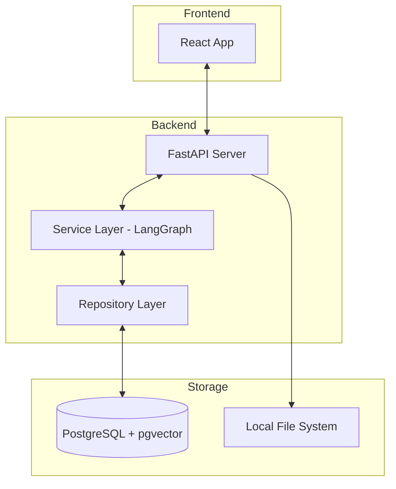

# 🤖 HR Copilot BS

  

> **채용 인재상과 이력서 데이터를 다각도로 분석하여, 검증 근거 중심의 맞춤형 면접 가이드와 꼬리 질문을 생성하는 채용 최적화 시스템**

  

<br>

  

## 📌 1. 프로젝트 개요

  

### 1.1 기본 정보

  

  * **프로젝트명**: HR Copilot BS (LLM 기반 채용 면접 질문 자동생성 시스템)

  * **팀명**: bamti95

  * **진행 기간**: 2026.04.10 ~ 2026.05.19

  * **서비스 유형**: 웹 애플리케이션 / API 서비스 / 챗봇

  * **한 줄 소개**: JD(채용공고)와 지원자 서류를 분석하여 질문 생성 근거와 평가 가이드를 설계하는 HR 맞춤 AI 에이전트

  

### 1.2 프로젝트 목적

  

채용공고(JD)와 지원자 문서를 AI가 분석하여 핵심 역량, 검증 포인트, 리스크 요소, 맞춤형 면접 질문을 자동 생성하는 시스템 구축

  

<br>

  

## 🎯 2. 배경 및 문제 정의

  

채용 현장에서 발생하는 비효율을 **LLM 기반의 문서 이해 시스템**으로 해결합니다.

  

  * **서류 검토 병목**: 지원자 서류를 일일이 검토하는 데 과도한 시간 소요

  * **면접 품질 편차**: 면접관 개인의 역량에 따라 질문의 질과 평가 기준이 상이함

  * **적합도 판단 판별 어려움**: JD(직무기술서)와 지원자 경험 간의 일치 여부를 즉각 파악하기 어려움

  * **근거 부족**: 생성된 질문이 왜 필요한지에 대한 객관적 근거 정리의 한계

  

<br>

  

## 🔄 3. 기획 변경 요약 (MVP 1단계)

  

### 3.1 기존 구조 (Before)

  

  * RAG 기반 검색 중심 구조

  * document_chunk / pgvector / retrieve workflow

  * 벡터 유사도 기반 질문 생성

  

### 3.2 변경 구조 (After)

  

  * LLM 직접 문서 분석 구조

  * 프롬프트 기반 생성 중심

  * 문서 → 분석 → 질문 생성

  

### 3.3 핵심 변경 포인트

  

| 구분 | 기존 | 변경 |

|:---:|:---:|:---:|

| **분석 방식** | RAG (검색 기반) | LLM 직접 해석 |

| **핵심 기술** | pgvector, chunk | Prompt Engineering |

| **데이터 흐름** | 검색 → 생성 | 문서 → 생성 |

| **복잡도** | 높음 | 단순화 |

| **MVP 적합성** | 낮음 | 높음 |

  

<br>

  

## 🔍 4. MVP 1단계 시스템 흐름

  

```

문서 업로드

    ↓

텍스트 추출 (PDF/DOCX)

    ↓

프롬프트 프로필 선택

    ↓

프롬프트 템플릿 조립

    ↓

LLM 호출 (분석 + 질문 생성)

    ↓

결과 저장

    ↓

관리자 UI 조회

```

  

<br>

  

## ✨ 5. 핵심 기능 요구사항 (Core Features)

  

### 📄 5.1 문서 관리 기능

  

  * JD / 이력서 / 포트폴리오 업로드

  * 파일 저장 및 텍스트 추출

  

**요구사항**

  * PDF, DOCX 지원

  * 텍스트 추출 실패 시 로그 기록

  

### 📝 5.2 프롬프트 템플릿 관리 기능

  

  * 프롬프트 템플릿 CRUD

  

**구성 요소**

  * system prompt

  * user prompt

  * output format

  

**요구사항**

  * 변수 치환 지원 ({{jd}}, {{resume}})

  * JSON 출력 포맷 정의 가능

  

### ⚙️ 5.3 프롬프트 프로필 관리 기능

  

  * 템플릿 조합 관리

  * 실행 전략 정의

  

**구성 요소**

  * 템플릿 ID 목록

  * 실행 순서

  * 모델 설정

  

### 🤖 5.4 LLM 분석 실행 기능

  

  * 문서 기반 AI 분석 수행

  

**분석 항목**

  * 핵심 역량 요약

  * 검증 포인트

  * 리스크 포인트

  * 면접 질문 생성

  

### 💬 5.5 질문 생성 관리 기능

  

  * 질문 세트 저장

  * 질문 상세 관리

  

**요구사항**

  * 질문 타입 분류

  * 난이도/카테고리 포함

  

### 📊 5.6 실행 로그 관리 기능

  

  * LLM 호출 로그 저장

  

**기록 항목**

  * 토큰 사용량

  * 응답 시간

  * 프롬프트 내용

  * 응답 결과

  

<br>

  

## 🧠 6. LLM 전략 (핵심)

  

### 6.1 구조 개요

  

```

PromptProfile

    ↓

PromptTemplate 조합

    ↓

문서 데이터 주입

    ↓

LLM 호출

    ↓

구조화된 결과 생성

```

  

### 6.2 Prompt Profile 역할

  

  * 어떤 템플릿을 사용할지 결정

  * 실행 순서 정의

  * 모델/파라미터 설정

  

### 6.3 Prompt Template 역할

  

  * LLM에게 수행할 작업 정의

  * 출력 포맷 강제

  

### 6.4 템플릿 조립 방식

  

**입력**

```json

{

  "jd": "...",

  "resume": "...",

  "portfolio": "..."

}

```

  

**템플릿**

```

당신은 채용 전문가입니다.

  

[채용공고]

{{jd}}

  

[지원자 이력서]

{{resume}}

  

다음을 수행하세요:

1. 핵심 역량 요약

2. 검증 포인트 추출

3. 면접 질문 생성

  

JSON 형식으로 출력하세요.

```

  

### 6.5 출력 구조 (고정)

  

```json

{

  "summary": "...",

  "skills": [],

  "risks": [],

  "questions": [

    {

      "question": "...",

      "type": "technical",

      "difficulty": "medium"

    }

  ]

}

```

  

<br>

  

## 🛠️ 7. 기술 스택 (Tech Stack)

  

### Backend & DB

  

  * **Language**: Python 3.12

  * **Framework**: FastAPI (Async/Await 기반 비동기 처리)

  * **Database**: PostgreSQL + **pgvector** (정형 데이터 및 임베딩 통합 관리)

  * **ORM**: SQLAlchemy, Alembic

  

### Frontend

  

  * **Library**: React

  * **State Management**: Zustand + TanStack Query (Server State 관리)

  

### AI / ML

  

  * **Orchestration**: LangChain, **LangGraph** (단계별 워크플로우 제어)

  * **Technique**: Prompt Engineering, Structured Output

  * **Output**: Pydantic 기반 Structured Output 적용

  

<br>

  

## 🏗️ 8. 시스템 아키텍처

  



  

<br>

  

## 💾 9. 데이터 구조 우선순위

  

### 9.1 포함 (MVP 필수)

  

  * document

  * prompt_template

  * prompt_profile

  * workflow_run

  * interview_question_set

  * interview_question_item

  * llm_call_log

  

### 9.2 제외 (2단계 이후)

  

  * document_chunk

  * document_job (chunk/embed)

  * pgvector

  * retrieve workflow

  

<br>

  

## 📈 10. 품질 전략

  

### 10.1 핵심 포인트

  

  * 프롬프트 고도화

  * 출력 포맷 강제

  * 로그 기반 개선

  

### 10.2 개선 방법

  

  * 실패 케이스 분석

  * 질문 품질 평가

  * 프롬프트 A/B 테스트

  

<br>

  

## 🗺️ 11. 단계별 로드맵

  

### 1단계 (현재 - MVP)

  

  * LLM 직접 분석

  * 질문 생성

  

### 2단계

  

  * 문서 분할 (chunk)

  * 긴 문서 대응

  

### 3단계

  

  * RAG 도입

  * 문서 간 비교 분석

  

<br>

  

## 📅 12. 프로젝트 일정

  

| 단계 | 기간 | 주요 산출물 |

|:---:|:---:|---|

| **기획** | 04.10~04.17 | 기획안, 요구사항 정의서, ERD, API 명세 |

| **설계** | 04.17~04.19 | 시스템 아키텍처 및 상세 테이블 설계 |

| **개발** | 04.20~04.30 | MVP 버전(핵심 LLM 파이프라인 및 UI) |

| **배포/테스트** | 05.06~05.13 | 기능 테스트, 버그 수정, 시나리오 검증 |

| **최종 정리** | ~05.19 | 최종 발표 자료 및 포트폴리오 작성 |

  

<br>

  

## 👥 13. 팀 구성 및 역할

  

| 이름 | 역할 | 담당 업무 |

|:---:|:---:|---|

| **홍길동** | 팀장 / AI | AI 모델 설계, 프롬프트 엔지니어링, LangGraph 구축 |

| **-** | 백엔드 | API 서버 개발, DB(pgvector) 설계, 배포 |

| **-** | 프론트엔드 | UI/UX 개발, 화면 설계, 상태 관리 |

| **-** | 데이터 | 데이터 전처리, 프롬프트 품질 평가 및 정제 |

  

<br>

  

## 🎯 14. 핵심 성공 지표 (KPI)

  

  * **질문 품질**: HR 만족도

  * **생성 정확도**: 출력 포맷 준수율

  * **응답 속도**: LLM 호출 시간

  * **토큰 비용**: 평균 토큰 사용량

  

<br>

  

## ⚠️ 15. 리스크 관리

  

  * **AI 모델 성능**: 성능 미달 시 경량 모델 대체 및 프롬프트 최적화

  * **데이터 확보**: 공개 데이터셋 및 합성 데이터 기법 활용

  * **일정 관리**: 주간 스프린트 점검을 통한 MVP 우선 개발

  * **프롬프트 품질**: 지속적인 A/B 테스트 및 로그 기반 개선

  

<br>

  

## 🤝 16. 협업 규칙

  

  * **회의**: 매일 오전 10:00 정기 미팅

  * **채널**: Slack (공식 소통), GitHub (코드 및 이슈 관리)

  * **코드**: feature 브랜치 전략 및 PR 기반 코드 리뷰

  * **문서**: Notion 팀 스페이스 통합 관리

  

<br>

  

---

  

## 💡 프로젝트 핵심 정의

  

**"채용공고와 지원자 문서를 AI가 분석하여 검증 포인트와 맞춤형 면접 질문을 생성하는 HR Copilot 시스템"**