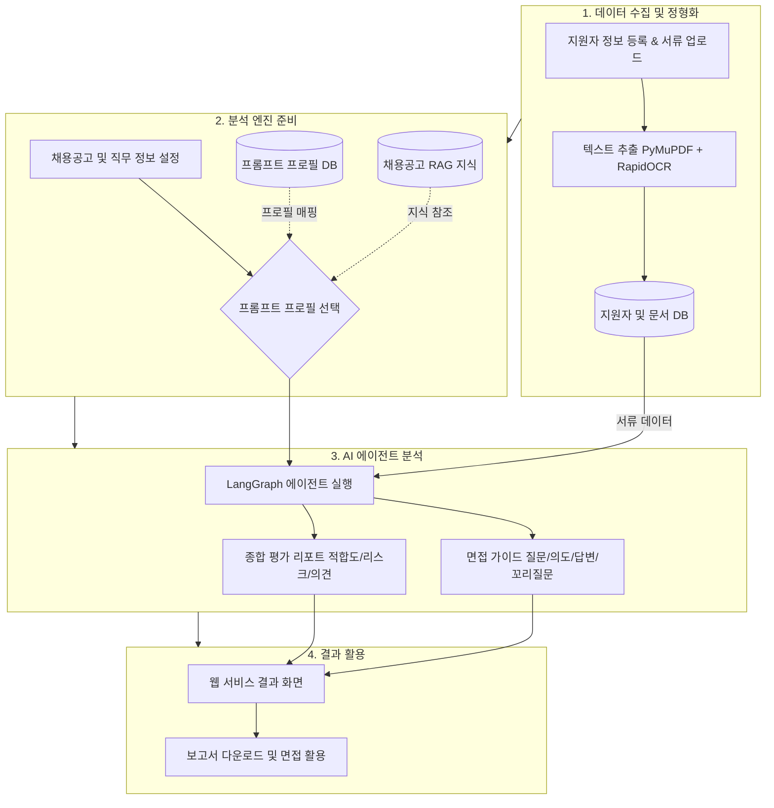
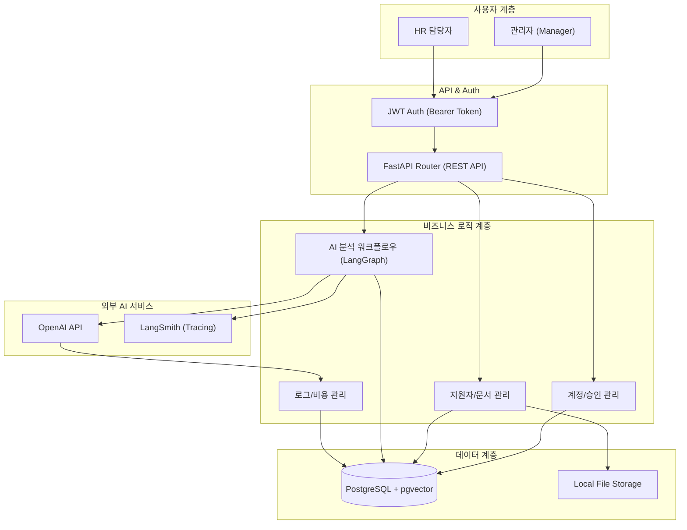

# HR Copilot BS

> **채용 인재상과 지원자 서류 데이터를 다각도로 분석하여, 근거 중심의 맞춤형 면접 가이드와 질문을 생성하는 HR 맞춤 전문 AI Agent 플랫폼**

<br>

##  1. 프로젝트 개요

### 1.1 기본 정보

- **프로젝트명**: HR Copilot BS (LLM 기반 채용 면접 질문 자동생성 시스템)
- **팀명**: BAMTI95 (개발 4명)
- **진행 기간**: 2026.04.10 ~ 2026.05.19
- **서비스 유형**: 웹 애플리케이션 / REST API / AI Agent
- **한 줄 소개**: 채용공고(JD)와 지원자 서류를 AI가 분석하여 성과·역량 검증 중심의 면접 가이드를 자동 생성하는 HR 맞춤 AI 에이전트

### 1.2 프로젝트 목적

채용공고(JD)와 지원자 서류(이력서/포트폴리오)를 AI가 분석하여 핵심 역량, 검증 포인트, 리스크 요소, 맞춤형 면접 질문과 평가 가이드를 자동 생성하는 시스템 구축

<br>

##  2. 배경 및 문제 정의

채용 현장에서 발생하는 비효율을 **LLM 기반 문서 분석 시스템**으로 해결합니다.

- **서류 검토 병목**: 지원자 서류를 일일이 검토하는 데 과도한 시간 소요
- **면접 품질 편차**: 면접관 개인 역량에 따라 질문의 질과 평가 기준이 상이함
- **적합도 판단 어려움**: JD와 지원자 경험 간의 일치 여부를 즉각 파악하기 어려움
- **근거 부족**: 생성된 질문이 왜 필요한지에 대한 객관적 근거 정리의 한계

<br>

##  3. 핵심 기능

###  3.1 지원자 및 문서 관리

- **지원자 일괄 등록**: CSV 기반 지원자 일괄 등록 및 사전 선별 결과 확인
- **문서 일괄 업로드**: 이력서/포트폴리오(PDF, DOCX) 일괄 업로드 및 자동 텍스트 추출
- **지능형 문서 추출**: PyMuPDF + RapidOCR(이미지 기반 PDF) 복합 처리로 정확도 향상
- **지원자 상태 추적**: 지원 완료 → 분석 중 → 준비 완료까지 실시간 상태 관리

###  3.2 프롬프트 프로필 관리

- **프로필 CRUD**: 부서 및 직무별 AI 분석 전략을 프로필로 생성·관리
- **커스텀 인재상 설정**: 부서 현실, 핵심 역량, 우대 조건 등 세부 항목 설정 가능
- **출력 스키마 정의**: 분석 결과의 JSON 출력 포맷을 프로필별로 정의

###  3.3 AI 면접 세션 분석 (LangGraph)

- **에이전트 워크플로우**: 문서 해석 → 전략 적용 → 질문 생성 → 검증 단계 자동화
- **채용공고 분석 및 RAG**: 채용공고를 분석하여 지식 청크로 저장, 분석 시 참조
- **면접 가이드 패키지 생성**: 직무 적합도, 질문 의도, 평가 기준, 예상 답변, 꼬리 질문 세트
- **종합 평가 리포트**: 역량 적합성, 리스크 요소, 보완 필요 역량 종합 의견 제시

###  3.4 워크플로우 대시보드 및 LLM 로그 관리

- **워크플로우 시각화**: 세션별 LangGraph 노드 실행 흐름 및 상세 로그 조회
- **LLM 비용 추적**: 모델별 토큰 사용량 실시간 추적 및 자동 비용 계산
- **LangSmith 연동**: AI 에이전트 호출 추적 및 트러블슈팅 데이터 확보
- **상태 모니터링**: API 호출 성공/실패 상태 관리

<br>

##  4. 데이터 흐름 (Data Flow)

```
지원자 정보 등록 & 서류 업로드 (PDF/DOCX)
    ↓
텍스트 추출 (PyMuPDF + RapidOCR)
    ↓
프롬프트 프로필 선택 (부서/직무별 분석 전략)
    ↓
LangGraph 에이전트 실행 (분석 + 질문 생성)
    ↓
면접 가이드 & 종합 평가 리포트 저장
    ↓
관리자 UI 조회 / 다운로드 / 추가 질문 생성
```



<br>

##  5. 기술 스택 (Tech Stack)

| 구분 | 기술 스택 | 비고 |
|:---:|---|---|
| **Front-End** | React 19, TypeScript, Zustand, TanStack Query, TailwindCSS | 고성능 상태 관리 및 UI 구현 |
| **Back-End** | Python 3.12, FastAPI | Async/Await 기반 비동기 처리 |
| **Database** | PostgreSQL + pgvector, SQLAlchemy, Alembic | RAG 벡터 저장 및 관계형 데이터 관리 |
| **AI / Agent** | LangGraph, OpenAI API, LangSmith | 에이전트 워크플로우 제어 및 추적 |
| **문서 처리** | PyMuPDF, RapidOCR, python-docx | PDF/DOCX 텍스트 추출 및 OCR |
| **인증** | JWT (Bearer Token), Bcrypt | 관리자 계정 인증 및 보안 |

<br>

##  6. 시스템 아키텍처



<br>

##  7. 주요 데이터 모델

| 모델 | 설명 |
|---|---|
| `manager` | 관리자 계정 및 권한 |
| `candidate` | 지원자 정보 및 상태 |
| `document` | 업로드 문서 및 추출 텍스트 |
| `prompt_profile` | 부서/직무별 AI 분석 전략 프로필 |
| `interview_session` | 면접 분석 세션 |
| `interview_question` | 생성된 면접 질문 세트 |
| `job_posting` | 채용공고 정보 |
| `job_posting_knowledge_chunk` | 채용공고 RAG 지식 청크 |
| `llm_call_log` | LLM 호출 로그 및 토큰/비용 기록 |
| `ai_job` | 비동기 AI 처리 작업 상태 |

<br>

##  8. 프로젝트 구조

```
hr-copilot/
├── backend/                      # FastAPI 백엔드
│   ├── main.py                   # 애플리케이션 진입점
│   ├── ai/
│   │   ├── interview_graph/      # HS LangGraph 에이전트
│   │   ├── interview_graph_HY/   # HY 에이전트 워크플로우
│   │   ├── interview_graph_JH/   # JH 에이전트 워크플로우
│   │   ├── interview_graph_JY/   # JY 에이전트 워크플로우
│   │   ├── graph_usage.py        # 에이전트 실행 진입점
│   │   └── llm_client.py         # OpenAI 클라이언트
│   ├── api/                      # FastAPI 라우터
│   ├── models/                   # SQLAlchemy ORM 모델
│   ├── schemas/                  # Pydantic 요청/응답 스키마
│   ├── services/                 # 비즈니스 로직
│   ├── repositories/             # 데이터 접근 계층
│   ├── common/                   # 문서 추출, 파일 처리 유틸
│   ├── core/                     # DB 설정, 보안
│   └── alembic/                  # DB 마이그레이션
│
└── frontend/                     # React 프론트엔드
    └── src/
        ├── features/
        │   └── manager/
        │       ├── Candidate/        # 지원자 관리
        │       ├── Document/         # 문서 관리
        │       ├── InterviewSession/ # 면접 세션
        │       ├── InterviewQuestion/# 면접 질문
        │       ├── PromptProfile/    # 프롬프트 프로필
        │       ├── LlmUsageDashboard/# LLM 사용량
        │       ├── Dashboard/        # 메인 대시보드
        │       └── Manager/          # 관리자 계정
        └── features/workflowDashboard/ # 워크플로우 시각화
```

<br>

##  9. 프로젝트 일정

| 단계 | 기간 | 주요 산출물 |
|:---:|:---:|---|
| **기획** | 04.10 ~ 04.17 | 기획안, 요구사항 정의서, ERD, API 명세 |
| **설계** | 04.17 ~ 04.19 | 시스템 아키텍처 및 상세 테이블 설계 |
| **개발** | 04.20 ~ 04.30 | MVP 버전 (핵심 LLM 파이프라인 및 UI) |
| **배포/테스트** | 05.06 ~ 05.13 | 기능 테스트, 버그 수정, 시나리오 검증 |
| **최종 정리** | ~ 05.19 | 최종 발표 자료 및 포트폴리오 작성 |

<br>

##  10. 커밋 메시지 규칙

| 태그 | 설명 | 태그 | 설명 |
|:---:|---|:---:|---|
| `feat` | 새로운 기능 추가 | `fix` | 자잘한 수정 (버그 아님) |
| `bugfix` | 버그 수정 | `refactor` | 코드 리팩토링 (기능 변화 없음) |
| `docs` | 문서 수정 (README 등) | `chore` | 설정 및 라이브러리 수정 |
| `rename` | 파일/변수명 변경 | `remove` | 기능 또는 파일 삭제 |
| `comment` | 주석 추가 및 수정 | `hotfix` | 긴급 버그 수정 |
| `test` | 테스트 코드 작성 | `post` | 새 글 추가 |

<br>

##  11. 협업 규칙

- **회의**: 매일 오전 10:00 정기 미팅
- **채널**: Slack (공식 소통), GitHub (코드 및 이슈 관리), Notion (문서 관리)
- **코드**: feature 브랜치 전략 및 PR 기반 코드 리뷰

### PR 작성 규칙

- **What**: 어떤 기능을 구현했는지 상세히 기술
- **Why**: 이 작업이 사용자에게 어떤 가치를 주는지 기술
- **How**: 핵심 로직 및 설계 의도 요약
- PR 완료 후 관련 팀원을 리뷰어로 지정하여 승인 후 `main` 브랜치에 병합

<br>

---

##  프로젝트 핵심 정의

**"채용공고와 지원자 서류를 AI가 분석하여 성과·역량 검증 중심의 맞춤형 면접 가이드를 자동 생성하는 HR Copilot BS 시스템"**
