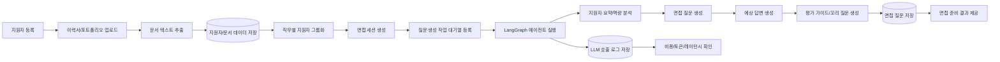
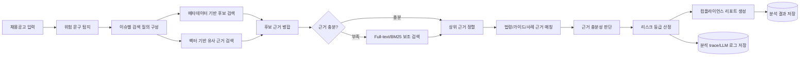
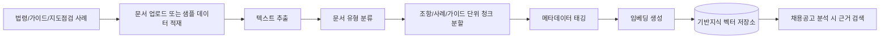
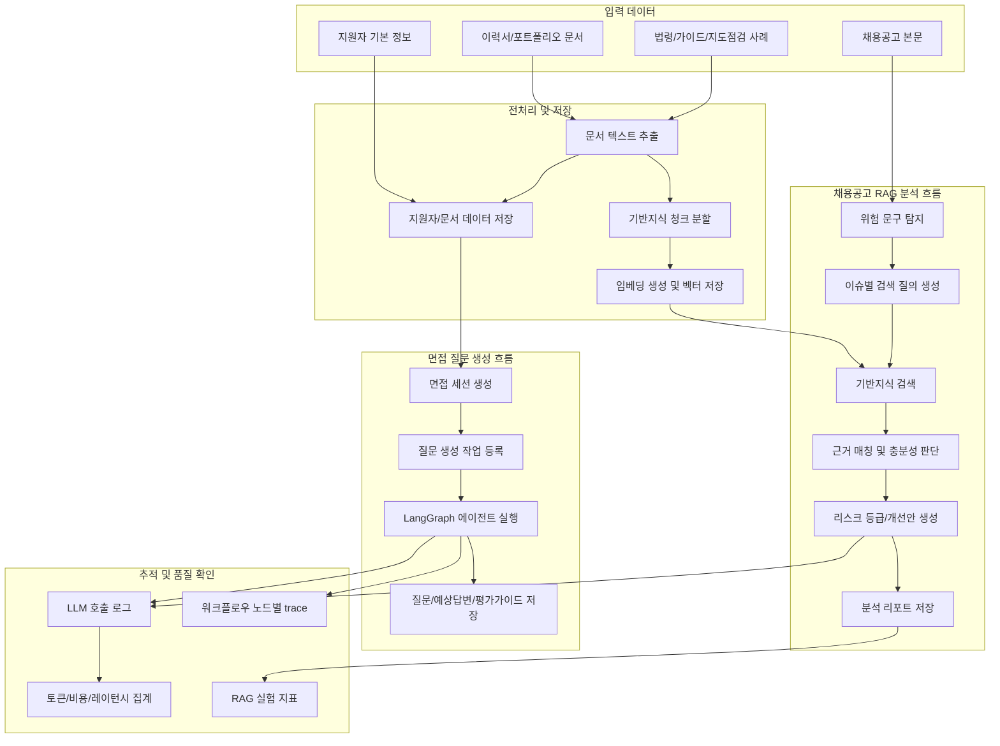
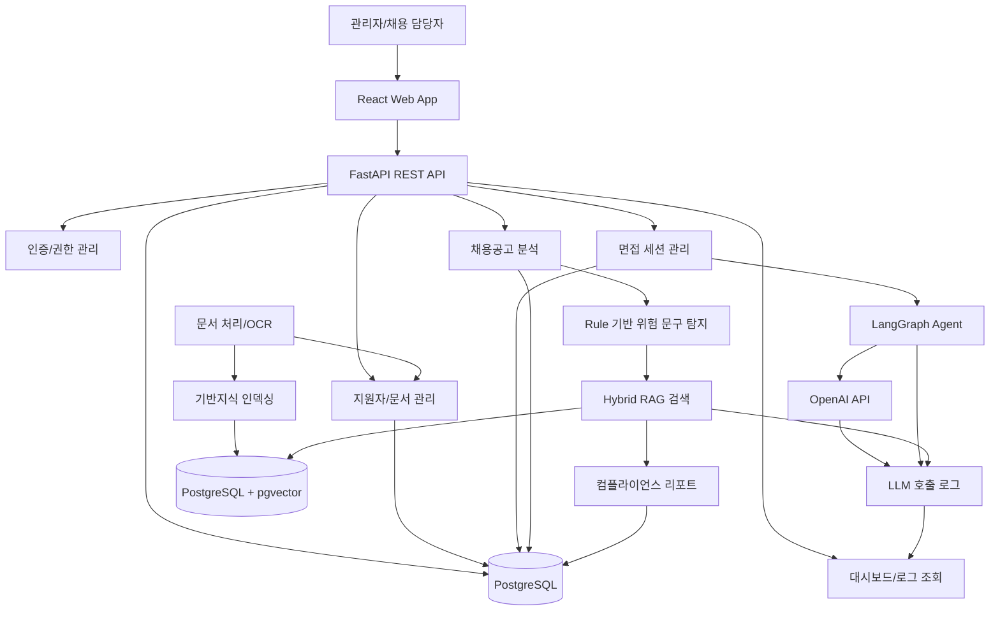

# HR Copilot BS

> 지원자 문서와 채용공고 데이터를 기반으로 면접 질문 생성, 평가 가이드 작성, 채용공고 컴플라이언스 분석을 지원하는 LLM 기반 HR 업무 지원 서비스입니다.

## 1. 프로젝트 개요

HR Copilot BS는 채용 담당자가 반복적으로 수행하는 지원자 검토, 면접 질문 준비, 채용공고 리스크 점검 업무를 AI로 보조하는 서비스입니다.

핵심 목표는 단순히 LLM을 호출하는 것이 아니라, 지원자 문서와 채용공고 데이터를 구조화하고, LangGraph와 RAG를 활용해 근거 기반 결과를 제공하는 것입니다.

## 2. 문제 정의

- 지원자 문서 검토와 직무 적합성 판단에 많은 시간이 소요됩니다.
- 면접 질문 품질이 면접관의 경험과 준비 시간에 따라 달라질 수 있습니다.
- 채용공고 문구에는 성별, 연령, 개인정보, 근로조건 관련 법적 리스크가 숨어 있을 수 있습니다.
- LLM 결과는 품질, 비용, 지연 시간이 일정하지 않아 추적 가능한 구조가 필요합니다.

## 3. 기술 스택

| 구분 | 기술 |
| --- | --- |
| Frontend | React, TypeScript, TailwindCSS, Zustand |
| Backend | Python, FastAPI, SQLAlchemy |
| Database | PostgreSQL, pgvector |
| AI / Agent | LangGraph, OpenAI API, LangSmith |
| RAG | Vector Search, Full-text Search, Reranker |
| Document Processing | PDF/DOCX 텍스트 추출, OCR |
| Async Job | Background Task 기반 비동기 작업 처리 |
| Monitoring | LLM 호출 로그, 토큰/비용/레이턴시 추적 |

## 4. 핵심 기능

### 4.1 지원자 및 문서 관리

- 지원자 등록 및 일괄 등록
- 이력서, 포트폴리오, 경력기술서 등 지원자 문서 업로드
- PDF, DOCX, 이미지 기반 PDF에서 텍스트 추출
- 지원자 상태와 분석 준비 상태 관리

### 4.2 AI 면접 세션 분석

지원자 문서와 직무 정보를 기반으로 LangGraph 에이전트가 면접 질문, 예상 답변, 평가 가이드, 꼬리 질문을 생성합니다.

팀원별 LangGraph 실험 흐름을 비교하고 개선하기 위해 여러 에이전트 파이프라인을 구성했습니다.

- 에이전트 실험일지: [Notion 링크](https://www.notion.so/3641480769ac8073b66fed35ffbc0efd)

#### 면접 질문 생성 Data Flow


```mermaid
flowchart LR
    A[지원자 등록] --> B[이력서/포트폴리오 업로드]
    B --> C[문서 텍스트 추출]
    C --> D[(지원자/문서 데이터 저장)]
    D --> E[직무별 지원자 그룹화]
    E --> F[면접 세션 생성]
    F --> G[질문 생성 작업 대기열 등록]
    G --> H[LangGraph 에이전트 실행]
    H --> I[지원자 요약/역량 분석]
    I --> J[면접 질문 생성]
    J --> K[예상 답변 생성]
    K --> L[평가 가이드/꼬리 질문 생성]
    L --> M[(면접 질문 저장)]
    H --> N[(LLM 호출 로그 저장)]
    M --> O[면접 준비 결과 제공]
    N --> P[비용/토큰/레이턴시 확인]
```

#### 면접 질문 생성 흐름

```text
지원자 등록
  -> 문서 업로드
  -> 직무별 그룹화
  -> 세션 생성
  -> LangGraph 에이전트 실행
  -> 질문 + 예상 답변 + 평가 가이드 생성
```

### 4.3 채용공고 컴플라이언스 RAG 분석

채용공고 문구를 분석해 법적 리스크가 될 수 있는 표현을 탐지하고, 법령·가이드·지도점검 사례 기반 근거를 함께 제공합니다.

- RAG 실험일지: [Notion 링크](https://www.notion.so/RAG-3641480769ac8059b603ef442b8f9f56)

#### 채용공고 RAG Data Flow


```mermaid
flowchart LR
    A[채용공고 입력] --> B[위험 문구 탐지]
    B --> C[이슈별 검색 질의 구성]
    C --> D[메타데이터 기반 후보 검색]
    C --> E[벡터 기반 유사 근거 검색]
    D --> F[후보 근거 병합]
    E --> F
    F --> G{근거 충분?}
    G -- 충분 --> H[상위 근거 정렬]
    G -- 부족 --> I[Full-text/BM25 보조 검색]
    I --> H
    H --> J[법령/가이드/사례 근거 매칭]
    J --> K[근거 충분성 판단]
    K --> L[리스크 등급 산정]
    L --> M[컴플라이언스 리포트 생성]
    M --> N[(분석 결과 저장)]
    L --> O[(분석 trace/LLM 로그 저장)]
```

### 4.4 RAG 기반지식 관리

채용공고 분석에 사용할 법령, 가이드북, 지도점검 사례 문서를 기반지식으로 관리합니다.


```mermaid
flowchart LR
    A[법령/가이드/지도점검 사례] --> B[문서 업로드 또는 샘플 데이터 적재]
    B --> C[텍스트 추출]
    C --> D[문서 유형 분류]
    D --> E[조항/사례/가이드 단위 청크 분할]
    E --> F[메타데이터 태깅]
    F --> G[임베딩 생성]
    G --> H[(기반지식 벡터 저장소)]
    H --> I[채용공고 분석 시 근거 검색]
```

### 4.5 LLM 사용량 및 워크플로우 추적

- LangGraph 노드별 실행 흐름 확인
- LLM 호출별 입력/출력 토큰 추적
- 비용, 평균 실행 시간, 실패 호출 확인
- 면접 질문 생성과 채용공고 분석 파이프라인을 구분해 조회

## 5. 전체 Data Flow

서비스는 크게 면접 질문 생성, 채용공고 분석, 기반지식 인덱싱, 사용량 추적 흐름으로 나뉩니다.


```mermaid
flowchart TB
    subgraph Input[입력 데이터]
        A1[지원자 기본 정보]
        A2[이력서/포트폴리오 문서]
        A3[채용공고 본문]
        A4[법령/가이드/지도점검 사례]
    end

    subgraph Preprocess[전처리 및 저장]
        B1[문서 텍스트 추출]
        B2[지원자/문서 데이터 저장]
        B3[기반지식 청크 분할]
        B4[임베딩 생성 및 벡터 저장]
    end

    subgraph InterviewFlow[면접 질문 생성 흐름]
        C1[면접 세션 생성]
        C2[질문 생성 작업 등록]
        C3[LangGraph 에이전트 실행]
        C4[질문/예상답변/평가가이드 저장]
    end

    subgraph RagFlow[채용공고 RAG 분석 흐름]
        D1[위험 문구 탐지]
        D2[이슈별 검색 질의 생성]
        D3[기반지식 검색]
        D4[근거 매칭 및 충분성 판단]
        D5[리스크 등급/개선안 생성]
        D6[분석 리포트 저장]
    end

    subgraph Observe[추적 및 품질 확인]
        E1[LLM 호출 로그]
        E2[토큰/비용/레이턴시 집계]
        E3[워크플로우 노드별 trace]
        E4[RAG 실험 지표]
    end

    A1 --> B2
    A2 --> B1 --> B2
    A4 --> B1 --> B3 --> B4
    A3 --> D1

    B2 --> C1 --> C2 --> C3 --> C4
    B4 --> D3
    D1 --> D2 --> D3 --> D4 --> D5 --> D6

    C3 --> E1
    D5 --> E1
    E1 --> E2
    C3 --> E3
    D6 --> E4
```

## 6. 시스템 아키텍처


```mermaid
flowchart TB
    U[관리자/채용 담당자] --> FE[React Web App]
    FE --> API[FastAPI REST API]

    API --> AUTH[인증/권한 관리]
    API --> CAND[지원자/문서 관리]
    API --> SESSION[면접 세션 관리]
    API --> POSTING[채용공고 분석]
    API --> DASH[대시보드/로그 조회]

    SESSION --> LG[LangGraph Agent]
    LG --> LLM[OpenAI API]

    POSTING --> RISK[Rule 기반 위험 문구 탐지]
    RISK --> RAG[Hybrid RAG 검색]
    RAG --> REPORT[컴플라이언스 리포트]

    DOC[문서 처리/OCR] --> CAND
    DOC --> KNOW[기반지식 인덱싱]
    KNOW --> VEC[(PostgreSQL + pgvector)]
    RAG --> VEC

    API --> DB[(PostgreSQL)]
    CAND --> DB
    SESSION --> DB
    POSTING --> DB
    REPORT --> DB

    LLM --> LOG[LLM 호출 로그]
    LG --> LOG
    RAG --> LOG
    LOG --> DASH
```

## 7. 주요 데이터 구조

| 영역 | 주요 데이터 |
| --- | --- |
| 관리자 | 계정, 권한, 인증 정보 |
| 지원자 | 기본 정보, 지원 상태, 지원 직무 |
| 문서 | 이력서, 포트폴리오, 경력기술서, 추출 텍스트 |
| 면접 세션 | 세션 상태, 질문 생성 진행 상태, 생성 결과 |
| 면접 질문 | 질문, 예상 답변, 평가 기준, 꼬리 질문 |
| 채용공고 | 공고 본문, 회사/직무 정보, 분석 상태 |
| 분석 리포트 | 리스크 등급, 탐지 이슈, 근거, 개선 제안 |
| 기반지식 | 법령, 가이드, 지도점검 사례, 임베딩 |
| 실험 결과 | RAG 평가 run, 케이스별 예측/정답 비교, 평가 지표 |
| LLM 로그 | 호출 노드, 토큰, 비용, 실행 시간, 오류 정보 |

## 8. AI 품질 검증 포인트

### 면접 질문 생성

- 지원자 문서 기반 질문 생성 여부
- 직무와 질문의 관련성
- 예상 답변과 평가 가이드의 일관성
- LangGraph 노드별 실행 흐름과 실패 지점 추적

### 채용공고 RAG 분석

- 위험 문구 탐지 정확도
- 법령/가이드/사례 근거 검색 정확도
- 고위험 공고 탐지율
- 근거 누락률
- 분석 처리 시간

### 사용한 평가 데이터

채용공고 RAG 분석은 샘플 데이터셋을 활용해 검증했습니다.

| 항목 | 구성 |
| --- | ---: |
| 전체 케이스 | 50건 |
| 위반 공고 | 45건 |
| 정상 공고 | 5건 |
| 직무군 | HR, AI 개발/데이터, 마케팅, 전략기획, 세일즈 |
| 주요 지표 | Macro F1, Recall@5, High-risk Recall, Source Omission Rate, Avg Latency |

## 9. 프로젝트 핵심 정리

HR Copilot BS는 지원자 문서 분석과 채용공고 컴플라이언스 분석을 하나의 HR 업무 흐름으로 연결한 서비스입니다.

특히 면접 질문 생성에서는 팀원별 LangGraph 에이전트 실험을 통해 질문 생성 품질을 개선했고, 채용공고 분석에서는 RAG 기반 근거 검색과 실험 데이터셋을 활용해 결과의 신뢰도를 높였습니다.

핵심은 “AI가 답을 생성한다”가 아니라, **AI 결과를 근거와 로그로 확인할 수 있게 만든 HR 업무 지원 시스템**입니다.
