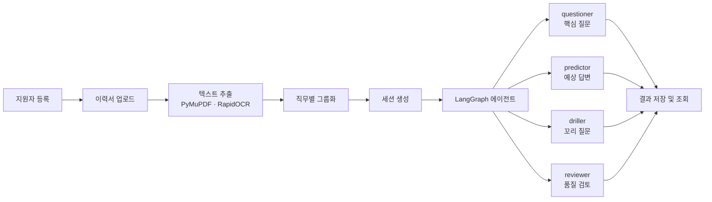
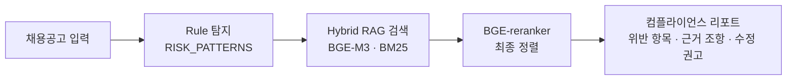
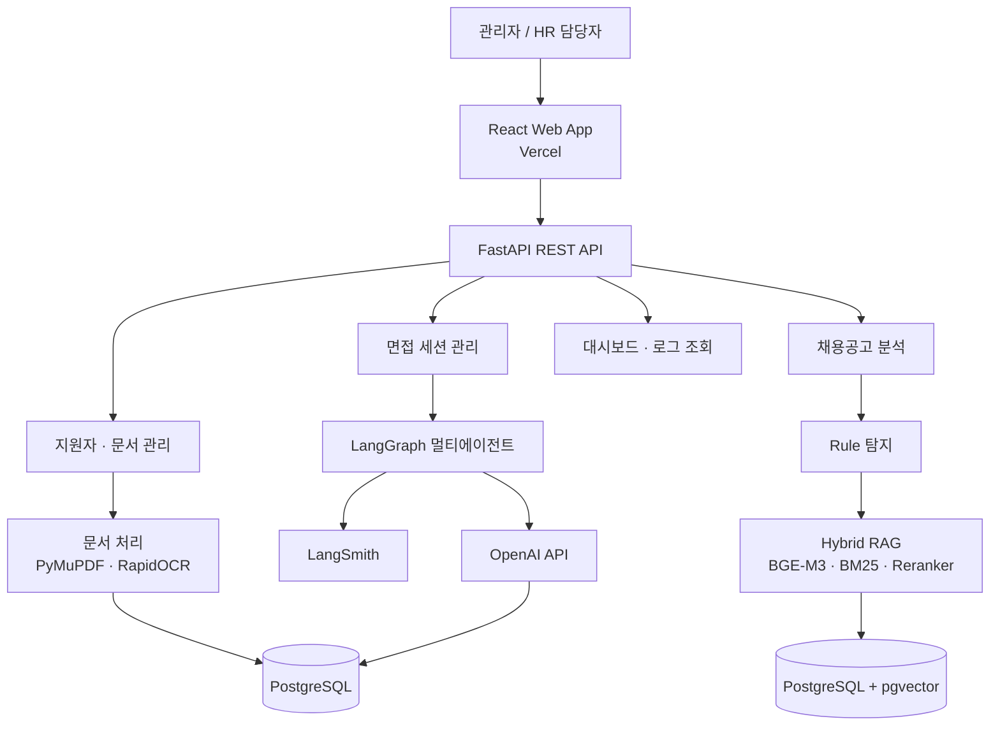

# HR Copilot BS

> 지원자 문서와 채용공고 데이터를 기반으로 **면접 질문 생성**, **평가 가이드 작성**, **채용공고 컴플라이언스 분석**을 지원하는 LLM 기반 HR 업무 지원 서비스입니다.

---

## 기술 스택

| 구분 | 기술 |
| --- | --- |
| Frontend | React 19, TypeScript, TailwindCSS 4, Zustand |
| Backend | Python, FastAPI, SQLAlchemy |
| Database | PostgreSQL, pgvector |
| AI / Agent | LangGraph, OpenAI API, LangSmith |
| RAG | BGE-M3, BM25, BGE-reranker-v2-m3, pgvector |
| 문서 처리 | PyMuPDF, RapidOCR |
| 비동기 작업 | FastAPI BackgroundTasks, AiJob 상태 관리 |
| 배포 | Vercel (Frontend), Team Server (Backend) |

---

## 문제 정의

| 문제 | 설명 |
| --- | --- |
| 면접 질문 품질 편차 | 면접관마다 질문의 깊이와 기준이 달라 일관된 평가가 어렵습니다 |
| 채용공고 법적 리스크 | 채용절차법 위반 문구가 공고에 포함될 경우 과태료 등 법적 불이익이 발생합니다 |
| 서류 검토 병목 | 지원자 수가 늘수록 HR 담당자의 수작업 검토 시간이 급증합니다 |
| LLM 결과 추적 한계 | 질문 생성 품질, 비용, 지연 시간을 체계적으로 추적하기 어렵습니다 |

---

## 핵심 기능

### 1. 면접 질문 생성

지원자 이력서와 직무 정보를 기반으로 LangGraph 멀티에이전트가 면접 질문, 예상 답변, 평가 가이드를 자동 생성합니다.

```mermaid
flowchart LR
    A[지원자 등록] --> B[이력서 업로드]
    B --> C[텍스트 추출\nPyMuPDF · RapidOCR]
    C --> D[직무별 그룹화]
    D --> E[세션 생성]
    E --> F[LangGraph 에이전트]
    F --> G[questioner\n핵심 질문]
    F --> H[predictor\n예상 답변]
    F --> I[driller\n꼬리 질문]
    F --> J[reviewer\n품질 검토]
    G & H & I & J --> K[결과 저장 및 조회]
```

- 팀원별 LangGraph 실험 비교 (4개 파이프라인)
- 100점 루브릭 기반 품질 평가 (Judge Agent + 팀 직접 채점)
- 에이전트 실험일지: [Notion](https://www.notion.so/3641480769ac8073b66fed35ffbc0efd)

---

### 2. 채용공고 컴플라이언스 분석

채용공고 문구를 분석해 채용절차법 위반 리스크를 탐지하고 법령 근거와 함께 리포트를 제공합니다.

```mermaid
flowchart LR
    A[채용공고 입력] --> B[Rule 탐지\nRISK_PATTERNS]
    B --> C[Hybrid RAG 검색\nBGE-M3 · BM25]
    C --> D[BGE-reranker\n최종 정렬]
    D --> E[컴플라이언스 리포트\n위반 항목 · 근거 조항 · 수정 권고]
```

- RAG 실험일지: [Notion](https://www.notion.so/RAG-3641480769ac8059b603ef442b8f9f56)

---

### 3. LLM 사용량 대시보드

LangSmith API 연동을 통해 노드별 토큰 사용량, 비용, 레이턴시를 실시간으로 조회합니다.

---

## 시스템 아키텍처

```mermaid
flowchart TB
    U[관리자 / HR 담당자] --> FE[React Web App\nVercel]
    FE --> API[FastAPI REST API]

    API --> CAND[지원자 · 문서 관리]
    API --> SESSION[면접 세션 관리]
    API --> POSTING[채용공고 분석]
    API --> DASH[대시보드 · 로그 조회]

    SESSION --> LG[LangGraph 멀티에이전트]
    LG --> LLM[OpenAI API]
    LG --> LS[LangSmith]

    POSTING --> RISK[Rule 탐지]
    RISK --> RAG[Hybrid RAG\nBGE-M3 · BM25 · Reranker]
    RAG --> VEC[(PostgreSQL + pgvector)]

    CAND --> DOC[문서 처리\nPyMuPDF · RapidOCR]
    DOC --> DB[(PostgreSQL)]
    LLM --> DB
```

---

## 평가 데이터셋

| 항목 | 내용 |
| --- | --- |
| 면접 질문 평가 | 62개 이력서 × 9가지 지원자 유형 |
| 채용공고 평가 | 50건 (위반 45건 · 정상 5건) |
| 평가 지표 | Macro F1, Recall@5, High-risk Recall, Source Omission Rate, Avg Latency |

---

## 주요 데이터 구조

| 영역 | 주요 데이터 |
| --- | --- |
| 지원자 | 기본 정보, 지원 직무, 상태 |
| 문서 | 이력서, 포트폴리오, 추출 텍스트, 임베딩 |
| 면접 세션 | 세션 상태, 생성 진행 상태, 결과 |
| 면접 질문 | 질문, 예상 답변, 평가 기준, 꼬리 질문 |
| 채용공고 | 공고 본문, 분석 상태, 리스크 리포트 |
| 기반지식 | 법령, 가이드, 지도점검 사례, 벡터 |
| LLM 로그 | 노드별 토큰, 비용, 실행 시간, 오류 |

---

## 문서

| 문서 | 설명 |
| --- | --- |
| [시스템 아키텍처](docs/01_시스템아키텍처.md) | 전체 시스템 구조 |
| [시스템 플로우차트](docs/02_시스템플로우차트.md) | 기능별 시퀀스 다이어그램 |
| [테이블 정의서](docs/03_테이블정의서.md) | DB 스키마 |
| [지원자 유형 정리](docs/04_지원자유형정리.docx) | 9가지 지원자 유형 정의 |
| [API 명세](docs/api-docs/) | REST API 문서 |
| [기획 문서](docs/기획/) | 요구사항, 설계안, RAG 가이드 등 |
| [팀원별 실험](docs/팀원별/) | HS / JH / JY LangGraph 실험 기록 |
