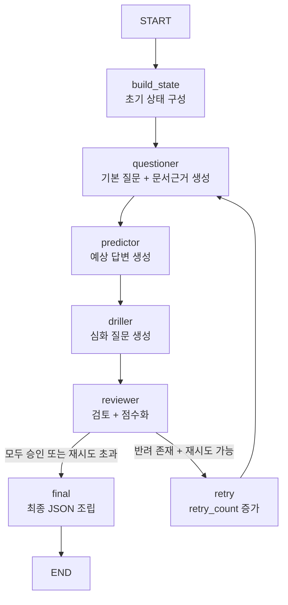
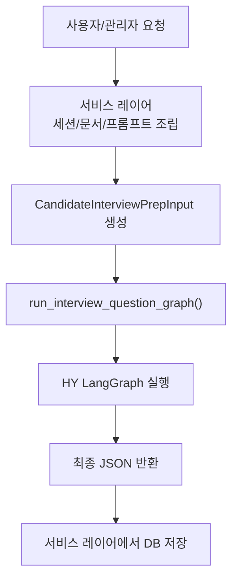
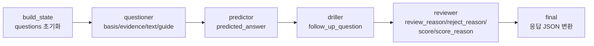

# HY LangGraph 설계 문서

이 문서는 [`backend/ai/interview_graph_HY`](C:/Users/USER/Desktop/hr-copilot/backend/ai/interview_graph_HY) 구현 코드를 기준으로 정리한 설계 문서입니다.
기획 이미지의 7개 구성을 따르되, 현재 HY 그래프가 실제로 생성하는 상태와 응답 구조를 반영했습니다.

## 1. 멀티 에이전트 전략

HY 그래프는 하나의 질문 세트를 여러 에이전트가 순차적으로 가공하는 구조입니다.
모든 에이전트는 `AgentState.questions` 배열을 공유하며, 각 단계에서 필요한 필드만 덧붙입니다.

| 에이전트 | 역할 | 현재 구현 책임 |
| --- | --- | --- |
| `Questioner` | 기본 질문 설계 | `generation_basis`, `document_evidence`, `question_text`, `evaluation_guide` 생성 |
| `Predictor` | 예상 답변 시뮬레이션 | `predicted_answer` 생성 |
| `Driller` | 심화 질문 생성 | `follow_up_question` 생성 |
| `Reviewer` | 품질 검토 + 점수화 | `status`, `review_reason`, `reject_reason`, `recommended_revision`, `quality_flags`, `duplicate_with`, `score`, `score_reason` 기록 |
| `Retry Controller` | 재시도 제어 | 반려 존재 시 `retry_count` 증가 후 `Questioner` 재호출 |
| `Final Formatter` | 최종 응답 조립 | `QuestionGenerationResponse` JSON 생성 |

핵심 원칙:

- 그래프 내부에서 사람과 직접 상호작용하지 않습니다.
- 서비스 레이어가 `human_action`, `additional_instruction`, `regen_question_ids`를 상태에 주입합니다.
- Reviewer 피드백은 상태에 남고, 다음 Questioner 라운드에서 재사용됩니다.

## 2. 랭그래프 노드 구성 및 상태 관리

상태 관리 포인트:

- `build_state`는 payload를 읽어 `candidate_text`, `recruitment_criteria`, `questions`를 초기화합니다.
- `questioner`는 질문 본문뿐 아니라 `document_evidence`도 함께 생성합니다.
- `reviewer`는 승인/반려 판정만 하는 것이 아니라, 리뷰 근거와 점수 근거도 남깁니다.
- `retry` 이후 `questioner`는 이전 반려 피드백을 프롬프트에 포함해 같은 실수를 줄입니다.

## 3. 서비스 레이어 설계

서비스 레이어 책임:

- 세션, 지원자, 문서, 프롬프트 프로필을 조회해 `CandidateInterviewPrepInput` 구성
- 사람 액션을 그래프 파라미터로 변환
  - 추가 생성: `human_action="more"`
  - 전체 재생성: `human_action="regenerate_all"`
  - 부분 재생성: `human_action="regenerate_partial"` 또는 `human_action="regenerate_question"`
- `on_node_complete(node_name)` 콜백으로 진행률 업데이트
- 그래프 결과를 인터뷰 질문 테이블에 저장

현재 구조는 "사람이 그래프 내부를 조작하는 구조"가 아니라, 서비스 레이어가 새 입력을 만들어 그래프를 다시 호출하는 방식입니다.

## 4. State 및 데이터 구조 정의

핵심 상태는 [`state.py`](C:/Users/USER/Desktop/hr-copilot/backend/ai/interview_graph_HY/state.py)에 정의되어 있습니다.

### 4.1 QuestionSet

| 필드 | 타입 | 설명 |
| --- | --- | --- |
| `id` | `str` | 질문 ID |
| `generation_basis` | `str` | 질문 생성 근거 |
| `document_evidence` | `list[str]` | 서류에서 뽑은 직접 근거 문장/팩트 |
| `question_text` | `str` | 기본 질문 문구 |
| `evaluation_guide` | `str` | 평가 가이드 |
| `predicted_answer` | `str` | 예상 답변 |
| `follow_up_question` | `str` | 꼬리 질문 |
| `status` | `pending \| approved \| rejected \| human_rejected` | 현재 상태 |
| `review_reason` | `str` | 승인/반려 최종 리뷰 요약 |
| `reject_reason` | `str` | 반려 시 결함 설명 |
| `recommended_revision` | `str` | 재생성 지침 |
| `quality_flags` | `list[str]` | 품질 결함 라벨 |
| `duplicate_with` | `str` | 중복 대상 질문 ID |
| `score` | `int` | Reviewer가 매긴 점수 |
| `score_reason` | `str` | 점수 근거 |
| `regen_targets` | `list[str]` | 재생성 대상 필드 |

### 4.2 AgentState

| 필드 | 설명 |
| --- | --- |
| `_payload` | 서비스 레이어가 넘긴 원본 payload |
| `candidate_text` | 문서들을 합친 LLM 입력 텍스트 |
| `recruitment_criteria` | 프롬프트 프로필 기반 채용 기준 |
| `questions` | `QuestionSet` 배열 |
| `retry_count` | 현재 재시도 횟수 |
| `max_retry_count` | 최대 재시도 횟수 |
| `is_all_approved` | 전체 승인 여부 |
| `human_action` | 사람 요청 유형 |
| `additional_instruction` | 추가 지시사항 |
| `regen_question_ids` | 부분 재생성 대상 질문 ID |
| `llm_usages` | 노드별 LLM 사용량 |
| `final_response` | 최종 응답 JSON |

## 5. 통합 에이전트 공유상태

공유 상태 관점에서 보면:

- `Questioner`는 질문의 뼈대와 문서근거를 만듭니다.
- `Predictor`는 예상 답변을 채웁니다.
- `Driller`는 심화 질문을 채웁니다.
- `Reviewer`는 리뷰/점수 메타데이터를 채웁니다.
- `Final Formatter`는 이 상태를 그대로 화면/DB용 JSON으로 바꿉니다.

즉, HY 구현은 "에이전트별 개별 산출물"보다 "공유 질문 상태를 점진적으로 완성하는 파이프라인"입니다.

## 6. 노드별 상세 흐름

### 6.1 `build_state`

- 입력: `CandidateInterviewPrepInput`
- 처리:
  - 문서 텍스트를 합쳐 `candidate_text` 생성
  - 채용 기준을 `recruitment_criteria`로 추출
  - 기존 질문이 있으면 `questions`로 로딩
  - 재시도 관련 카운터 초기화
- 출력: 초기 `AgentState`

### 6.2 `questioner`

- 역할: 기본 질문 + 문서근거 생성
- 처리:
  - `human_action`에 따라 추가 생성/전체 재생성/부분 재생성 분기
  - `retry_count > 0`이면 이전 Reviewer 반려 피드백을 프롬프트에 주입
  - 새 질문에 `generation_basis`, `document_evidence`, `question_text`, `evaluation_guide`를 채움
- 출력: `questions` 확장 또는 갱신

### 6.3 `predictor`

- 역할: 예상 답변 생성
- 처리:
  - 각 질문 ID 기준으로 `predicted_answer` 생성
- 출력: 기존 질문 객체에 `predicted_answer` 추가

### 6.4 `driller`

- 역할: 심화 질문 생성
- 처리:
  - 질문 + 예상 답변 묶음을 입력받아 각 질문별 `follow_up_question` 생성
- 출력: 기존 질문 객체에 `follow_up_question` 추가

### 6.5 `reviewer`

- 역할: 검토 + 점수화
- 처리:
  - 질문별 `approved` 또는 `rejected` 판정
  - `review_reason`, `reject_reason`, `recommended_revision`, `quality_flags`, `duplicate_with` 저장
  - `score`, `score_reason` 저장
  - 반려 질문이 있으면 `regen_question_ids` 수집
- 출력: 리뷰 및 점수 메타데이터가 반영된 `questions`

### 6.6 `route_after_review`

- 역할: 다음 노드 선택
- 규칙:
  - 모두 승인되면 `final`
  - 재시도 횟수 초과 시 `final`
  - 그 외에는 `retry`

### 6.7 `retry`

- 역할: 재시도 카운트 증가
- 처리:
  - `retry_count += 1`
- 이후 다시 `questioner`로 이동

### 6.8 `final`

- 역할: 최종 응답 조립
- 처리:
  - `questions` 배열을 `QuestionGenerationResponse`로 변환
  - 화면에 필요한 `document_evidence`, `review.reason`, `reject_reason`, `recommended_revision`, `score`, `score_reason`을 모두 포함
- 출력: 서비스 레이어가 그대로 저장/반환 가능한 JSON

## 7. 생성근거 작성 예시

`generation_basis`는 "왜 이 질문을 했는가"를 설명하고, `document_evidence`는 "어느 서류 팩트에서 나왔는가"를 보여주는 필드입니다.

### 예시 1

서류 팩트:

- "추천 알고리즘 리뉴얼"
- "사용자 체류시간 35% 증가"
- "실측 데이터 분석을 통해 추천 알고리즘 리뉴얼"

좋은 `generation_basis`:

> 이력서에 추천 알고리즘 리뉴얼과 체류시간 35% 증가를 정량 성과로 제시했지만, 개선 기준선과 측정 방법은 보이지 않는다. 따라서 알고리즘 변경의 실제 기여와 검증 방식을 확인할 필요가 있다.

좋은 `document_evidence`:

- "추천 알고리즘 리뉴얼"
- "사용자 체류시간 35% 증가"
- "실측 데이터 분석을 통해 추천 알고리즘 리뉴얼"

### 예시 2

서류 팩트:

- "MSA 전환 프로젝트 주도"
- "Kafka, Kubernetes 사용"

좋은 `generation_basis`:

> 경력기술서에 MSA 전환 주도 경험을 제시했으나 서비스 경계 분리 기준과 메시징 선택 이유는 드러나지 않는다. 따라서 Kafka와 Kubernetes를 실제로 어느 수준까지 설계/운영했는지 검증하는 질문이 필요하다.

좋은 `document_evidence`:

- "MSA 전환 프로젝트 주도"
- "Kafka, Kubernetes 사용"

## 구현 기준 메모

현재 HY 그래프는 원본 기획 이미지와 비교하면 다음 특징이 있습니다.

- 별도 `Analyzer`, `Scorer`, `Selector` 노드는 없습니다.
- 대신 `Reviewer`가 검토와 점수화를 함께 담당합니다.
- 사람의 추가 요청은 그래프 내부 이벤트가 아니라 서비스 레이어 재호출로 처리합니다.
- 최종 결과에는 이제 `document_evidence`, 리뷰 근거, 점수 근거가 포함됩니다.
