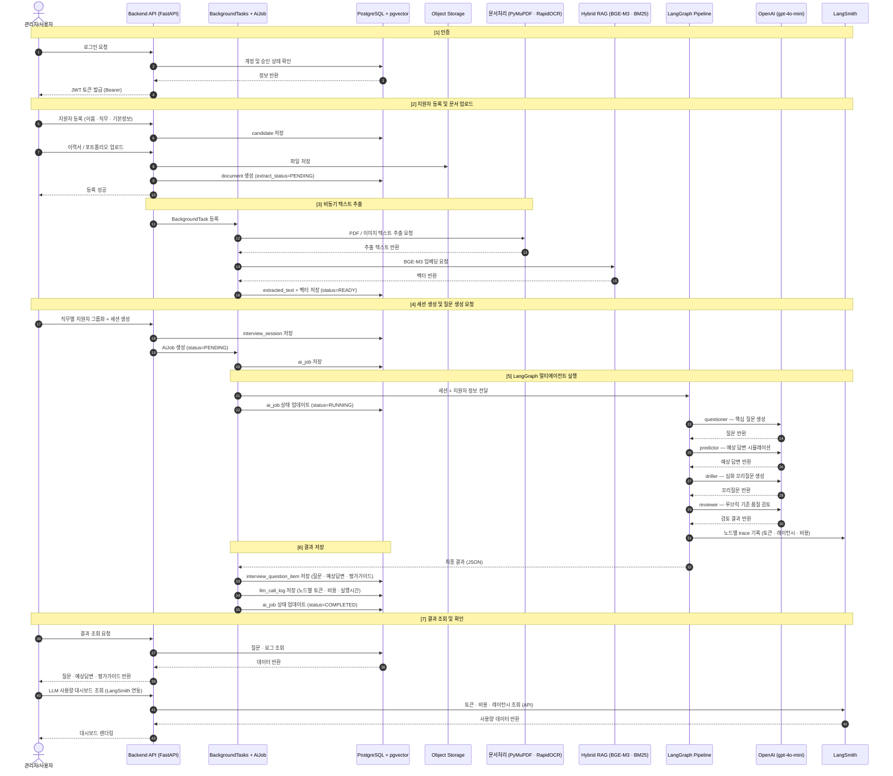
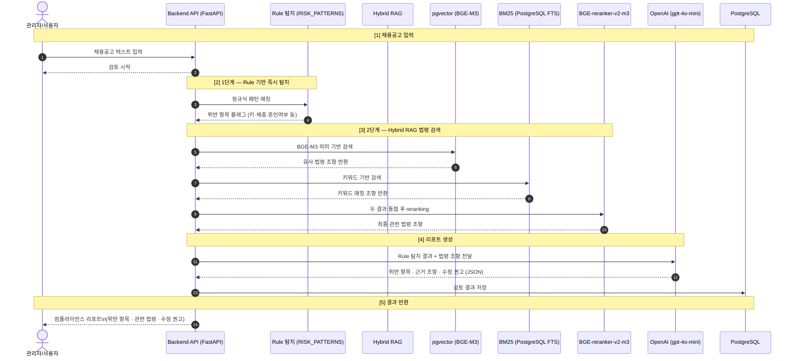

# HR Copilot BS — 시스템 플로우차트 (최신)

> 최종 업데이트: 2026-05-18
> 노션 붙여넣기용 Mermaid 다이어그램

---

## 1. 전체 시퀀스 다이어그램



---

## 2. 채용공고 컴플라이언스 검토 흐름



---

> **노션 사용법:** 코드블록(```) 안의 내용을 노션 `/mermaid` 블록에 붙여넣으면 바로 렌더링됩니다.
