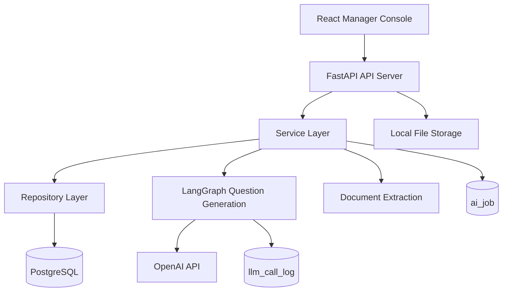

# HR Copilot BS

HR Copilot BS는 지원자 기본정보와 제출 문서를 기반으로 채용 서류 검토, 면접 세션 구성, 맞춤형 면접 질문 생성, LLM 실행 로그 관찰까지 지원하는 HR 업무 보조 시스템입니다.

현재 프로젝트는 1차 MVP의 “개별 지원자/개별 면접 세션 기반 질문 생성”을 넘어, 2차 MVP에서 “대량 지원자 등록, 문서 기반 일괄 등록, 질문 생성 전 면접자 선별, AI 작업 상태 관리” 흐름으로 확장하는 중입니다.

## 프로젝트 개요

| 항목 | 내용 |
|---|---|
| 프로젝트명 | HR Copilot BS |
| 팀명 | bamti95 |
| 진행 기간 | 2026.04.10 ~ 2026.05.19 |
| 서비스 유형 | 웹 애플리케이션, API 서비스, LLM 기반 HR Copilot |
| 핵심 목적 | 지원자 문서와 직무 기준을 분석해 면접 질문과 평가 근거를 생성하고, HR 담당자의 서류 검토/면접 준비 시간을 줄임 |

## 문제 정의

채용 실무에서는 다음 병목이 반복적으로 발생합니다.

| 문제 | 설명 |
|---|---|
| 서류 검토 병목 | 지원자 수가 늘수록 HR 담당자가 문서를 일일이 확인하는 시간이 급증 |
| 면접 질문 품질 편차 | 면접관 또는 담당자별로 질문의 깊이, 근거, 평가 기준이 달라짐 |
| 직무 적합도 판단 어려움 | 지원자의 경험과 직무 요구사항 간의 연결 근거를 빠르게 파악하기 어려움 |
| LLM 작업 추적 한계 | 질문 생성이 오래 걸리거나 실패할 때 상태, 원인, 중복 실행 여부를 확인하기 어려움 |
| 대량 채용 처리 부담 | 지원자 등록, 문서 업로드, AI 분석, 면접 대상자 확정이 개별 처리 중심으로 흩어짐 |

## 현재 구현된 주요 기능

| 구분 | 기능 | 구현 상태 |
|---|---|---|
| 인증 | 관리자 로그인, 토큰 재발급, 로그아웃 | 구현 |
| 관리자 대시보드 | 지원자/세션/운영 요약 조회 | 구현 |
| 관리자 관리 | 관리자 목록, 상세, 생성, 수정, 상태 변경, 삭제 | 구현 |
| 지원자 관리 | 지원자 목록, 검색, 직무/상태 필터, 상세, 생성, 수정, 삭제, 상태 변경 | 구현 |
| 지원자 샘플 일괄 등록 | 서버 샘플 폴더 기반 지원자/문서 일괄 등록 | 구현 |
| 문서 기반 일괄 등록 | ZIP 또는 다중 파일 업로드, 미리보기 작업, row별 검증, 선택 row 확정 등록 | 구현 |
| 지원자 문서 관리 | 문서 업로드, 상세 조회, 텍스트 추출 결과 조회, 다운로드, 교체, 삭제 | 구현 |
| 문서 텍스트 추출 | PDF/DOCX 등 문서 업로드 후 텍스트 추출 BackgroundTasks 실행 | 구현 |
| 프롬프트 프로필 관리 | 직무/역할별 system prompt, output schema 관리 | 구현 |
| 면접 세션 관리 | 지원자별 면접 세션 생성, 목록, 상세, 수정, 삭제 | 구현 |
| 질문 생성 | 면접 세션 기준 LangGraph 질문 생성, 수동 재생성, 진행 상태 조회 | 구현 |
| 멀티 파이프라인 | 기본, JH, HY, JY 그래프 파이프라인 선택 실행 | 구현 |
| 질문 생성 결과 조회 | 질문, 생성 근거, 문서 근거, 예상 답변, 후속 질문, 리뷰, 점수 조회 | 구현 |
| LLM 사용량 대시보드 | LLM 사용 요약, 세션별 로그, 노드별 실행 로그, trace 형태 UI | 구현 |
| LLM 호출 로그 | 노드별 request/output/토큰/비용/실행 시간 저장 및 조회 | 구현 |
| AI Job 기반 구조 | `ai_job` 모델과 작업 상태/진행률/결과 payload 저장 구조 | 기반 구현 |
| 면접자 선별 | 질문 생성 전 지원자/문서 기반 선별 그래프 설계 | 설계 반영 |
| 작업 현황 화면 | job 목록, 재시도, 취소, 실패 로그 조회 | 예정 |
| Celery/Redis 전환 | BackgroundTasks를 실제 분산 큐로 고도화 | 예정 |

## 사용자 업무 흐름

### 1차 MVP 흐름

```text
지원자 등록
→ 문서 업로드
→ 텍스트 추출
→ 프롬프트 프로필 선택
→ 면접 세션 생성
→ LangGraph 질문 생성
→ 생성 질문/근거/예상 답변 조회
→ LLM 로그 기반 품질 확인
```

### 2차 MVP 목표 흐름

```text
대량 지원자 등록
→ 문서 일괄 업로드 및 미리보기
→ 정상 row 확정 등록
→ 질문 생성 전 면접자 선별
→ 면접 대상 확정
→ 분석 세션 생성
→ 질문 생성
→ 작업 상태/LLM 로그 확인
```

## 2차 MVP 고도화 방향

상세 기획은 [docs/2차_MVP_고도화_기획안.md](docs/2차_MVP_고도화_기획안.md)에 정리되어 있습니다.

| 우선순위 | 항목 | 설명 |
|---:|---|---|
| 1 | 지원자 일괄 등록 | Excel/CSV 또는 샘플 폴더 기반 대량 지원자 등록 |
| 2 | 문서 기반 일괄 등록 | ZIP/다중 파일 기반 지원자 프로필 추출, 미리보기, 확정 등록 |
| 3 | 질문 생성 전 면접자 선별 | 지원자 기본정보와 문서 추출 정보를 기반으로 면접 대상 후보를 AI 선별 |
| 4 | 분석 세션 생성 연결 | 선별된 후보를 기준으로 면접 세션 및 질문 생성으로 연결 |
| 5 | AI 작업 큐 고도화 | `ai_job` 기반 상태 관리, 중복 실행 방지, 재시도/실패 추적 |
| 6 | 운영 가시성 개선 | 작업 현황, 실패 원인, LLM 로그, 오래 걸리는 작업 확인 |
| 7 | Celery/Redis worker 전환 | BackgroundTasks 한계를 보완하는 실제 worker 구조 도입 |

## 질문 생성 전 면접자 선별 설계

2차 MVP에서 새로 추가 예정인 핵심 기능입니다. 지원자 관리 화면의 상단 버튼 영역에 `면접자 선별` 버튼을 추가하고, 선택된 지원자 또는 현재 필터 조건의 지원자를 대상으로 AI 서류 선별 그래프를 실행합니다.

### 선별 흐름

```text
지원자 목록 조회
→ 지원자 선택 또는 검색/필터 조건 설정
→ 면접자 선별 버튼 클릭
→ 지원자 기본정보 + 문서 추출 정보 payload 조립
→ 서류검토 담당관 프롬프트 프로필 주입
→ screening_graph 실행
→ 후보자별 추천/보류/제외 결과 저장
→ HR 담당자가 면접 대상 확정
→ 확정자 기준 분석 세션 생성
→ 질문 생성 graph 실행
```

### 버튼 배치

```text
검색 | 신규 등록 | 단체 지원자 등록 | 문서 일괄등록 | 면접자 선별 | 분석 세션 생성
```

### 선별 입력 payload 예시

```json
{
  "candidate": {
    "candidate_id": 88,
    "name": "정지훈",
    "email": "jhoon94@naver.com",
    "phone": "010-2987-1472",
    "birth_date": "1994-01-01",
    "job_position": "SALES",
    "apply_status": "APPLIED"
  },
  "documents": [
    {
      "document_id": 1001,
      "document_type": "RESUME",
      "title": "정지훈_이력서.pdf",
      "extract_status": "COMPLETED",
      "extracted_text": "..."
    }
  ],
  "target_job": "SALES",
  "prompt_profile": {
    "id": 3,
    "profile_key": "SCREENING_SALES_REVIEWER",
    "system_prompt": "당신은 서류검토 담당관입니다...",
    "output_schema": {}
  },
  "screening_policy": {
    "recommend_threshold": 75,
    "hold_threshold": 55,
    "temperature": 0
  }
}
```

### screening_graph 노드 초안

| 노드 | 역할 |
|---|---|
| `build_state` | 후보자 기본정보, 문서, 프롬프트 프로필 입력 정리 |
| `document_compactor` | 문서 타입별 핵심 텍스트 압축, 누락/추출 실패 표시 |
| `screening_evaluator` | LLM으로 직무 적합도, 추천 여부, 판단 근거 산출 |
| `screening_reviewer` | 문서 근거 부족, 환각 위험, 판단 제한 사항 검증 |
| `final_formatter` | 점수, 추천 상태, 사유, 리스크, 면접 검증 포인트 최종 JSON 정리 |

### 선별 출력 예시

```json
{
  "candidate_id": 88,
  "recommendation": "RECOMMEND",
  "score": 82,
  "confidence": 0.78,
  "summary": "영업 직무와 관련된 고객 대응 및 성과 경험이 확인됩니다.",
  "fit_reasons": [
    "지원 직무와 유관한 영업 경험 보유",
    "정량 성과가 일부 문서에서 확인됨"
  ],
  "risk_factors": [
    "최근 경력 공백 여부 추가 확인 필요"
  ],
  "missing_evidence": [
    "포트폴리오 문서 없음"
  ],
  "interview_focus": [
    "실제 영업 성과 산정 방식",
    "고객 갈등 대응 경험"
  ],
  "suggested_next_action": "INTERVIEW"
}
```

### MVP 포함/제외

| 기능 | MVP 포함 |
|---|---|
| 지원자 관리 화면 내 면접자 선별 버튼 | Y |
| 선택 지원자 또는 현재 필터 기반 선별 실행 | Y |
| 지원자 기본정보 + 문서 추출 정보 payload 조립 | Y |
| 선별 전용 프롬프트 프로필 선택 | Y |
| 후보자별 `screening_graph` 실행 | Y |
| 후보자별 점수, 추천 사유, 리스크 저장 | Y |
| HR 수동 확정/보류/제외 | Y |
| 확정자 분석 세션 생성 연결 | Y |
| RAG 기반 채용 공고 지식 주입 | N |
| 후보자 간 직접 비교 평가 | N |
| Celery/Redis 기반 선별 작업 큐 | N |

## 기술 스택

### Backend

| 항목 | 기술 |
|---|---|
| Language | Python 3.12 |
| Framework | FastAPI |
| ORM/Migration | SQLAlchemy, Alembic |
| Database | PostgreSQL, asyncpg |
| AI Orchestration | LangGraph, LangChain 계열 구조 |
| LLM Client | OpenAI API |
| Document Extraction | PyMuPDF, python-docx, RapidOCR ONNX Runtime |
| Auth | JWT, refresh token, bcrypt/passlib |
| Observability | 자체 `llm_call_log`, LangSmith 설정 지원 |

### Frontend

| 항목 | 기술 |
|---|---|
| Runtime/Build | Vite |
| Library | React 19 |
| Language | TypeScript |
| Routing | React Router |
| HTTP Client | Axios |
| State | Zustand |
| Styling | Tailwind CSS 4 |
| Icons | lucide-react |

## 시스템 아키텍처



## 주요 백엔드 모듈

| 경로 | 역할 |
|---|---|
| `backend/main.py` | FastAPI 앱 생성, CORS, 라우터 등록 |
| `backend/api/v1/routers` | 인증, 관리자, 지원자, 세션, 프롬프트, LLM 로그 API |
| `backend/models` | SQLAlchemy 모델 |
| `backend/repositories` | DB 접근 계층 |
| `backend/services` | 비즈니스 로직 |
| `backend/ai/interview_graph` | 기본 질문 생성 LangGraph |
| `backend/ai/interview_graph_JH` | JH 실험/개선 파이프라인 |
| `backend/ai/interview_graph_JY` | JY 실험/개선 파이프라인 |
| `backend/ai/interview_graph_HY` | HY 실험/개선 파이프라인 |
| `backend/alembic/versions` | DB 마이그레이션 |
| `backend/sample_data` | 1차/2차 지원자 샘플 문서 및 메타데이터 |

## 주요 프론트엔드 모듈

| 경로 | 역할 |
|---|---|
| `frontend/src/app/router` | 관리자 콘솔 라우팅 |
| `frontend/src/common/layout` | 관리자 레이아웃, 사이드바, 헤더 |
| `frontend/src/features/auth` | 관리자 로그인 |
| `frontend/src/features/manager/Dashboard` | 관리자 대시보드 |
| `frontend/src/features/manager/Manager` | 관리자 계정 관리 |
| `frontend/src/features/manager/Candidate` | 지원자/문서/일괄등록/분석 세션 생성 |
| `frontend/src/features/manager/PromptProfile` | 프롬프트 프로필 관리 |
| `frontend/src/features/manager/InterviewSession` | 면접 세션 및 질문 생성 상태 |
| `frontend/src/features/manager/InterviewQuestion` | 면접 질문 목록 |
| `frontend/src/features/manager/LlmUsageDashboard` | AI 운영 현황 화면 |
| `frontend/src/features/workflowDashboard` | LLM trace, 노드 로그, 세션별 워크플로우 상세 |

## 주요 API

기본 prefix는 `/api/v1`입니다.

| 영역 | API |
|---|---|
| 인증 | `POST /auth/login`, `POST /auth/refresh`, `POST /auth/logout` |
| 관리자 대시보드 | `GET /manager/dashboard/summary` |
| 관리자 | `GET/POST /managers`, `GET/PUT/DELETE /managers/{manager_id}`, `PATCH /managers/{manager_id}/status` |
| 지원자 | `GET/POST /candidates`, `GET/PUT/DELETE /candidates/{candidate_id}`, `PATCH /candidates/{candidate_id}/status` |
| 지원자 통계 | `GET /candidates/statistics` |
| 샘플 일괄 등록 | `GET /candidates/sample-folders`, `POST /candidates/bulk-import` |
| 문서 일괄 등록 | `POST /candidates/document-bulk/preview`, `POST /candidates/document-bulk/preview/files`, `GET /candidates/document-bulk/preview/jobs`, `POST /candidates/document-bulk/import` |
| 지원자 문서 | `POST /candidates/{candidate_id}/documents`, `GET /candidates/{candidate_id}/documents/{document_id}`, `PUT/DELETE /candidates/{candidate_id}/documents/{document_id}` |
| 면접 세션 | `GET/POST /interview-sessions`, `GET/PUT/DELETE /interview-sessions/{session_id}` |
| 질문 생성 | `POST /interview-sessions/{session_id}/generate-questions`, `GET /interview-sessions/{session_id}/question-generation` |
| 파이프라인 선택 | `POST /interview-sessions/pipeline/jh`, `/pipeline/hy`, `/pipeline/jy` |
| 프롬프트 프로필 | `GET/POST /prompt-profiles`, `GET/PUT/DELETE /prompt-profiles/{profile_id}` |
| LLM 사용량 | `GET /llm-usage/summary` |
| LLM 로그 | `GET /llm-logs/interview-sessions/{session_id}`, `GET /llm-logs/interview-sessions/{session_id}/nodes/{node_name}` |
| 헬스체크 | `GET /health`, `GET /health/db` |

## 데이터 모델 요약

| 모델 | 설명 |
|---|---|
| `manager` | 관리자 계정 |
| `manager_refresh_token` | refresh token 관리 |
| `candidate` | 지원자 기본정보, 지원 상태, 지원 직무 |
| `document` | 지원자 제출 문서, 파일 메타데이터, 텍스트 추출 상태/결과 |
| `prompt_profile` | 질문 생성 또는 선별에 사용할 system prompt/output schema |
| `interview_sessions` | 지원자별 면접 세션, 질문 생성 상태/진행률 |
| `interview_question` | 생성된 면접 질문, 근거, 예상 답변, 후속 질문, 리뷰, 점수 |
| `llm_call_log` | LLM 호출 로그, 노드별 request/output, 토큰, 비용, trace |
| `ai_job` | AI/일괄 작업 상태, 진행률, 결과 payload, 실패 메시지 |

2차 MVP 선별 기능 도입 시 다음 모델을 추가하는 방향으로 설계되어 있습니다.

| 모델 | 설명 |
|---|---|
| `candidate_screening_run` | 면접자 선별 배치 실행 단위 |
| `candidate_screening_result` | 후보자별 선별 점수, 추천 사유, 리스크, HR 결정 상태 |

## 로컬 실행

### Backend

```powershell
cd backend
uv sync
uv run alembic -c alembic.ini upgrade head
uv run fastapi dev main.py --host 0.0.0.0 --port 8000
```

필요한 환경 변수는 `backend/.env`에 설정합니다.

```env
DB_HOST=localhost
DB_PORT=5432
DB_NAME=hr_copilot
DB_USER=postgres
DB_PASSWORD=postgres
JWT_SECRET_KEY=change-me
OPENAI_API_KEY=...
OPENAI_MODEL=gpt-5-mini
UPLOAD_PATH=./uploads
LANGCHAIN_TRACING_V2=true
LANGCHAIN_API_KEY=
LANGCHAIN_PROJECT=HR-Copilot
```

### Frontend

```powershell
cd frontend
npm install
npm run dev
```

기본 개발 서버는 Vite 설정에 따라 `http://localhost:5173`에서 실행됩니다.

## 개발 및 검증 명령

```powershell
# Backend import/문법 확인 예시
cd backend
uv run python -m compileall backend

# Alembic head 확인
uv run alembic -c alembic.ini heads

# Frontend build
cd frontend
npm run build

# Frontend lint
npm run lint
```

## 문서 구조

| 문서 | 설명 |
|---|---|
| [docs/2차_MVP_고도화_기획안.md](docs/2차_MVP_고도화_기획안.md) | 2차 MVP 목표, 우선순위, 면접자 선별 그래프 설계 |
| [docs/지원자_일괄등록_고도화_설계안.md](docs/지원자_일괄등록_고도화_설계안.md) | 지원자/문서 일괄 등록 상세 설계 |
| [docs/지원자별_질문생성_품질평가_가이드.md](docs/지원자별_질문생성_품질평가_가이드.md) | 지원자별 질문 생성 품질 평가 기준 |
| [docs/랭그래프_실험일지_작성_가이드.md](docs/랭그래프_실험일지_작성_가이드.md) | LangGraph 실험 기록 방식 |
| [docs/시스템아키텍처.md](docs/시스템아키텍처.md) | 시스템 아키텍처 정리 |
| [docs/테이블정의서.md](docs/테이블정의서.md) | DB 테이블 정의 |
| [docs/알렘빅가이드.md](docs/알렘빅가이드.md) | Alembic 마이그레이션 가이드 |
| [docs/api-docs](docs/api-docs) | 도메인별 API 문서 |

## 품질 전략

| 영역 | 전략 |
|---|---|
| 질문 품질 | 질문 근거, 문서 evidence, 예상 답변, 후속 질문, 평가 가이드를 구조화 |
| 출력 안정성 | Pydantic schema와 LangGraph final formatter로 응답 형식 고정 |
| 실패 대응 | 질문 생성 상태, stale protection, partial completed 보정 로직 운영 |
| 비용 관리 | LLM call log 기반 토큰/비용/노드별 호출량 추적 |
| 관찰 가능성 | 세션별 LLM trace, 노드별 request/output, score breakdown UI 제공 |
| 대량 처리 | 일괄 등록 preview/import와 향후 `ai_job` 기반 큐 고도화 |

## 리스크 및 대응

| 리스크 | 대응 |
|---|---|
| 문서 추출 실패 | 추출 상태와 실패 메시지를 문서 단위로 관리, 선별/질문 생성 payload에 판단 제한으로 반영 |
| LLM 환각 | 문서 근거 기반 응답 요구, reviewer/scorer 노드에서 검증 |
| 질문 생성 장시간 처리 | 상태 polling, stale timeout, 작업 큐 고도화 계획 |
| 대량 후보 처리 시 토큰 초과 | 후보자별 그래프 실행, 문서 타입별 텍스트 압축 |
| 자동 선별에 대한 신뢰 문제 | AI 결과는 추천으로만 사용하고, HR 담당자가 확정/보류/제외를 수동 결정 |
| 운영 큐 부재 | 2차 MVP 후반에 `ai_job`, 작업 현황, Celery/Redis worker로 단계적 전환 |

## 로드맵

| 단계 | 주요 작업 |
|---|---|
| 1차 MVP | 지원자/문서/프롬프트/면접 세션/질문 생성/LLM 로그 기반 구축 |
| 2차 MVP 전반 | 지원자 일괄 등록, 문서 일괄 등록, preview/import UX |
| 2차 MVP 중반 | 질문 생성 전 면접자 선별 버튼, `screening_graph`, 선별 결과 저장 |
| 2차 MVP 후반 | `ai_job` 상태 관리, 작업 현황 화면, 중복 실행 방지 |
| 운영 고도화 | Celery/Redis worker, 재시도/취소, RAG 기반 채용 공고 지식 주입 |

## 커밋 메시지 태그 규칙

| 태그 | 설명 |
|---|---|
| `feat` | 새로운 기능 추가 |
| `fix` | 일반 수정 |
| `bugfix` | 버그 수정 |
| `refactor` | 기능 변화 없는 리팩토링 |
| `chore` | 설정, 빌드, 라이브러리 등 프로덕션 코드 외 수정 |
| `rename` | 파일명, 변수명 수정 |
| `docs` | 문서 수정 |
| `comment` | 주석 추가 또는 수정 |
| `remove` | 기능 또는 파일 삭제 |
| `test` | 테스트 코드 작성 |
| `hotfix` | 배포 후 치명적 문제 긴급 수정 |

## 핵심 정의

HR Copilot BS는 지원자의 기본정보와 제출 문서를 AI가 구조적으로 분석하여, 면접 대상자 선별과 맞춤형 면접 질문 생성을 지원하는 HR Copilot 시스템입니다.
