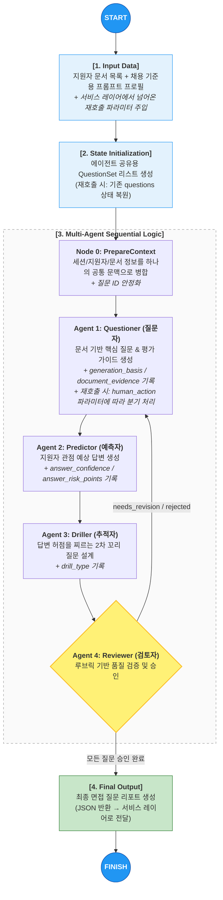
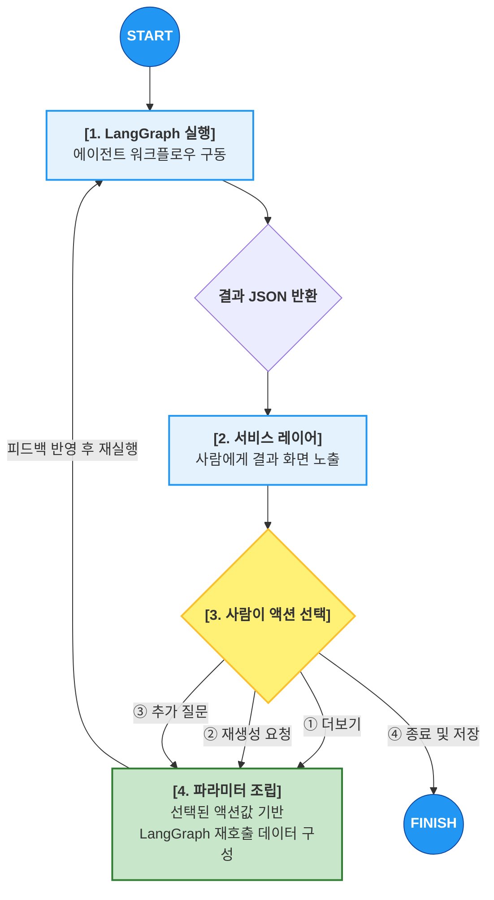

## **멀티 에이전트 및 노드 전략 (Multi-Agent & Node Strategy)**
**작성일**: 2026-04-30 (초기버전)

---

초기 구현 상태는 여러 에이전트가 순차적으로 협업하는 구조이며, 각 노드는 State에 저장된 질문 상태(status)와 질문 메타데이터를 공유하면서 자신의 역할만 수행합니다.

즉, 하나의 거대한 에이전트가 모든 일을 처리하는 방식이 아니라,

**질문 생성 → 답변 예측 → 꼬리질문 생성 → 품질 검토**

를 역할별로 분리한 멀티 에이전트 전략입니다.

### **에이전트/노드 구성**

| **에이전트 / 노드** | **역할** | **주요 미션** |
| --- | --- | --- |
| **PrepareContext (문맥 준비 노드)** | 입력 문맥 정리 | 세션 정보, 지원자 정보, 문서 텍스트를 하나의 공통 문맥(candidate_context)으로 병합하고, 기존 질문 ID를 안정화 |
| **Questioner (질문자)** | 기초 질문 설계 | 지원자 문서와 채용 기준을 바탕으로 핵심 질문과 평가 가이드 초안 생성. **질문 생성 근거(generation_basis)와 문서 근거(document_evidence)를 함께 기록** |
| **Predictor (예측자)** | 답변 시뮬레이션 | 지원자의 입장에서 가장 현실적인 **예상 답변(predicted_answer)** 을 생성하고, **답변 신뢰도(answer_confidence)** 와 **위험 포인트(answer_risk_points)** 를 함께 남김 |
| **Driller (추적자)** | 꼬리 질문 생성 | 예상 답변의 빈틈, 검증 포인트, 오너십, 수치, 의사결정 지점을 파고드는 심층 2차 질문(Follow-up) 설계. **꼬리질문 목적(drill_type)도 함께 기록** |
| **Reviewer (검토자)** | 품질 보증 (QA) | 채용 기준과 질문 품질 루브릭에 따라 각 질문을 검토하고 approved / needs_revision / rejected 상태를 부여. **이슈 유형(issue_types)과 수정 대상 필드(requested_revision_fields)도 함께 기록** |
| **Review Router (분기 노드)** | 재시도 여부 판단 | Reviewer 결과를 보고 questioner로 되돌릴지, 최종 응답으로 종료할지 결정 |

### **전략적 특징**

- PrepareContext는 질문을 만들지 않고, 뒤 노드들이 공통으로 참고할 입력 문맥을 정리하는 전처리 노드입니다.
- Questioner는 질문 생성만 담당하고, 답변 예측이나 품질 판정은 직접 하지 않습니다.
- Predictor는 질문 자체의 자연스러움보다, “이 지원자가 실제로 뭐라고 답할지”를 시뮬레이션하는 역할에 집중합니다.
- Driller는 본 질문과 예상 답변을 함께 보고, 어디를 더 깊게 검증해야 할지 결정합니다.
- Reviewer는 단순 승인기가 아니라, **루브릭 기반 평가 + 수정 방향 제시 + 재시도 분기 근거 제공** 역할까지 맡습니다.
- Review Router는 Reviewer 결과를 바탕으로 재루프 여부를 판단하는 제어 노드입니다.

> ***사람의 개입(더보기, 재생성, 추가 질문 등)은 LangGraph 내부가 아니라 서비스 레이어에서 처리합니다.**
LangGraph는 순수하게 AI 파이프라인만 담당하고, 사람과의 인터랙션은 프론트/백엔드가 결과를 받아 재호출하는 방식으로 구현합니다.
현재 JH 그래프는 서비스 레이어에서 human_action, target_question_ids, additional_instruction, existing_questions를 조립해 재호출하는 구조입니다.*
> 

## **랭그래프 노드 구성 및 상태 관리 (Node Workflow)**

---



## **서비스 레이어 설계 (Human Interaction)**

---

LangGraph는 실행이 끝나면 결과 JSON을 반환하고 종료합니다. 이후 사람의 액션(더보기, 재생성, 추가 질문 등)은 **서비스 레이어(프론트+백엔드)** 가 결과를 받아 적절한 파라미터를 조립한 뒤 LangGraph를 재호출하는 방식으로 처리합니다.



**케이스별 재호출 파라미터 조립 방식**

| 액션 | 서비스 레이어가 하는 일 | LangGraph에 넘기는 파라미터 |
| --- | --- | --- |
| **① 추천 질문 더보기** | 기존 결과 JSON을 유지하고 추가 생성만 요청 | `human_action: "more"` 또는 `"more_questions"`, 기존 `questions` 배열 그대로 주입 |
| **② 전체 재생성** | 모든 질문 초기화 후 처음부터 재실행 | `existing_questions` 비움, `human_action` 제거 후 재호출 |
| **② 개별 재생성** | 사용자가 선택한 질문만 재작성 대상으로 지정. 필요 시 특정 필드만 재생성 | `target_question_ids`, `human_action: "regenerate"` 또는 `"regenerate_question"`, 기존 `questions` 주입 |
| **③ 추가 질문 생성** | 사용자가 입력한 지시사항을 기반으로 신규 질문 추가 생성 | `human_action: "add_question"` 또는 유사 액션, `additional_instruction` 세팅, 기존 `questions` 유지 |

> **핵심 원칙**: LangGraph 자체를 바꾸는 것이 아니라, 서비스 레이어가 `human_action`과 보조 파라미터를 조립해서 재호출합니다. Questioner 에이전트는 이 값을 읽어 신규 생성 / 더보기 / 부분 재생성 / 추가 생성을 분기합니다.
> 

## **State 및 데이터 구조 정의**

---

### **1. 개별 면접 질문 세트 구조 (Unit: QuestionSet)**

지원자 1인에 대해 생성되는 개별 질문 단위의 데이터 모델입니다.

현재 JH 랭그래프에서는 QuestionSet 하나를 여러 에이전트가 순차적으로 업데이트하며 사용합니다.

질문 세트는 한 번에 모든 필드가 채워지는 것이 아니라,

- 공통 기본 정보
- Questioner 생성 정보
- Predictor 예측 정보
- Driller 꼬리질문 정보
- Reviewer 검토 정보

순서로 점진적으로 완성됩니다.

---

## **공통 기본 필드**

질문 세트의 뼈대가 되는 공통 필드입니다.

| **구분** | **필드명 (Field)** | **데이터 타입** | **상세 설명** | **담당** |
| --- | --- | --- | --- | --- |
| **질문 ID** | **id** | String | 질문 세트 고유 ID. 부분 재생성, 리뷰 결과 매핑, 상태 복원에 사용 | 시스템 |
| **질문 카테고리** | **category** | Enum/String | 질문 유형 분류 (TECH, EXPERIENCE, RISK 등 내부 코드값으로 정규화) | 질문 agent |
| **질문 본문** | **question_text** | String | 지원자 문서 내용을 기반으로 추출한 핵심 면접 질문 | 질문 agent |
| **처리 상태** | **status** | Enum | 현재 질문의 처리 상태 (pending, approved, needs_revision, rejected, human_rejected) | 검토 agent / 휴먼 |
| **생성 모드** | **generation_mode** | String | 이 질문이 어떤 흐름에서 만들어졌는지 (initial, more, add_question, rewrite, partial_rewrite) | 시스템 |

---

## **Questioner가 작성하는 필드**

Questioner는 질문 초안과 질문의 근거를 만드는 역할을 담당합니다.

| **구분** | **필드명 (Field)** | **데이터 타입** | **상세 설명** | **담당 에이전트** |
| --- | --- | --- | --- | --- |
| **생성 근거** | **generation_basis** | String | 이 질문을 생성한 구체적 근거. 문서 어느 문구/경험/수치를 보고 왜 이 질문을 만들었는지 기술 | 질문 agent |
| **문서 근거 목록** | **document_evidence** | List[String] | 질문 생성에 사용한 핵심 문서 근거 목록 | 질문 agent |
| **평가 가이드** | **evaluation_guide** | String | 답변의 정답 유무가 아니라, 평가 의도 및 고득점/감점 기준 | 질문 agent |
| **리스크 태그** | **risk_tags** | List[String] | 질문이 검증하려는 리스크 태그 | 질문 agent |
| **역량 태그** | **competency_tags** | List[String] | 질문이 검증하려는 역량 태그 | 질문 agent |

> ***generation_basis 작성 원칙**
• 지원자 문서의 구체적인 문구, 수치, 역할, 경력 단서를 기준으로 작성
• 왜 이 내용을 검증해야 하는지 평가 의도를 한 문장으로 명확히 기술
• question_text에는 장문 인용을 넣지 말고, 자세한 근거는 generation_basis와 document_evidence에 남김
예시: "이력서 경력 2항목에서 '5명 규모 프로젝트 리드' 언급 → 실제 리딩 범위와 의사결정 수준을 검증하기 위해 생성"*
> 

---

## **Predictor가 작성하는 필드**

Predictor는 질문에 대해 지원자가 실제로 어떤 답변을 할지 예측합니다.

| **구분** | **필드명 (Field)** | **데이터 타입** | **상세 설명** | **담당 에이전트** |
| --- | --- | --- | --- | --- |
| **예측답변** | **predicted_answer** | String | 해당 질문에 대해 지원자가 내놓을 것으로 예상되는 가상 답변 | 예측 agent |
| **예측답변 근거** | **predicted_answer_basis** | String | 왜 그 답변이 나올 가능성이 높은지에 대한 짧은 근거 | 예측 agent |
| **답변 신뢰도** | **answer_confidence** | Enum/String | 예상 답변의 신뢰도 (low, medium, high) | 예측 agent |
| **답변 위험 포인트** | **answer_risk_points** | List[String] | 예상 답변에서 불확실하거나 과장 가능성이 있는 지점 | 예측 agent |

---

## **Driller가 작성하는 필드**

Driller는 예상 답변을 읽고 더 깊게 검증할 꼬리질문을 생성합니다.

| **구분** | **필드명 (Field)** | **데이터 타입** | **상세 설명** | **담당 에이전트** |
| --- | --- | --- | --- | --- |
| **꼬리질문** | **follow_up_question** | String | 예상 답변의 허점을 찌르거나 깊이를 파고드는 2차 꼬리 질문 | 꼬리질문 agent |
| **꼬리질문 근거** | **follow_up_basis** | String | 왜 이 꼬리질문이 필요한지 설명하는 근거 | 꼬리질문 agent |
| **꼬리질문 유형** | **drill_type** | Enum/String | 꼬리질문의 검증 목적 (EVIDENCE_CHECK, METRIC_CHECK 등 내부 코드값으로 정규화) | 꼬리질문 agent |

---

## **Reviewer가 작성하는 필드**

Reviewer는 질문 세트를 루브릭 기반으로 검토하고, 수정 또는 승인 여부를 결정합니다.

| **구분** | **필드명 (Field)** | **데이터 타입** | **상세 설명** | **담당 에이전트** |
| --- | --- | --- | --- | --- |
| **리뷰 상태** | **review_status** | Enum/String | Reviewer가 내린 판정 상태 (approved, needs_revision, rejected) | 검토 agent |
| **리뷰 요약** | **review_reason** | String | Reviewer가 남긴 검토 요약 | 검토 agent |
| **피드백** | **reject_reason** | String | rejected 또는 human_rejected 상태일 때의 구체적인 반려 사유 | 검토 agent / 휴먼 |
| **수정 제안** | **recommended_revision** | String | 수정 방향 제안 | 검토 agent |
| **이슈 유형** | **review_issue_types** | List[String] | 품질 문제 유형 (weak_evidence, too_generic 등) | 검토 agent |
| **재생성 대상** | **requested_revision_fields** | List[String] | Reviewer가 판단한 수정 필요 필드 목록 | 검토 agent |
| **질문 품질 점수** | **question_quality_scores** | Dict[String, Int] | 질문 품질 루브릭 항목별 점수 | 검토 agent |
| **평가가이드 점수** | **evaluation_guide_scores** | Dict[String, Int] | 평가가이드 품질 루브릭 항목별 점수 | 검토 agent |
| **질문 품질 평균** | **question_quality_average** | Float | 질문 품질 루브릭 평균 점수 | 검토 agent |
| **평가가이드 평균** | **evaluation_guide_average** | Float | 평가가이드 품질 루브릭 평균 점수 | 검토 agent |
| **최종 점수** | **score** | Float | Reviewer가 계산한 전체 점수 | 검토 agent |
| **점수 사유** | **score_reason** | String | 최종 점수의 근거 요약 | 검토 agent |

---

## **휴먼 / 서비스 레이어가 개입하는 필드**

이 필드들은 AI가 스스로 만드는 값이 아니라, 재호출 시 서비스 레이어나 사람이 지정하는 값입니다.

| **구분** | **필드명 (Field)** | **데이터 타입** | **상세 설명** | **담당** |
| --- | --- | --- | --- | --- |
| **휴먼 재생성 대상** | **regen_targets** | List[String] | 휴먼 또는 서비스 레이어가 개별 재생성 시 지정한 필드명 목록 | 휴먼 / 서비스 레이어 |

---

## **2. 통합 에이전트 공유 상태 (Object: AgentState)**

워크플로우 전체 과정에서 유지되는 거대 데이터 객체로, 입력 정보와 생성된 결과물을 통합 관리합니다.

---

## **입력 데이터 영역 (Input Context)**

그래프 실행 시 최초로 주입되는 입력값입니다.

| **구분** | **필드명 (Field)** | **데이터 타입** | **상세 설명** |
| --- | --- | --- | --- |
| **세션 ID** | **session_id** | Int | 면접 세션 식별자 |
| **지원자 ID** | **candidate_id** | Int | 지원자 식별자 |
| **지원자 이름** | **candidate_name** | String | 지원자 이름 |
| **지원 직무** | **target_job** | String | 지원 직무 |
| **난이도** | **difficulty_level** | String / None | 신입/경력/시니어 수준 판단에 사용하는 값 |
| **프롬프트 프로필** | **prompt_profile** | Dict / None | 채용 기준 및 평가 기준이 담긴 프롬프트 프로필 |
| **문서 목록** | **documents** | List[DocumentRef] | 이력서, 자기소개서, 포트폴리오 등 입력 문서 목록 |

---

## **파생 입력 영역 (Prepared Context)**

입력 데이터를 바탕으로 그래프 내부에서 만들어지는 공통 문맥 정보입니다.

| **구분** | **필드명 (Field)** | **데이터 타입** | **상세 설명** |
| --- | --- | --- | --- |
| **공통 문맥** | **candidate_context** | String | prepare_context가 세션 정보 + 지원자 정보 + 문서 내용을 병합해 만든 공통 입력 문맥 |

---

## **핵심 프로세스 데이터 영역 (Core Process)**

에이전트들이 순차적으로 갱신하는 핵심 데이터입니다.

| **구분** | **필드명 (Field)** | **데이터 타입** | **상세 설명** |
| --- | --- | --- | --- |
| **질문 세트 리스트** | **questions** | List[QuestionSet] | 모든 질문 세트가 저장되는 메인 리스트. 각 에이전트가 이 배열을 읽고 갱신함 |

---

## **시스템 제어 영역 (Flow Control)**

그래프의 루프, 종료 조건, 재시도 흐름을 제어하는 필드입니다.

| **구분** | **필드명 (Field)** | **데이터 타입** | **상세 설명** |
| --- | --- | --- | --- |
| **재시도 횟수** | **retry_count** | Int | Reviewer 판정으로 재수정 루프에 들어간 횟수 |
| **최대 재시도 횟수** | **max_retry_count** | Int | 무한 루프 방지를 위한 최대 재시도 횟수 |
| **최종 승인 여부** | **is_all_approved** | Bool | 모든 질문이 승인되었는지 여부 |
| **현재 생성 모드** | **generation_mode** | String / None | 현재 실행이 initial, more, add_question, rewrite, partial_rewrite 중 어떤 흐름인지 기록 |

---

## **서비스 레이어 재호출 파라미터 영역 (Re-invocation Params)**

사람의 액션을 받아 서비스 레이어가 LangGraph 재호출 시 주입하는 값입니다.

| **구분** | **필드명 (Field)** | **데이터 타입** | **상세 설명** |
| --- | --- | --- | --- |
| **재호출 액션 유형** | **human_action** | Enum/String/None | 사람이 선택한 액션 유형 (more, regenerate, add_question 등) |
| **추가 질문 지시사항** | **additional_instruction** | String / None | 사람이 입력한 추가 질문 생성 요청 문장 |
| **재생성 대상 질문 ID 목록** | **target_question_ids** | List[String] | 개별 재생성 시 대상 질문 ID 목록 |

---

## **관측성 영역 (Observability)**

실험, 디버깅, 성능 분석을 위해 기록되는 보조 데이터입니다.

| **구분** | **필드명 (Field)** | **데이터 타입** | **상세 설명** |
| --- | --- | --- | --- |
| **LLM 사용량 기록** | **llm_usages** | List[LlmUsageState] | 노드별 모델명, 입력/출력 토큰, 비용, 소요시간 기록 |
| **노드 경고 기록** | **node_warnings** | List[Dict] | 매칭 실패, 파싱 실패, fallback 사용 등 경고 정보 |

### **코드 예시**

```python
from typing import TypedDict, List, Optional, Literal

# 1. 개별 질문 세트의 구조 (단순 예시)
class QuestionSet(TypedDict):
    id: str
    category: str
    generation_basis: str
    document_evidence: List[str]
    question_text: str
    evaluation_guide: str
    predicted_answer: str
    predicted_answer_basis: str
    answer_confidence: str
    answer_risk_points: List[str]
    follow_up_question: str
    follow_up_basis: str
    drill_type: str
    status: str  # pending / approved / needs_revision / rejected / human_rejected
    reject_reason: str
    recommended_revision: str
    requested_revision_fields: List[str]
    regen_targets: List[str]

# 2. 전체 에이전트가 공유하는 State (단순 예시)
class AgentState(TypedDict):
    session_id: int
    candidate_id: int
    candidate_name: str
    target_job: str
    difficulty_level: Optional[str]
    documents: List[dict]
    prompt_profile: Optional[dict]
    candidate_context: str
    questions: List[QuestionSet]
    retry_count: int
    max_retry_count: int
    is_all_approved: bool
    human_action: Optional[
        Literal[
            "more",
            "more_questions",
            "regenerate",
            "regenerate_question",
            "add_question",
            "generate_follow_up",
            "risk_questions",
            "different_perspective",
        ]
    ]
    additional_instruction: Optional[str]
    target_question_ids: List[str]

# 3. 서비스 레이어 재호출 예시 (pseudo-code)
def reinvoke_langgraph(prev_result: AgentState, user_action: dict) -> AgentState:
    new_state = prev_result.copy()

    if user_action["type"] == "more":
        new_state["human_action"] = "more"

    elif user_action["type"] == "regenerate_all":
        new_state["questions"] = []
        new_state["human_action"] = None
        new_state["target_question_ids"] = []

    elif user_action["type"] == "regenerate_partial":
        for q in new_state["questions"]:
            if q["id"] in user_action["question_ids"]:
                q["status"] = "human_rejected"
                q["regen_targets"] = user_action.get("regen_targets", [])
        new_state["human_action"] = "regenerate"
        new_state["target_question_ids"] = user_action["question_ids"]

    elif user_action["type"] == "add_question":
        new_state["human_action"] = "add_question"
        new_state["additional_instruction"] = user_action["instruction"]

    return langgraph_run(new_state)
```

---

### **생성 근거(generation_basis) 작성 예시**

> 실제 Questioner 에이전트가 출력하는 `generation_basis` 예시
> 

| 문서 단서 | generation_basis 예시 |
| --- | --- |
| 이력서: "팀장으로 5명 리드, 6개월 내 프로젝트 완료" | `"이력서 경력 항목에서 '5명 규모 프로젝트 리드'가 언급되어 있어, 실제 리딩 범위와 갈등 조정 방식, 일정 관리 기여도를 검증하기 위해 생성"` |
| 자기소개서: "실패를 통해 성장했습니다" | `"자기소개서에서 실패 경험을 추상적으로 언급하고 있어, 구체적인 실패 사례와 재발 방지 행동을 확인할 필요가 있어 생성"` |
| 포트폴리오: "매출 30% 개선 기여" | `"포트폴리오 성과 요약에 매출 30% 개선 수치가 있어, 본인 기여 범위와 측정 방식, 외부 변수 통제 여부를 검증하기 위해 생성"` |
| 이력서: 잦은 이직 (평균 재직 1.2년) | `"경력 이력상 평균 재직 기간이 짧아 보이므로, 이직 사유의 일관성과 장기 재직 의향을 확인하기 위해 생성"` |