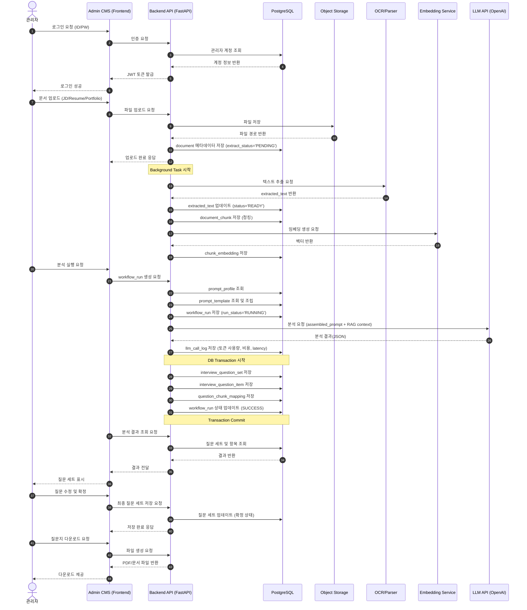

# 🔁 HR Copilot BS — 시스템 시퀀스 다이어그램

> **목적:** 관리자 인증부터 문서 분석 및 면접 질문 확정까지의 시스템 간 상호작용을 시간 순서대로 표현

---

## 1. 📊 시퀀스 다이어그램 (Sequence Diagram)

---

## 2. 📌 다이어그램 참여자(Participants) 설명

| 참여자 | 설명 |
|--------|------|
| **관리자 (Admin)** | 시스템을 사용하는 HR 담당자 |
| **Admin CMS** | 관리자용 프론트엔드 인터페이스 |
| **Backend API** | FastAPI 기반 비즈니스 로직 처리 |
| **PostgreSQL** | 서비스 데이터 저장소 |
| **Object Storage** | 업로드된 문서 파일 저장 |
| **OCR/Parser** | 문서에서 텍스트를 추출하는 서비스 |
| **Embedding Service** | 텍스트를 벡터로 변환 |
| **LLM API** | 면접 질문 생성을 위한 AI 모델 |

---

## 3. 📌 주요 특징

### ✅ 3.1 End-to-End 프로세스 반영
- 인증 → 문서 업로드 → 전처리 → LLM 분석 → 결과 저장 → 사용자 확정까지 전체 흐름을 포함합니다.

### ✅ 3.2 비동기 처리 표현
- `Note over API: Background Task 시작`을 통해 OCR 및 임베딩이 비동기적으로 수행됨을 명확히 표현했습니다.

### ✅ 3.3 데이터 무결성 보장
- 결과 저장 시 `Transaction Commit`을 명시하여 데이터 정합성을 확보했습니다.

### ✅ 3.4 운영 관점의 로그 관리
- `llm_call_log`에 토큰 사용량, 비용, 지연 시간 등을 기록하여 FR-07 요구사항을 충족합니다.

### ✅ 3.5 사용자 개입 단계
- AI가 생성한 질문을 관리자가 **검토·수정·확정**하는 단계가 포함되어 실무 활용성을 높였습니다.

---

## 4. 📌 확장 가능성

향후 다음과 같은 요소를 추가하여 확장할 수 있습니다.

| 확장 항목 | 설명 |
|-----------|------|
| Message Queue | 대규모 트래픽 대응을 위한 비동기 처리 고도화 |
| Multi-Tenant | 기업별 데이터 분리 |
| Analytics Dashboard | 채용 데이터 분석 및 시각화 |
| Candidate Feedback | 면접 평가 및 피드백 저장 |

---

## ✅ 한줄 정의
> **"HR Copilot BS의 시퀀스 다이어그램은 관리자 인증부터 AI 기반 면접 질문 생성 및 확정까지의 시스템 간 상호작용을 시간 흐름에 따라 표현한 것이다."**
