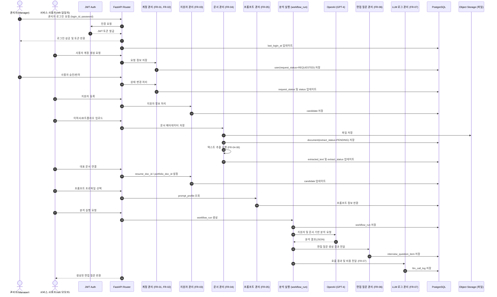

# HR Copilot BS 시스템 시퀀스 다이어그램

## 1. 개요
본 시퀀스 다이어그램은 **HR Copilot BS**의 기능 요구사항 정의서(FR) 및 API 명세서를 바탕으로 관리자 승인, 지원자 관리, 문서 처리, 그리고 LLM 분석으로 이어지는 전체 시스템 흐름을 정의합니다.

## 2. 시스템 시퀀스 다이어그램 (Mermaid)

## 3. 실무 설계 핵심 (Review)

- **데이터 무결성:** 모든 주요 변경 사항은 PostgreSQL DB에 즉시 반영되며, 파일 본체는 Object Storage에 저장하여 효율성을 높였습니다.
- **상태 기반 워크플로우:** `request_status`, `extract_status` 등 단계별 상태값을 통해 비동기 작업(텍스트 추출 등)의 진행 상황을 명확히 추적합니다.
- **Audit 관리:** 모든 DB 저장 시 `FR-08`에 정의된 공통 Audit 컬럼(`created_at`, `created_by` 등)이 자동으로 적용됩니다.

## 4. 트러블슈팅 포인트
- **텍스트 추출 지연:** `extract_status`가 `PENDING`에서 멈출 경우, 문서 처리 모듈의 로그를 확인하여 OCR 엔진의 정상 작동 여부를 점검해야 합니다.
- **로그 유실 방지:** `llm_call_log`는 LLM 응답 직후 저장되어야 하며, 비용 계산(`cost_amount`) 로직이 요구사항(FR-07-05)대로 수행되는지 모니터링이 필요합니다.