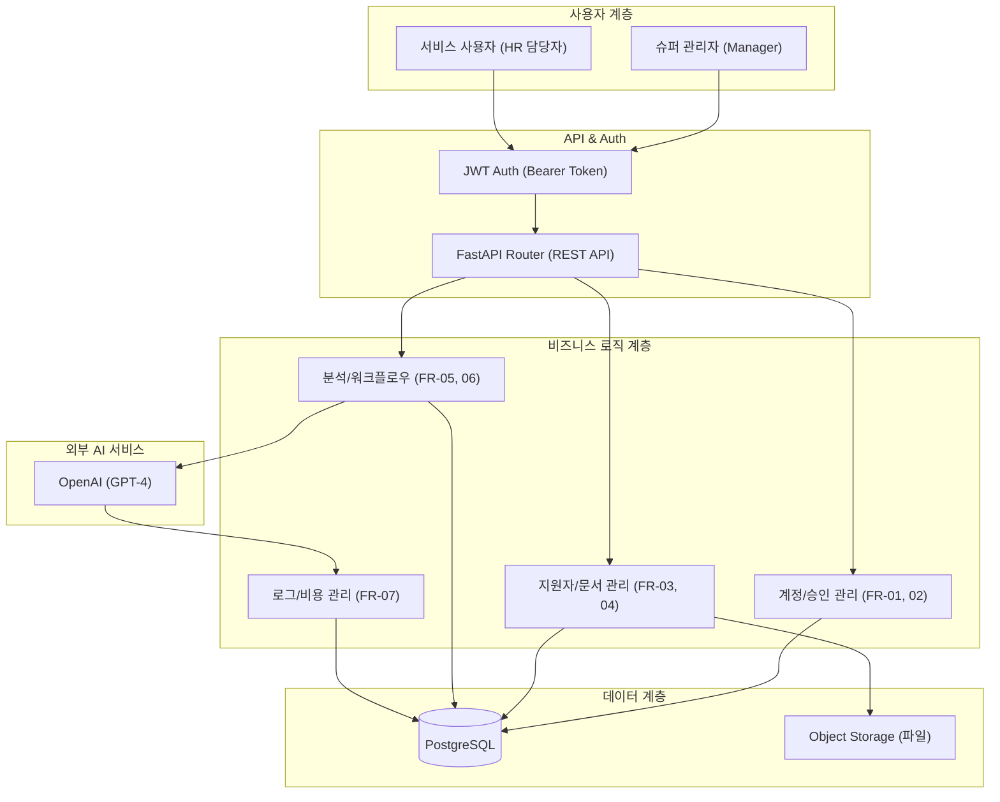

# HR Copilot BS 시스템 아키텍처

## 1. 🏗️ 시스템 아키텍처 개요
**HR Copilot BS**는 채용 공고와 지원자 서류(이력서, 포트폴리오)를 AI가 분석하여 면접 질문을 자동 생성하는 RAG 기반 시스템입니다. 특히 **Blind Screening(BS)** 환경을 고려한 데이터 관리와 LLM 운영 비용 추적에 최적화되어 있습니다.

## 2. 🔄 시스템 구조 (Mermaid Diagram)

## 3. 🛠️ 핵심 모듈 설계 (파일 명세 기반)

### 3.1 🔐 인증 및 계정 관리 (FR-01, FR-02)
- **권한 체계:** 관리자(`manager`)와 일반 사용자(`user`)를 구분하며, 사용자는 승인 절차(`request_status`)를 거쳐야 활성화됩니다.
- **상태값:** `ACTIVE`, `INACTIVE`, `LOCK`(잠금) 등 구체적인 상태 코드를 통해 계정 보안을 관리합니다.

### 3.2 📄 문서 처리 및 분석 (FR-04, FR-05)
- **문서 파이프라인:** 업로드(`document`) → 텍스트 추출 → 분석 전략(`prompt_profile`) 적용 순으로 진행됩니다.
- **추출 상태:** `extract_status`를 통해 추출 대기부터 완료까지의 라이프사이클을 추적합니다.

### 3.3 🤖 LLM 분석 및 로그 (FR-07)
- **비용 최적화:** 단순 호출에 그치지 않고 `total_tokens`와 `cost_amount`를 계산하여 저장함으로써 운영 효율성을 극대화합니다.
- **추적성:** 모든 호출 결과는 `response_json` 형태로 원본 저장되어 트러블슈팅에 활용됩니다.

## 4. 📝 설계 핵심 포인트 & 코드리뷰

### 1) 데이터 표준화 (FR-08 적용)
모든 테이블은 실무 표준인 **Snake Case**를 적용하고, 공통 Audit 컬럼을 포함합니다.
- **제안 이름:** `created_at`, `updated_at`, `deleted_at`
- **삭제 정책:** 물리 삭제가 아닌 `deleted_at`에 값을 넣는 **논리 삭제(Soft Delete)** 방식을 채택하여 데이터 복구 가능성을 확보했습니다.

### 2)  RAG 흐름
> "이 시스템은 도서관(데이터베이스)에서 필요한 책(이력서)을 찾아서, 똑똑한 비서(LLM)에게 '이 사람의 장점을 요약해줘'라고 시키고, 비서가 일한 만큼의 월급(토큰 비용)을 가계부(로그)에 적는 것과 같습니다."

---
