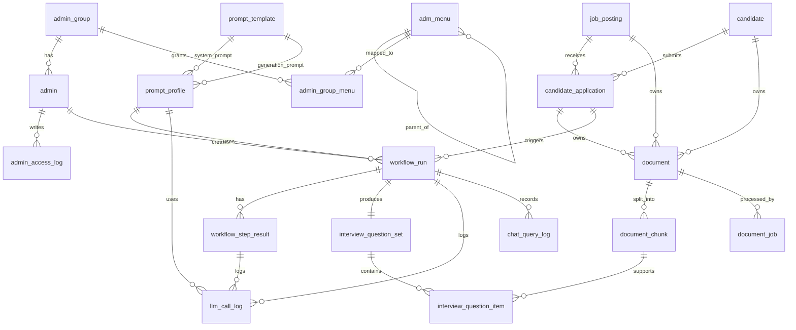
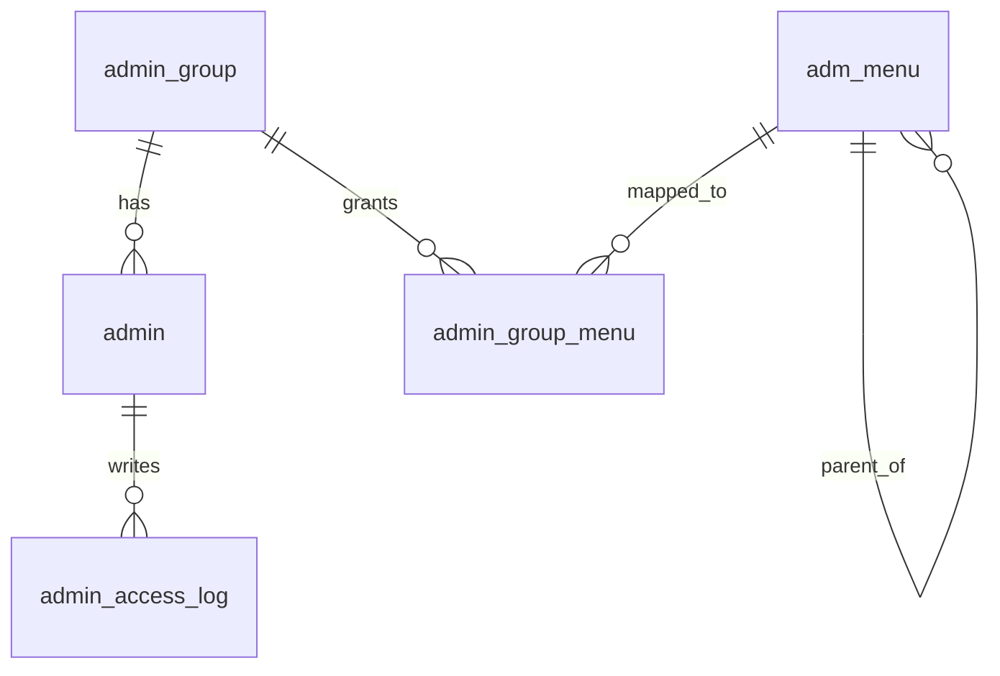
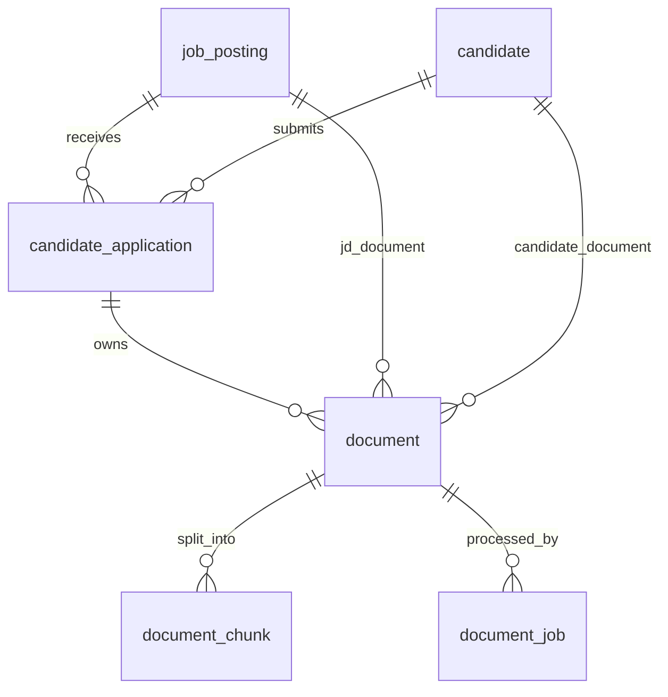
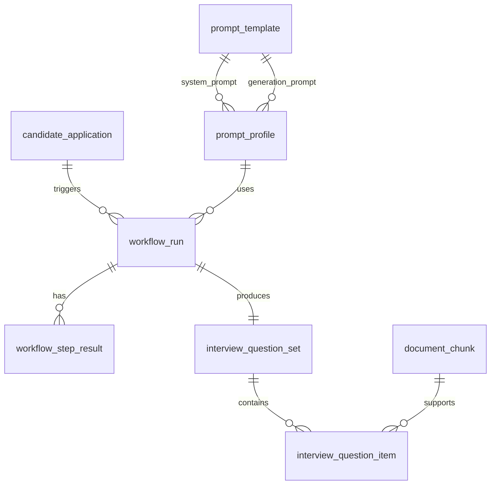
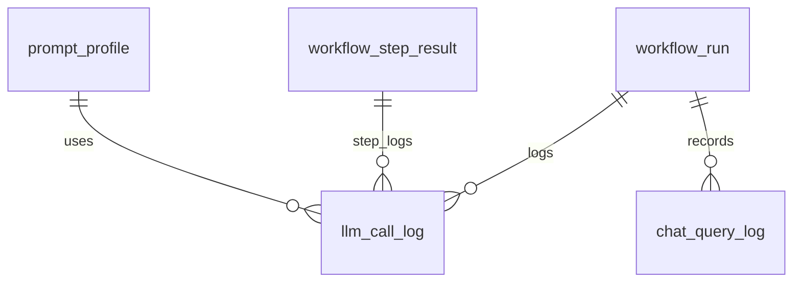

# HR Copilot MVP - PostgreSQL DDL + ERD 관계도

> 기준  
> - PostgreSQL 15+
> - `pgvector` 확장 사용
> - MVP 기준: 멀티테넌트(site_key) 제외
> - 관리자 CMS + HR + 문서관리 + 프롬프트/워크플로우 + AI 로그/통계 포함
> - 공통 audit 컬럼 포함

---

## 1. 확장 설치

```sql
CREATE EXTENSION IF NOT EXISTS vector;
```

---

## 2. 테이블 생성 DDL

---

### 2.1 관리자 권한 그룹

```sql
CREATE TABLE admin_group (
    id              BIGSERIAL PRIMARY KEY,
    group_name      VARCHAR(100) NOT NULL,
    group_desc      VARCHAR(500),
    use_tf          CHAR(1) NOT NULL DEFAULT 'Y',
    del_tf          CHAR(1) NOT NULL DEFAULT 'N',
    reg_adm         VARCHAR(100),
    reg_date        TIMESTAMP NOT NULL DEFAULT NOW(),
    up_adm          VARCHAR(100),
    up_date         TIMESTAMP,
    del_adm         VARCHAR(100),
    del_date        TIMESTAMP
);

CREATE UNIQUE INDEX uq_admin_group_name
    ON admin_group (group_name)
    WHERE del_tf = 'N';
```

---

### 2.2 관리자 계정

```sql
CREATE TABLE admin (
    id              BIGSERIAL PRIMARY KEY,
    group_id        BIGINT NOT NULL,
    login_id        VARCHAR(100) NOT NULL,
    password_hash   VARCHAR(255) NOT NULL,
    name            VARCHAR(100) NOT NULL,
    email           VARCHAR(255),
    status          VARCHAR(30) NOT NULL DEFAULT 'ACTIVE', -- ACTIVE, LOCKED, INACTIVE
    last_login_at   TIMESTAMP,
    use_tf          CHAR(1) NOT NULL DEFAULT 'Y',
    del_tf          CHAR(1) NOT NULL DEFAULT 'N',
    reg_adm         VARCHAR(100),
    reg_date        TIMESTAMP NOT NULL DEFAULT NOW(),
    up_adm          VARCHAR(100),
    up_date         TIMESTAMP,
    del_adm         VARCHAR(100),
    del_date        TIMESTAMP,
    CONSTRAINT fk_admin_group
        FOREIGN KEY (group_id) REFERENCES admin_group(id)
);

CREATE UNIQUE INDEX uq_admin_login_id
    ON admin (login_id)
    WHERE del_tf = 'N';
```

---

### 2.2.1 관리자 계정 refresh Token

```sql
CREATE TABLE admin_refresh_token (
    id              BIGSERIAL PRIMARY KEY,
    admin_id        BIGINT NOT NULL,
    token_hash      VARCHAR(255) NOT NULL,
    expires_at      TIMESTAMP NOT NULL,
    revoked_tf      CHAR(1) NOT NULL DEFAULT 'N',
    user_agent      VARCHAR(1000),
    ip_address      VARCHAR(100),
    reg_adm         VARCHAR(100),
    reg_date        TIMESTAMP NOT NULL DEFAULT NOW(),
    up_adm          VARCHAR(100),
    up_date         TIMESTAMP,
    del_adm         VARCHAR(100),
    del_date        TIMESTAMP,
    CONSTRAINT fk_admin_refresh_token_admin
        FOREIGN KEY (admin_id) REFERENCES admin(id)
);

CREATE INDEX idx_admin_refresh_token_admin_id
    ON admin_refresh_token(admin_id);

CREATE INDEX idx_admin_refresh_token_expires_at
    ON admin_refresh_token(expires_at);

```

---

### 2.3 관리자 메뉴

```sql
CREATE TABLE adm_menu (
    id              BIGSERIAL PRIMARY KEY,
    parent_id       BIGINT,
    menu_name       VARCHAR(100) NOT NULL,
    menu_key        VARCHAR(100) NOT NULL,
    menu_path       VARCHAR(255),
    depth           INT NOT NULL DEFAULT 1,
    sort_no         INT NOT NULL DEFAULT 0,
    icon            VARCHAR(100),
    use_tf          CHAR(1) NOT NULL DEFAULT 'Y',
    del_tf          CHAR(1) NOT NULL DEFAULT 'N',
    reg_adm         VARCHAR(100),
    reg_date        TIMESTAMP NOT NULL DEFAULT NOW(),
    up_adm          VARCHAR(100),
    up_date         TIMESTAMP,
    del_adm         VARCHAR(100),
    del_date        TIMESTAMP,
    CONSTRAINT fk_adm_menu_parent
        FOREIGN KEY (parent_id) REFERENCES adm_menu(id)
);

CREATE UNIQUE INDEX uq_adm_menu_key
    ON adm_menu (menu_key)
    WHERE del_tf = 'N';
```

---

### 2.4 권한 그룹별 메뉴 권한

```sql
CREATE TABLE admin_group_menu (
    id              BIGSERIAL PRIMARY KEY,
    group_id        BIGINT NOT NULL,
    menu_id         BIGINT NOT NULL,
    read_tf         CHAR(1) NOT NULL DEFAULT 'Y',
    write_tf        CHAR(1) NOT NULL DEFAULT 'N',
    delete_tf       CHAR(1) NOT NULL DEFAULT 'N',
    use_tf          CHAR(1) NOT NULL DEFAULT 'Y',
    del_tf          CHAR(1) NOT NULL DEFAULT 'N',
    reg_adm         VARCHAR(100),
    reg_date        TIMESTAMP NOT NULL DEFAULT NOW(),
    up_adm          VARCHAR(100),
    up_date         TIMESTAMP,
    del_adm         VARCHAR(100),
    del_date        TIMESTAMP,
    CONSTRAINT fk_admin_group_menu_group
        FOREIGN KEY (group_id) REFERENCES admin_group(id),
    CONSTRAINT fk_admin_group_menu_menu
        FOREIGN KEY (menu_id) REFERENCES adm_menu(id)
);

CREATE UNIQUE INDEX uq_admin_group_menu
    ON admin_group_menu (group_id, menu_id)
    WHERE del_tf = 'N';
```

---

### 2.5 관리자 접근/작업 로그

```sql
CREATE TABLE admin_access_log (
    id              BIGSERIAL PRIMARY KEY,
    admin_id        BIGINT NOT NULL,
    action_type     VARCHAR(50) NOT NULL,   -- LOGIN, LOGOUT, CREATE, UPDATE, DELETE, EXPORT ...
    action_target   VARCHAR(100),           -- job_posting, candidate, document ...
    target_id       VARCHAR(100),
    ip_address      VARCHAR(100),
    user_agent      VARCHAR(1000),
    result_tf       CHAR(1) NOT NULL DEFAULT 'Y',
    message         TEXT,
    created_at      TIMESTAMP NOT NULL DEFAULT NOW(),
    CONSTRAINT fk_admin_access_log_admin
        FOREIGN KEY (admin_id) REFERENCES admin(id)
);

CREATE INDEX idx_admin_access_log_admin_id ON admin_access_log(admin_id);
CREATE INDEX idx_admin_access_log_created_at ON admin_access_log(created_at);
```

---

## 2.6 채용공고

```sql
CREATE TABLE job_posting (
    id                      BIGSERIAL PRIMARY KEY,
    title                   VARCHAR(255) NOT NULL,
    department              VARCHAR(100),
    position_name           VARCHAR(100),
    employment_type         VARCHAR(50),    -- FULL_TIME, CONTRACT ...
    experience_level        VARCHAR(50),    -- INTERN, JUNIOR, SENIOR ...
    jd_content              TEXT,
    required_skills_json    JSONB,
    preferred_skills_json   JSONB,
    status                  VARCHAR(30) NOT NULL DEFAULT 'DRAFT', -- DRAFT, OPEN, CLOSED
    open_date               DATE,
    close_date              DATE,
    use_tf                  CHAR(1) NOT NULL DEFAULT 'Y',
    del_tf                  CHAR(1) NOT NULL DEFAULT 'N',
    reg_adm                 VARCHAR(100),
    reg_date                TIMESTAMP NOT NULL DEFAULT NOW(),
    up_adm                  VARCHAR(100),
    up_date                 TIMESTAMP,
    del_adm                 VARCHAR(100),
    del_date                TIMESTAMP
);

CREATE INDEX idx_job_posting_status ON job_posting(status);
CREATE INDEX idx_job_posting_open_date ON job_posting(open_date);
```

---

### 2.7 지원자

```sql
CREATE TABLE candidate (
    id                      BIGSERIAL PRIMARY KEY,
    name                    VARCHAR(100) NOT NULL,
    email                   VARCHAR(255),
    phone                   VARCHAR(50),
    years_of_experience     NUMERIC(4,1),
    current_title           VARCHAR(100),
    summary                 TEXT,
    status                  VARCHAR(30) NOT NULL DEFAULT 'ACTIVE',
    use_tf                  CHAR(1) NOT NULL DEFAULT 'Y',
    del_tf                  CHAR(1) NOT NULL DEFAULT 'N',
    reg_adm                 VARCHAR(100),
    reg_date                TIMESTAMP NOT NULL DEFAULT NOW(),
    up_adm                  VARCHAR(100),
    up_date                 TIMESTAMP,
    del_adm                 VARCHAR(100),
    del_date                TIMESTAMP
);

CREATE INDEX idx_candidate_name ON candidate(name);
CREATE INDEX idx_candidate_email ON candidate(email);
```

---

### 2.8 지원서

```sql
CREATE TABLE candidate_application (
    id                      BIGSERIAL PRIMARY KEY,
    job_posting_id          BIGINT NOT NULL,
    candidate_id            BIGINT NOT NULL,
    application_status      VARCHAR(30) NOT NULL DEFAULT 'APPLIED', -- APPLIED, REVIEWING, INTERVIEWING, REJECTED, HIRED
    applied_at              TIMESTAMP NOT NULL DEFAULT NOW(),
    memo                    TEXT,
    use_tf                  CHAR(1) NOT NULL DEFAULT 'Y',
    del_tf                  CHAR(1) NOT NULL DEFAULT 'N',
    reg_adm                 VARCHAR(100),
    reg_date                TIMESTAMP NOT NULL DEFAULT NOW(),
    up_adm                  VARCHAR(100),
    up_date                 TIMESTAMP,
    del_adm                 VARCHAR(100),
    del_date                TIMESTAMP,
    CONSTRAINT fk_candidate_application_job
        FOREIGN KEY (job_posting_id) REFERENCES job_posting(id),
    CONSTRAINT fk_candidate_application_candidate
        FOREIGN KEY (candidate_id) REFERENCES candidate(id)
);

CREATE UNIQUE INDEX uq_candidate_application
    ON candidate_application(job_posting_id, candidate_id)
    WHERE del_tf = 'N';

CREATE INDEX idx_candidate_application_status ON candidate_application(application_status);
```

---

## 2.9 문서 메타

```sql
CREATE TABLE document (
    id                  BIGSERIAL PRIMARY KEY,
    application_id      BIGINT,
    job_posting_id      BIGINT,
    candidate_id        BIGINT,
    document_type       VARCHAR(50) NOT NULL,  -- JD, RESUME, PORTFOLIO, COVER_LETTER
    owner_type          VARCHAR(50) NOT NULL,  -- JOB_POSTING, CANDIDATE, APPLICATION
    title               VARCHAR(255) NOT NULL,
    original_file_name  VARCHAR(255) NOT NULL,
    stored_file_name    VARCHAR(255) NOT NULL,
    file_path           VARCHAR(1000) NOT NULL,
    file_ext            VARCHAR(30),
    mime_type           VARCHAR(100),
    file_size           BIGINT,
    parser_type         VARCHAR(50) DEFAULT 'auto',
    doc_status          VARCHAR(30) NOT NULL DEFAULT 'UPLOADED', -- UPLOADED, PARSING, CHUNKED, EMBEDDED, READY, FAIL
    summary_text        TEXT,
    use_tf              CHAR(1) NOT NULL DEFAULT 'Y',
    del_tf              CHAR(1) NOT NULL DEFAULT 'N',
    reg_adm             VARCHAR(100),
    reg_date            TIMESTAMP NOT NULL DEFAULT NOW(),
    up_adm              VARCHAR(100),
    up_date             TIMESTAMP,
    del_adm             VARCHAR(100),
    del_date            TIMESTAMP,
    CONSTRAINT fk_document_application
        FOREIGN KEY (application_id) REFERENCES candidate_application(id),
    CONSTRAINT fk_document_job_posting
        FOREIGN KEY (job_posting_id) REFERENCES job_posting(id),
    CONSTRAINT fk_document_candidate
        FOREIGN KEY (candidate_id) REFERENCES candidate(id)
);

CREATE INDEX idx_document_application_id ON document(application_id);
CREATE INDEX idx_document_job_posting_id ON document(job_posting_id);
CREATE INDEX idx_document_candidate_id ON document(candidate_id);
CREATE INDEX idx_document_document_type ON document(document_type);
CREATE INDEX idx_document_doc_status ON document(doc_status);
```

---

### 2.10 문서 청크 + 임베딩

```sql
CREATE TABLE document_chunk (
    id                  BIGSERIAL PRIMARY KEY,
    document_id         BIGINT NOT NULL,
    chunk_index         INT NOT NULL,
    content             TEXT NOT NULL,
    content_preview     VARCHAR(500),
    token_count         INT,
    embedding           VECTOR(1536),
    metadata_json       JSONB,
    created_at          TIMESTAMP NOT NULL DEFAULT NOW(),
    CONSTRAINT fk_document_chunk_document
        FOREIGN KEY (document_id) REFERENCES document(id)
);

CREATE UNIQUE INDEX uq_document_chunk_doc_idx
    ON document_chunk(document_id, chunk_index);

CREATE INDEX idx_document_chunk_document_id
    ON document_chunk(document_id);

-- pgvector 유사도 검색용 인덱스 (cosine)
CREATE INDEX idx_document_chunk_embedding_cosine
    ON document_chunk
    USING ivfflat (embedding vector_cosine_ops)
    WITH (lists = 100);
```

> 참고  
> `ivfflat` 인덱스는 데이터가 어느 정도 쌓인 뒤 효과가 좋습니다.  
> 초기 개발 단계에서는 인덱스 없이 시작해도 됩니다.

---

### 2.11 문서 처리 작업 이력

```sql
CREATE TABLE document_job (
    id                  BIGSERIAL PRIMARY KEY,
    document_id         BIGINT NOT NULL,
    job_type            VARCHAR(30) NOT NULL, -- PARSE, CHUNK, EMBED, INDEX, SUMMARY
    job_status          VARCHAR(30) NOT NULL DEFAULT 'PENDING', -- PENDING, RUNNING, SUCCESS, FAIL
    started_at          TIMESTAMP,
    ended_at            TIMESTAMP,
    error_message       TEXT,
    retry_count         INT NOT NULL DEFAULT 0,
    created_at          TIMESTAMP NOT NULL DEFAULT NOW(),
    CONSTRAINT fk_document_job_document
        FOREIGN KEY (document_id) REFERENCES document(id)
);

CREATE INDEX idx_document_job_document_id ON document_job(document_id);
CREATE INDEX idx_document_job_status ON document_job(job_status);
```

---

## 2.12 프롬프트 템플릿

```sql
CREATE TABLE prompt_template (
    id                  BIGSERIAL PRIMARY KEY,
    prompt_type         VARCHAR(50) NOT NULL, -- SYSTEM, USER, ANALYSIS, QUESTION_GENERATION
    name                VARCHAR(150) NOT NULL,
    version             INT NOT NULL DEFAULT 1,
    template_text       TEXT NOT NULL,
    output_schema_json  JSONB,
    status              VARCHAR(30) NOT NULL DEFAULT 'ACTIVE',
    use_tf              CHAR(1) NOT NULL DEFAULT 'Y',
    del_tf              CHAR(1) NOT NULL DEFAULT 'N',
    reg_adm             VARCHAR(100),
    reg_date            TIMESTAMP NOT NULL DEFAULT NOW(),
    up_adm              VARCHAR(100),
    up_date             TIMESTAMP,
    del_adm             VARCHAR(100),
    del_date            TIMESTAMP
);

CREATE INDEX idx_prompt_template_prompt_type ON prompt_template(prompt_type);
CREATE INDEX idx_prompt_template_status ON prompt_template(status);
```

---

### 2.13 프롬프트 프로필

```sql
CREATE TABLE prompt_profile (
    id                      BIGSERIAL PRIMARY KEY,
    name                    VARCHAR(150) NOT NULL,
    description             VARCHAR(1000),
    question_count          INT NOT NULL DEFAULT 5,
    difficulty_level        VARCHAR(30) NOT NULL DEFAULT 'MEDIUM', -- EASY, MEDIUM, HARD
    question_style          VARCHAR(50) NOT NULL DEFAULT 'BALANCED', -- TECHNICAL, PERSONALITY, BALANCED, DEEP_DIVE
    include_reason_tf       CHAR(1) NOT NULL DEFAULT 'Y',
    include_followup_tf     CHAR(1) NOT NULL DEFAULT 'N',
    temperature             NUMERIC(4,2) NOT NULL DEFAULT 0.40,
    top_p                   NUMERIC(4,2),
    max_tokens              INT,
    system_prompt_id        BIGINT,
    generation_prompt_id    BIGINT,
    use_tf                  CHAR(1) NOT NULL DEFAULT 'Y',
    del_tf                  CHAR(1) NOT NULL DEFAULT 'N',
    reg_adm                 VARCHAR(100),
    reg_date                TIMESTAMP NOT NULL DEFAULT NOW(),
    up_adm                  VARCHAR(100),
    up_date                 TIMESTAMP,
    del_adm                 VARCHAR(100),
    del_date                TIMESTAMP,
    CONSTRAINT fk_prompt_profile_system_prompt
        FOREIGN KEY (system_prompt_id) REFERENCES prompt_template(id),
    CONSTRAINT fk_prompt_profile_generation_prompt
        FOREIGN KEY (generation_prompt_id) REFERENCES prompt_template(id)
);

CREATE UNIQUE INDEX uq_prompt_profile_name
    ON prompt_profile(name)
    WHERE del_tf = 'N';
```

---

## 2.14 워크플로우 실행 이력

```sql
CREATE TABLE workflow_run (
    id                  BIGSERIAL PRIMARY KEY,
    application_id      BIGINT,
    prompt_profile_id   BIGINT,
    run_type            VARCHAR(30) NOT NULL, -- ANALYZE, GENERATE_QUESTIONS, REGENERATE
    status              VARCHAR(30) NOT NULL DEFAULT 'PENDING', -- PENDING, RUNNING, SUCCESS, FAIL
    started_at          TIMESTAMP,
    ended_at            TIMESTAMP,
    error_message       TEXT,
    created_by          BIGINT,
    created_at          TIMESTAMP NOT NULL DEFAULT NOW(),
    CONSTRAINT fk_workflow_run_application
        FOREIGN KEY (application_id) REFERENCES candidate_application(id),
    CONSTRAINT fk_workflow_run_prompt_profile
        FOREIGN KEY (prompt_profile_id) REFERENCES prompt_profile(id),
    CONSTRAINT fk_workflow_run_created_by
        FOREIGN KEY (created_by) REFERENCES admin(id)
);

CREATE INDEX idx_workflow_run_application_id ON workflow_run(application_id);
CREATE INDEX idx_workflow_run_prompt_profile_id ON workflow_run(prompt_profile_id);
CREATE INDEX idx_workflow_run_status ON workflow_run(status);
CREATE INDEX idx_workflow_run_created_at ON workflow_run(created_at);
```

---

### 2.15 워크플로우 단계별 결과

```sql
CREATE TABLE workflow_step_result (
    id                  BIGSERIAL PRIMARY KEY,
    workflow_run_id     BIGINT NOT NULL,
    step_name           VARCHAR(50) NOT NULL, -- RETRIEVE, JD_ANALYZE, CANDIDATE_ANALYZE, GAP_ANALYZE, QUESTION_GENERATE
    step_status         VARCHAR(30) NOT NULL DEFAULT 'SUCCESS',
    input_json          JSONB,
    output_json         JSONB,
    error_message       TEXT,
    latency_ms          INT,
    created_at          TIMESTAMP NOT NULL DEFAULT NOW(),
    CONSTRAINT fk_workflow_step_result_workflow_run
        FOREIGN KEY (workflow_run_id) REFERENCES workflow_run(id)
);

CREATE INDEX idx_workflow_step_result_workflow_run_id
    ON workflow_step_result(workflow_run_id);

CREATE INDEX idx_workflow_step_result_step_name
    ON workflow_step_result(step_name);
```

---

## 2.16 질문 세트 헤더

```sql
CREATE TABLE interview_question_set (
    id                  BIGSERIAL PRIMARY KEY,
    workflow_run_id     BIGINT NOT NULL,
    job_posting_id      BIGINT,
    candidate_id        BIGINT,
    application_id      BIGINT,
    title               VARCHAR(255) NOT NULL,
    summary             TEXT,
    risk_points_json    JSONB,
    result_json         JSONB,
    status              VARCHAR(30) NOT NULL DEFAULT 'ACTIVE',
    created_at          TIMESTAMP NOT NULL DEFAULT NOW(),
    CONSTRAINT fk_question_set_workflow_run
        FOREIGN KEY (workflow_run_id) REFERENCES workflow_run(id),
    CONSTRAINT fk_question_set_job_posting
        FOREIGN KEY (job_posting_id) REFERENCES job_posting(id),
    CONSTRAINT fk_question_set_candidate
        FOREIGN KEY (candidate_id) REFERENCES candidate(id),
    CONSTRAINT fk_question_set_application
        FOREIGN KEY (application_id) REFERENCES candidate_application(id)
);

CREATE INDEX idx_interview_question_set_workflow_run_id
    ON interview_question_set(workflow_run_id);
```

---

### 2.17 질문 항목 상세

```sql
CREATE TABLE interview_question_item (
    id                  BIGSERIAL PRIMARY KEY,
    question_set_id     BIGINT NOT NULL,
    question_type       VARCHAR(50) NOT NULL, -- TECHNICAL, PERSONALITY, PROJECT, FOLLOW_UP
    question_text       TEXT NOT NULL,
    question_order      INT NOT NULL DEFAULT 1,
    reason_text         TEXT,
    source_chunk_id     BIGINT,
    difficulty_level    VARCHAR(30),
    created_at          TIMESTAMP NOT NULL DEFAULT NOW(),
    CONSTRAINT fk_question_item_question_set
        FOREIGN KEY (question_set_id) REFERENCES interview_question_set(id),
    CONSTRAINT fk_question_item_source_chunk
        FOREIGN KEY (source_chunk_id) REFERENCES document_chunk(id)
);

CREATE INDEX idx_interview_question_item_question_set_id
    ON interview_question_item(question_set_id);
```

---

## 2.18 LLM 호출 로그

```sql
CREATE TABLE llm_call_log (
    id                      BIGSERIAL PRIMARY KEY,
    workflow_run_id         BIGINT,
    step_result_id          BIGINT,
    prompt_profile_id       BIGINT,
    model_name              VARCHAR(100) NOT NULL, -- gpt-4o-mini, text-embedding-3-small ...
    provider_name           VARCHAR(50) NOT NULL DEFAULT 'OPENAI',
    request_type            VARCHAR(30) NOT NULL, -- CHAT, EMBEDDING, RERANK
    success_tf              CHAR(1) NOT NULL DEFAULT 'Y',
    fail_reason_code        VARCHAR(100),
    fail_reason_message     TEXT,
    latency_ms              INT,
    prompt_tokens           INT NOT NULL DEFAULT 0,
    completion_tokens       INT NOT NULL DEFAULT 0,
    total_tokens            INT NOT NULL DEFAULT 0,
    estimated_cost          NUMERIC(12,6) NOT NULL DEFAULT 0,
    currency                VARCHAR(10) NOT NULL DEFAULT 'USD',
    started_at              TIMESTAMP,
    ended_at                TIMESTAMP,
    created_at              TIMESTAMP NOT NULL DEFAULT NOW(),
    CONSTRAINT fk_llm_call_log_workflow_run
        FOREIGN KEY (workflow_run_id) REFERENCES workflow_run(id),
    CONSTRAINT fk_llm_call_log_step_result
        FOREIGN KEY (step_result_id) REFERENCES workflow_step_result(id),
    CONSTRAINT fk_llm_call_log_prompt_profile
        FOREIGN KEY (prompt_profile_id) REFERENCES prompt_profile(id)
);

CREATE INDEX idx_llm_call_log_workflow_run_id ON llm_call_log(workflow_run_id);
CREATE INDEX idx_llm_call_log_request_type ON llm_call_log(request_type);
CREATE INDEX idx_llm_call_log_model_name ON llm_call_log(model_name);
CREATE INDEX idx_llm_call_log_created_at ON llm_call_log(created_at);
CREATE INDEX idx_llm_call_log_success_tf ON llm_call_log(success_tf);
```

---

### 2.19 사용자 질문 로그

```sql
CREATE TABLE chat_query_log (
    id                      BIGSERIAL PRIMARY KEY,
    workflow_run_id         BIGINT,
    question_text           TEXT NOT NULL,
    normalized_question     TEXT,
    response_status         VARCHAR(30) NOT NULL DEFAULT 'SUCCESS',
    created_at              TIMESTAMP NOT NULL DEFAULT NOW(),
    CONSTRAINT fk_chat_query_log_workflow_run
        FOREIGN KEY (workflow_run_id) REFERENCES workflow_run(id)
);

CREATE INDEX idx_chat_query_log_created_at ON chat_query_log(created_at);
```

---

### 2.20 일별 사용량 집계 (선택 but 추천)

```sql
CREATE TABLE usage_daily_stats (
    id                      BIGSERIAL PRIMARY KEY,
    stat_date               DATE NOT NULL,
    total_calls             INT NOT NULL DEFAULT 0,
    success_calls           INT NOT NULL DEFAULT 0,
    fail_calls              INT NOT NULL DEFAULT 0,
    success_rate            NUMERIC(6,2) NOT NULL DEFAULT 0,
    avg_latency_ms          NUMERIC(12,2) NOT NULL DEFAULT 0,
    prompt_tokens           BIGINT NOT NULL DEFAULT 0,
    completion_tokens       BIGINT NOT NULL DEFAULT 0,
    total_tokens            BIGINT NOT NULL DEFAULT 0,
    estimated_cost          NUMERIC(12,6) NOT NULL DEFAULT 0,
    created_at              TIMESTAMP NOT NULL DEFAULT NOW()
);

CREATE UNIQUE INDEX uq_usage_daily_stats_stat_date
    ON usage_daily_stats(stat_date);
```

---

## 3. 권장 조회용 뷰 예시

### 3.1 주별 집계 뷰

```sql
CREATE OR REPLACE VIEW vw_usage_weekly_stats AS
SELECT
    DATE_TRUNC('week', created_at)::date AS week_start,
    COUNT(*) AS total_calls,
    SUM(CASE WHEN success_tf = 'Y' THEN 1 ELSE 0 END) AS success_calls,
    SUM(CASE WHEN success_tf = 'N' THEN 1 ELSE 0 END) AS fail_calls,
    ROUND(
        CASE WHEN COUNT(*) = 0 THEN 0
             ELSE (SUM(CASE WHEN success_tf = 'Y' THEN 1 ELSE 0 END)::numeric / COUNT(*)) * 100
        END, 2
    ) AS success_rate,
    ROUND(AVG(latency_ms), 2) AS avg_latency_ms,
    SUM(prompt_tokens) AS prompt_tokens,
    SUM(completion_tokens) AS completion_tokens,
    SUM(total_tokens) AS total_tokens,
    SUM(estimated_cost) AS estimated_cost
FROM llm_call_log
GROUP BY DATE_TRUNC('week', created_at)::date
ORDER BY week_start DESC;
```

---

### 3.2 월별 집계 뷰

```sql
CREATE OR REPLACE VIEW vw_usage_monthly_stats AS
SELECT
    DATE_TRUNC('month', created_at)::date AS month_start,
    COUNT(*) AS total_calls,
    SUM(CASE WHEN success_tf = 'Y' THEN 1 ELSE 0 END) AS success_calls,
    SUM(CASE WHEN success_tf = 'N' THEN 1 ELSE 0 END) AS fail_calls,
    ROUND(
        CASE WHEN COUNT(*) = 0 THEN 0
             ELSE (SUM(CASE WHEN success_tf = 'Y' THEN 1 ELSE 0 END)::numeric / COUNT(*)) * 100
        END, 2
    ) AS success_rate,
    ROUND(AVG(latency_ms), 2) AS avg_latency_ms,
    SUM(prompt_tokens) AS prompt_tokens,
    SUM(completion_tokens) AS completion_tokens,
    SUM(total_tokens) AS total_tokens,
    SUM(estimated_cost) AS estimated_cost
FROM llm_call_log
GROUP BY DATE_TRUNC('month', created_at)::date
ORDER BY month_start DESC;
```

---

## 4. ERD 관계도 (시각적)

### 4.1 전체 ERD - Mermaid



---

### 4.2 관리자/CMS 영역 관계도



**해석**
- `admin_group` 1 : N `admin`
- `admin_group` 1 : N `admin_group_menu`
- `adm_menu` 1 : N `admin_group_menu`
- `adm_menu`는 self reference로 상하위 메뉴를 구성
- `admin`은 로그인/작업 로그를 남김

---

### 4.3 채용/문서 영역 관계도



**해석**
- 하나의 채용공고에 여러 지원서가 연결될 수 있음
- 하나의 지원자는 여러 공고에 지원할 수 있음
- 문서는 `application_id`, `job_posting_id`, `candidate_id` 중 문맥에 맞는 FK를 가질 수 있음
- 문서 1건은 여러 청크로 나뉨
- 문서 처리 작업 이력은 여러 건 쌓일 수 있음

---

### 4.4 프롬프트/워크플로우/질문 결과 관계도



**해석**
- `prompt_template`는 원문 프롬프트
- `prompt_profile`은 실행 옵션 세트
- `workflow_run`은 한 번의 분석/질문 생성 실행 단위
- `workflow_step_result`는 LangGraph 단계 결과
- 실행이 끝나면 질문 세트가 생성됨
- 각 질문은 특정 청크를 근거로 연결 가능

---

### 4.5 AI 로그/통계 관계도



**해석**
- `llm_call_log`는 통계 대시보드의 핵심 원천 테이블
- 성공률, 실패 이유, 평균 응답 시간, 토큰 사용량, 예상 비용 전부 여기서 계산 가능
- `chat_query_log`는 TOP 질문, 많이 물은 질문 목록 산출용

---

## 5. 테이블 간 실제 업무 흐름

### 5.1 문서 업로드 흐름
1. 관리자 로그인 → `admin`
2. 채용공고 등록 → `job_posting`
3. 지원자 등록 → `candidate`
4. 지원서 생성 → `candidate_application`
5. 이력서/포트폴리오 업로드 → `document`
6. 파싱/청킹/임베딩 → `document_job`, `document_chunk`

---

### 5.2 질문 생성 흐름
1. 프로필 선택 → `prompt_profile`
2. 실행 시작 → `workflow_run`
3. 단계별 분석 → `workflow_step_result`
4. LLM 호출 로그 → `llm_call_log`
5. 질문 세트 저장 → `interview_question_set`
6. 질문 개별 저장 → `interview_question_item`

---

### 5.3 대시보드 통계 흐름
1. `llm_call_log` 집계
2. 일/주/월별 사용량 산출
3. `chat_query_log`로 TOP 질문 산출
4. `admin_access_log`로 관리자 활동 추적

---

## 6. 추천 구현 순서

### 1순위
- admin_group
- admin
- adm_menu
- admin_group_menu
- job_posting
- candidate
- candidate_application
- document
- document_chunk
- prompt_template
- prompt_profile
- workflow_run
- interview_question_set
- interview_question_item
- llm_call_log

### 2순위
- admin_access_log
- document_job
- workflow_step_result
- chat_query_log
- usage_daily_stats

---

## 7. 비고

### 7.1 `document`의 owner 구조
MVP에서는 단순화를 위해 `application_id`, `job_posting_id`, `candidate_id`를 nullable로 두었습니다.  
실무적으로 더 엄격하게 가려면:

- `owner_type`
- `owner_id`

조합으로 통일하거나,
문서 전용 연결 테이블을 둘 수 있습니다.

다만 MVP에서는 현재 구조가 구현이 쉽고 조회도 편합니다.

---

### 7.2 `workflow_run`과 질문 세트 관계
현재 DDL은 **1 run : 1 question set** 기준으로 설계했습니다.  
질문 재생성/버전 이력을 강하게 관리하려면:

- `workflow_run` 1 : N `interview_question_set`

으로 확장해도 됩니다.

현재도 충분히 확장 가능합니다.

---

### 7.3 비용 계산
`llm_call_log.estimated_cost`는 호출 시점 단가 기준으로 저장하는 방식을 추천합니다.  
그래야 이후 모델 단가가 바뀌어도 과거 통계가 흔들리지 않습니다.

---

## 8. 최종 정리

이 구조는 단순 CRUD가 아니라 아래를 동시에 만족하도록 설계되었습니다.

- 관리자 CMS
- 채용/지원자 관리
- 문서 업로드 및 RAG 처리
- 프롬프트/워크플로우 관리
- 질문 결과 관리
- AI 사용 로그 및 비용/성능 통계 대시보드

즉 MVP에서도 실무형 운영 시스템으로 보이도록 설계된 구조입니다.
