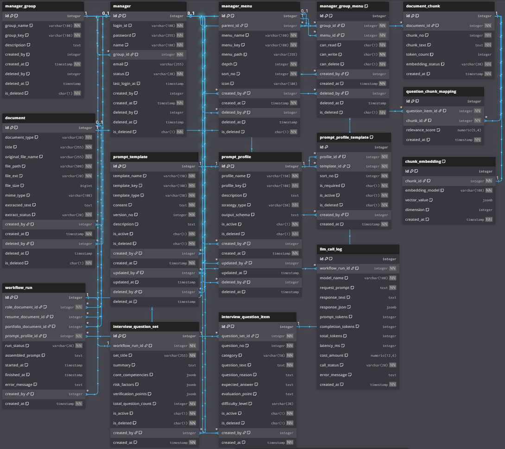

# 📄 HR Copilot BS — 테이블 정의서

> PostgreSQL 15+ 기준 | 네이밍 표준 v2 적용  
> 작성일: 2025-04

---

## 네이밍 표준 요약

| 구분 | 컬럼명 | 의미 |
|:---|:---|:---|
| Boolean | `is_deleted` | Soft delete 여부 (Y/N) |
| Boolean | `is_active` | 활성 여부 (Y/N) |
| Boolean | `is_required` | 필수 여부 (Y/N) |
| 권한 | `can_read` | 조회 권한 (Y/N) |
| 권한 | `can_write` | 등록/수정 권한 (Y/N) |
| 권한 | `can_delete` | 삭제 권한 (Y/N) |
| Audit | `created_by` / `created_at` | 등록자 ID / 등록 일시 |
| Audit | `updated_by` / `updated_at` | 수정자 ID / 수정 일시 |
| Audit | `deleted_by` / `deleted_at` | 삭제자 ID / 삭제 일시 |

---

## ERD 


---

## 1. 관리자 CMS 공통 영역

---

### 1.1 `manager_group` — 권한 그룹

> 관리자 계정이 속하는 권한 그룹. `manager` 테이블보다 먼저 생성되어야 함.  
> `created_by`는 순환참조 방지를 위해 FK 미설정.

| 구분 | 컬럼명 | 타입 | NOT NULL | 기본값 | 설명 |
|:---|:---|:---|:---:|:---|:---|
| PK | `id` | SERIAL | ✓ | AUTO | 권한 그룹 식별자 |
| 일반 | `group_name` | VARCHAR(100) | ✓ | — | 권한 그룹명 |
| 일반 | `group_key` | VARCHAR(100) | ✓ | — | 고유 키 (UNIQUE), 예: `ROLE_ADMIN` |
| 일반 | `description` | TEXT | — | NULL | 그룹 설명 |
| Audit | `created_by` | INTEGER | — | NULL | 등록 관리자 ID → manager.id (FK 미설정) |
| Audit | `created_at` | TIMESTAMPTZ | ✓ | NOW() | 등록 일시 |
| Audit | `deleted_by` | INTEGER | — | NULL | 삭제 관리자 ID → manager.id (FK 미설정) |
| Audit | `deleted_at` | TIMESTAMPTZ | — | NULL | 삭제 일시 |
| Boolean | `is_deleted` | CHAR(1) | ✓ | 'N' | Soft delete 여부 (Y/N) |

**제약조건**
- `UNIQUE (group_key)`

---

### 1.2 `manager` — 관리자 계정

> CMS를 사용하는 내부 관리자 계정. 비밀번호는 BCrypt 단방향 해시로 저장.

| 구분 | 컬럼명 | 타입 | NOT NULL | 기본값 | 설명 |
|:---|:---|:---|:---:|:---|:---|
| PK | `id` | SERIAL | ✓ | AUTO | 관리자 식별자 |
| 일반 | `login_id` | VARCHAR(100) | ✓ | — | 로그인 아이디 (UNIQUE) |
| 일반 | `password` | VARCHAR(255) | ✓ | — | BCrypt 해시 비밀번호 |
| 일반 | `name` | VARCHAR(100) | ✓ | — | 관리자 이름 |
| FK | `group_id` | INTEGER | ✓ | — | 권한 그룹 ID → manager_group.id |
| 일반 | `email` | VARCHAR(255) | — | NULL | 이메일 |
| 일반 | `status` | VARCHAR(20) | ✓ | 'ACTIVE' | 계정 상태: ACTIVE / INACTIVE / LOCK |
| 일반 | `last_login_at` | TIMESTAMPTZ | — | NULL | 최종 로그인 일시 |
| Audit | `created_by` | INTEGER | — | NULL | 등록 관리자 ID → manager.id (자기참조, FK 미설정) |
| Audit | `created_at` | TIMESTAMPTZ | ✓ | NOW() | 등록 일시 |
| Audit | `deleted_by` | INTEGER | — | NULL | 삭제 관리자 ID |
| Audit | `deleted_at` | TIMESTAMPTZ | — | NULL | 삭제 일시 |
| Boolean | `is_deleted` | CHAR(1) | ✓ | 'N' | Soft delete 여부 (Y/N) |

**제약조건**
- `UNIQUE (login_id)`
- `FK: group_id → manager_group.id`
- `CHECK: status IN ('ACTIVE','INACTIVE','LOCK')`

---

### 1.3 `manager_menu` — 관리자 메뉴

> 계층 트리 구조의 CMS 메뉴. `parent_id`로 자기참조하며 최상위 메뉴는 NULL.

| 구분 | 컬럼명 | 타입 | NOT NULL | 기본값 | 설명 |
|:---|:---|:---|:---:|:---|:---|
| PK | `id` | SERIAL | ✓ | AUTO | 메뉴 식별자 |
| FK | `parent_id` | INTEGER | — | NULL | 상위 메뉴 ID (자기참조) → manager_menu.id |
| 일반 | `menu_name` | VARCHAR(100) | ✓ | — | 메뉴명 |
| 일반 | `menu_key` | VARCHAR(100) | ✓ | — | 메뉴 고유 키 (UNIQUE) |
| 일반 | `menu_path` | VARCHAR(255) | — | NULL | 라우팅 경로 / API 매핑 |
| 일반 | `depth` | INTEGER | ✓ | 1 | 메뉴 깊이 (1: 최상위) |
| 일반 | `sort_no` | INTEGER | ✓ | 0 | 같은 depth 내 정렬 순서 |
| 일반 | `icon` | VARCHAR(100) | — | NULL | 메뉴 아이콘명 |
| Audit | `created_by` | INTEGER | — | NULL | 등록 관리자 ID → manager.id |
| Audit | `created_at` | TIMESTAMPTZ | ✓ | NOW() | 등록 일시 |
| Audit | `deleted_by` | INTEGER | — | NULL | 삭제 관리자 ID → manager.id |
| Audit | `deleted_at` | TIMESTAMPTZ | — | NULL | 삭제 일시 |
| Boolean | `is_deleted` | CHAR(1) | ✓ | 'N' | Soft delete 여부 (Y/N) |

**제약조건**
- `UNIQUE (menu_key)`
- `FK: parent_id → manager_menu.id`

---

### 1.4 `manager_group_menu` — 그룹별 메뉴 권한

> 권한 그룹과 메뉴의 N:M 관계 해소 테이블. 조회/등록수정/삭제 권한을 개별 관리.

| 구분 | 컬럼명 | 타입 | NOT NULL | 기본값 | 설명 |
|:---|:---|:---|:---:|:---|:---|
| PK | `id` | SERIAL | ✓ | AUTO | 그룹-메뉴 권한 식별자 |
| FK | `group_id` | INTEGER | ✓ | — | 권한 그룹 ID → manager_group.id |
| FK | `menu_id` | INTEGER | ✓ | — | 메뉴 ID → manager_menu.id |
| 권한 | `can_read` | CHAR(1) | ✓ | 'N' | 조회 권한 (Y/N) |
| 권한 | `can_write` | CHAR(1) | ✓ | 'N' | 등록/수정 권한 (Y/N) |
| 권한 | `can_delete` | CHAR(1) | ✓ | 'N' | 삭제 권한 (Y/N) |
| Audit | `created_by` | INTEGER | — | NULL | 등록 관리자 ID → manager.id |
| Audit | `created_at` | TIMESTAMPTZ | ✓ | NOW() | 등록 일시 |
| Audit | `deleted_by` | INTEGER | — | NULL | 삭제 관리자 ID → manager.id |
| Audit | `deleted_at` | TIMESTAMPTZ | — | NULL | 삭제 일시 |
| Boolean | `is_deleted` | CHAR(1) | ✓ | 'N' | Soft delete 여부 (Y/N) |

**제약조건**
- `UNIQUE (group_id, menu_id)` — 그룹-메뉴 중복 방지
- `FK: group_id → manager_group.id`
- `FK: menu_id → manager_menu.id`

---

## 2. 지원자 및 문서 관리 영역

---

### 2.1 `candidate` — 지원자

> 분석 대상이 되는 지원자 마스터 정보.  
> 지원자별 문서, 분석 실행, 질문 결과의 기준 엔티티.

| 구분 | 컬럼명 | 타입 | NOT NULL | 기본값 | 설명 |
|:---|:---|:---|:---:|:---|:---|
| PK | `id` | SERIAL | ✓ | AUTO | 지원자 식별자 |
| 일반 | `name` | VARCHAR(100) | ✓ | — | 지원자명 |
| 일반 | `email` | VARCHAR(255) | — | NULL | 이메일 |
| 일반 | `phone` | VARCHAR(50) | — | NULL | 연락처 |
| 일반 | `birth_date` | DATE | — | NULL | 생년월일 |
| 일반 | `years_of_experience` | NUMERIC(4,1) | — | NULL | 총 경력 연수 |
| 일반 | `current_title` | VARCHAR(100) | — | NULL | 현재 직함 |
| 일반 | `status` | VARCHAR(20) | ✓ | 'ACTIVE' | 지원자 상태: ACTIVE / INACTIVE |
| Boolean | `is_active` | CHAR(1) | ✓ | 'Y' | 활성 여부 (Y/N) |
| Boolean | `is_deleted` | CHAR(1) | ✓ | 'N' | Soft delete 여부 (Y/N) |
| Audit | `created_by` | INTEGER | — | NULL | 등록 관리자 ID → manager.id |
| Audit | `created_at` | TIMESTAMPTZ | ✓ | NOW() | 등록 일시 |
| Audit | `updated_by` | INTEGER | — | NULL | 수정 관리자 ID → manager.id |
| Audit | `updated_at` | TIMESTAMPTZ | — | NULL | 수정 일시 |
| Audit | `deleted_by` | INTEGER | — | NULL | 삭제 관리자 ID → manager.id |
| Audit | `deleted_at` | TIMESTAMPTZ | — | NULL | 삭제 일시 |

**제약조건**
- `CHECK: status IN ('ACTIVE','INACTIVE')`
- `FK: created_by, updated_by, deleted_by → manager.id`

---

### 2.2 `document` — 업로드 문서 원본

> 지원자별 이력서 / 포트폴리오 / 경력기술서 / 자기소개서 등 업로드 문서를 통합 관리.  
> OCR/파서 결과 텍스트를 함께 보관.

| 구분 | 컬럼명 | 타입 | NOT NULL | 기본값 | 설명 |
|:---|:---|:---|:---:|:---|:---|
| PK | `id` | SERIAL | ✓ | AUTO | 문서 식별자 |
| FK | `candidate_id` | INTEGER | ✓ | — | 지원자 ID → candidate.id |
| 일반 | `document_type` | VARCHAR(30) | ✓ | — | RESUME / PORTFOLIO / COVER_LETTER / CAREER_DESCRIPTION / ROLE_PROFILE |
| 일반 | `title` | VARCHAR(255) | ✓ | — | 문서 제목 |
| 일반 | `original_file_name` | VARCHAR(255) | ✓ | — | 업로드 원본 파일명 |
| 일반 | `file_path` | VARCHAR(500) | ✓ | — | 서버 저장 경로 |
| 일반 | `file_ext` | VARCHAR(20) | ✓ | — | 파일 확장자 (pdf, docx 등) |
| 일반 | `file_size` | BIGINT | — | NULL | 파일 크기 (byte) |
| 일반 | `mime_type` | VARCHAR(100) | — | NULL | MIME 타입 (application/pdf 등) |
| 일반 | `extracted_text` | TEXT | — | NULL | OCR / 파서 추출 텍스트 전문 |
| 일반 | `extract_status` | VARCHAR(20) | ✓ | 'PENDING' | PENDING / READY / FAILED |
| Audit | `created_by` | INTEGER | — | NULL | 업로드 관리자 ID → manager.id |
| Audit | `created_at` | TIMESTAMPTZ | ✓ | NOW() | 등록 일시 |
| Audit | `updated_by` | INTEGER | — | NULL | 수정 관리자 ID → manager.id |
| Audit | `updated_at` | TIMESTAMPTZ | — | NULL | 수정 일시 |
| Audit | `deleted_by` | INTEGER | — | NULL | 삭제 관리자 ID → manager.id |
| Audit | `deleted_at` | TIMESTAMPTZ | — | NULL | 삭제 일시 |
| Boolean | `is_deleted` | CHAR(1) | ✓ | 'N' | Soft delete 여부 (Y/N) |

**제약조건**
- `CHECK: document_type IN ('RESUME','PORTFOLIO','COVER_LETTER','CAREER_DESCRIPTION','ROLE_PROFILE')`
- `CHECK: extract_status IN ('PENDING','READY','FAILED')`
- `FK: candidate_id → candidate.id`
- `FK: created_by, updated_by, deleted_by → manager.id`

---

## 3. HR 가이드라인 및 프롬프트 관리 영역

---

### 3.1 `recruitment_guideline` — 채용 가이드라인

> HR 시스템의 채용 기준, 평가 원칙, 질문 금지 정책, 인재상, 검증 기준 등을 관리하는 테이블.  
> 지원자 문서 외에 면접 질문 생성 시 참조하는 공통 판단 기준 역할을 한다.

| 구분 | 컬럼명 | 타입 | NOT NULL | 기본값 | 설명 |
|:---|:---|:---|:---:|:---|:---|
| PK | `id` | SERIAL | ✓ | AUTO | 가이드라인 식별자 |
| 일반 | `guideline_name` | VARCHAR(150) | ✓ | — | 가이드라인명 |
| 일반 | `guideline_key` | VARCHAR(100) | ✓ | — | 고유 키 (UNIQUE) |
| 일반 | `description` | TEXT | — | NULL | 가이드라인 설명 |
| 일반 | `content` | TEXT | ✓ | — | 채용/면접 기준 본문 |
| 일반 | `version_no` | INTEGER | ✓ | 1 | 버전 번호 |
| Boolean | `is_active` | CHAR(1) | ✓ | 'Y' | 활성 여부 (Y/N) |
| Boolean | `is_deleted` | CHAR(1) | ✓ | 'N' | Soft delete 여부 (Y/N) |
| Audit | `created_by` | INTEGER | — | NULL | 등록 관리자 ID → manager.id |
| Audit | `created_at` | TIMESTAMPTZ | ✓ | NOW() | 등록 일시 |
| Audit | `updated_by` | INTEGER | — | NULL | 수정 관리자 ID → manager.id |
| Audit | `updated_at` | TIMESTAMPTZ | — | NULL | 수정 일시 |
| Audit | `deleted_by` | INTEGER | — | NULL | 삭제 관리자 ID → manager.id |
| Audit | `deleted_at` | TIMESTAMPTZ | — | NULL | 삭제 일시 |

**제약조건**
- `UNIQUE (guideline_key)`
- `FK: created_by, updated_by, deleted_by → manager.id`

---

### 3.2 `prompt_template` — 프롬프트 템플릿

> 시스템/사용자/전략 프롬프트 원문을 버전 단위로 관리.  
> `template_key`로 코드에서 직접 참조 가능.

| 구분 | 컬럼명 | 타입 | NOT NULL | 기본값 | 설명 |
|:---|:---|:---|:---:|:---|:---|
| PK | `id` | SERIAL | ✓ | AUTO | 프롬프트 템플릿 식별자 |
| 일반 | `template_name` | VARCHAR(150) | ✓ | — | 템플릿명 |
| 일반 | `template_key` | VARCHAR(100) | ✓ | — | 고유 키 (UNIQUE) |
| 일반 | `template_type` | VARCHAR(50) | ✓ | — | SYSTEM / USER / STRATEGY |
| 일반 | `content` | TEXT | ✓ | — | 프롬프트 본문 (플레이스홀더 포함 가능) |
| 일반 | `version_no` | INTEGER | ✓ | 1 | 버전 번호 (1부터 시작) |
| 일반 | `description` | TEXT | — | NULL | 템플릿 설명 |
| Boolean | `is_active` | CHAR(1) | ✓ | 'Y' | 활성 여부 (Y/N) |
| Boolean | `is_deleted` | CHAR(1) | ✓ | 'N' | Soft delete 여부 (Y/N) |
| Audit | `created_by` | INTEGER | — | NULL | 등록 관리자 ID → manager.id |
| Audit | `created_at` | TIMESTAMPTZ | ✓ | NOW() | 등록 일시 |
| Audit | `updated_by` | INTEGER | — | NULL | 수정 관리자 ID → manager.id |
| Audit | `updated_at` | TIMESTAMPTZ | — | NULL | 수정 일시 |
| Audit | `deleted_by` | INTEGER | — | NULL | 삭제 관리자 ID → manager.id |
| Audit | `deleted_at` | TIMESTAMPTZ | — | NULL | 삭제 일시 |

**제약조건**
- `UNIQUE (template_key)`
- `CHECK: template_type IN ('SYSTEM','USER','STRATEGY')`
- `FK: created_by, updated_by, deleted_by → manager.id`

---

### 3.3 `prompt_profile` — 프롬프트 실행 전략 프로파일

> 어떤 전략(GENERAL / DEEP_DIVE / RISK_FOCUS)으로 면접 질문을 생성할지를 정의.  
> LLM 출력 JSON 스키마(`output_schema`)를 저장해 구조화 응답 검증에 활용.

| 구분 | 컬럼명 | 타입 | NOT NULL | 기본값 | 설명 |
|:---|:---|:---|:---:|:---|:---|
| PK | `id` | SERIAL | ✓ | AUTO | 프롬프트 프로파일 식별자 |
| 일반 | `profile_name` | VARCHAR(150) | ✓ | — | 프로파일명 |
| 일반 | `profile_key` | VARCHAR(100) | ✓ | — | 고유 키 (UNIQUE) |
| 일반 | `description` | TEXT | — | NULL | 프로파일 설명 |
| 일반 | `strategy_type` | VARCHAR(50) | ✓ | — | GENERAL / DEEP_DIVE / RISK_FOCUS |
| 일반 | `output_schema` | TEXT | — | NULL | LLM 출력 JSON 스키마 명세 (JSONB 고려 가능) |
| Boolean | `is_active` | CHAR(1) | ✓ | 'Y' | 활성 여부 (Y/N) |
| Boolean | `is_deleted` | CHAR(1) | ✓ | 'N' | Soft delete 여부 (Y/N) |
| Audit | `created_by` | INTEGER | — | NULL | 등록 관리자 ID → manager.id |
| Audit | `created_at` | TIMESTAMPTZ | ✓ | NOW() | 등록 일시 |
| Audit | `updated_by` | INTEGER | — | NULL | 수정 관리자 ID → manager.id |
| Audit | `updated_at` | TIMESTAMPTZ | — | NULL | 수정 일시 |
| Audit | `deleted_by` | INTEGER | — | NULL | 삭제 관리자 ID → manager.id |
| Audit | `deleted_at` | TIMESTAMPTZ | — | NULL | 삭제 일시 |

**제약조건**
- `UNIQUE (profile_key)`
- `CHECK: strategy_type IN ('GENERAL','DEEP_DIVE','RISK_FOCUS')`
- `FK: created_by, updated_by, deleted_by → manager.id`

---

### 3.4 `prompt_profile_template` — 프로파일-템플릿 조립 매핑

> 하나의 프로파일에 어떤 템플릿을 어떤 순서로 조립할지 정의.  
> `sort_no` 오름차순으로 템플릿을 조립해 최종 프롬프트를 구성.

| 구분 | 컬럼명 | 타입 | NOT NULL | 기본값 | 설명 |
|:---|:---|:---|:---:|:---|:---|
| PK | `id` | SERIAL | ✓ | AUTO | 매핑 식별자 |
| FK | `profile_id` | INTEGER | ✓ | — | 프롬프트 프로파일 ID → prompt_profile.id |
| FK | `template_id` | INTEGER | ✓ | — | 프롬프트 템플릿 ID → prompt_template.id |
| 일반 | `sort_no` | INTEGER | ✓ | 0 | 조립 순서 (오름차순) |
| Boolean | `is_required` | CHAR(1) | ✓ | 'Y' | 필수 포함 여부 (Y: 항상 포함) |
| Boolean | `is_active` | CHAR(1) | ✓ | 'Y' | 활성 여부 (Y/N) |
| Boolean | `is_deleted` | CHAR(1) | ✓ | 'N' | Soft delete 여부 (Y/N) |
| Audit | `created_by` | INTEGER | — | NULL | 등록 관리자 ID → manager.id |
| Audit | `created_at` | TIMESTAMPTZ | ✓ | NOW() | 등록 일시 |

**제약조건**
- `UNIQUE (profile_id, template_id)` — 프로파일-템플릿 중복 방지
- `FK: profile_id → prompt_profile.id`
- `FK: template_id → prompt_template.id`
- `FK: created_by → manager.id`

---

### 3.5 `prompt_profile_guideline` — 프로파일-가이드라인 매핑

> 하나의 프롬프트 프로파일이 어떤 HR 채용 가이드라인을 어떤 순서로 참조할지 정의.  
> 템플릿 조립 외에 공통 판단 기준을 함께 주입하기 위한 매핑 테이블.

| 구분 | 컬럼명 | 타입 | NOT NULL | 기본값 | 설명 |
|:---|:---|:---|:---:|:---|:---|
| PK | `id` | SERIAL | ✓ | AUTO | 매핑 식별자 |
| FK | `profile_id` | INTEGER | ✓ | — | 프롬프트 프로파일 ID → prompt_profile.id |
| FK | `guideline_id` | INTEGER | ✓ | — | 채용 가이드라인 ID → recruitment_guideline.id |
| 일반 | `sort_no` | INTEGER | ✓ | 0 | 적용 순서 (오름차순) |
| Boolean | `is_required` | CHAR(1) | ✓ | 'Y' | 필수 포함 여부 (Y/N) |
| Boolean | `is_active` | CHAR(1) | ✓ | 'Y' | 활성 여부 (Y/N) |
| Boolean | `is_deleted` | CHAR(1) | ✓ | 'N' | Soft delete 여부 (Y/N) |
| Audit | `created_by` | INTEGER | — | NULL | 등록 관리자 ID → manager.id |
| Audit | `created_at` | TIMESTAMPTZ | ✓ | NOW() | 등록 일시 |

**제약조건**
- `UNIQUE (profile_id, guideline_id)` — 프로파일-가이드라인 중복 방지
- `FK: profile_id → prompt_profile.id`
- `FK: guideline_id → recruitment_guideline.id`
- `FK: created_by → manager.id`

---

## 4. LLM 실행 및 결과 영역

---

### 4.1 `workflow_run` — 분석 실행 단위

> 1번의 LLM 분석 실행을 나타내는 헤더.  
> 특정 지원자, 문서 3종(Role/Resume/Portfolio), 채용 가이드라인, 프롬프트 프로파일을 연결한다.  
> `assembled_prompt`에 실제 전달된 최종 프롬프트를 저장해 디버깅 및 이력 추적에 활용한다.

| 구분 | 컬럼명 | 타입 | NOT NULL | 기본값 | 설명 |
|:---|:---|:---|:---:|:---|:---|
| PK | `id` | SERIAL | ✓ | AUTO | 분석 실행 식별자 |
| FK | `candidate_id` | INTEGER | ✓ | — | 지원자 ID → candidate.id |
| FK | `guideline_id` | INTEGER | — | NULL | 채용 가이드라인 ID → recruitment_guideline.id |
| FK | `role_document_id` | INTEGER | ✓ | — | Role Profile 문서 ID → document.id |
| FK | `resume_document_id` | INTEGER | — | NULL | Resume 문서 ID → document.id |
| FK | `portfolio_document_id` | INTEGER | — | NULL | Portfolio 문서 ID → document.id |
| FK | `prompt_profile_id` | INTEGER | ✓ | — | 프롬프트 프로파일 ID → prompt_profile.id |
| 일반 | `run_status` | VARCHAR(20) | ✓ | 'READY' | READY / RUNNING / SUCCESS / FAIL |
| 일반 | `assembled_prompt` | TEXT | — | NULL | 최종 조립 프롬프트 (디버깅/이력용) |
| 일반 | `started_at` | TIMESTAMPTZ | — | NULL | 실행 시작 일시 |
| 일반 | `finished_at` | TIMESTAMPTZ | — | NULL | 실행 완료 일시 |
| 일반 | `error_message` | TEXT | — | NULL | 실패 시 오류 메시지 |
| Audit | `created_by` | INTEGER | — | NULL | 실행 관리자 ID → manager.id |
| Audit | `created_at` | TIMESTAMPTZ | ✓ | NOW() | 생성 일시 |

**제약조건**
- `CHECK: run_status IN ('READY','RUNNING','SUCCESS','FAIL')`
- `FK: candidate_id → candidate.id`
- `FK: guideline_id → recruitment_guideline.id`
- `FK: role_document_id, resume_document_id, portfolio_document_id → document.id`
- `FK: prompt_profile_id → prompt_profile.id`
- `FK: created_by → manager.id`

---

### 4.2 `interview_question_set` — 면접 질문 세트 (결과 헤더)

> `workflow_run` 1건당 1건 생성(1:1). 전체 분석 요약 및 JSONB 배열 형태의 역량/리스크/검증포인트 저장.

| 구분 | 컬럼명 | 타입 | NOT NULL | 기본값 | 설명 |
|:---|:---|:---|:---:|:---|:---|
| PK | `id` | SERIAL | ✓ | AUTO | 질문 세트 식별자 |
| FK | `workflow_run_id` | INTEGER | ✓ | — | 분석 실행 ID → workflow_run.id (UNIQUE) |
| 일반 | `set_title` | VARCHAR(255) | ✓ | — | 질문 세트 제목 |
| 일반 | `summary` | TEXT | — | NULL | 전체 분석 요약 |
| 일반 | `core_competencies` | JSONB | — | NULL | 핵심 역량 요약 배열 |
| 일반 | `risk_factors` | JSONB | — | NULL | 리스크 요약 배열 |
| 일반 | `verification_points` | JSONB | — | NULL | 검증 포인트 배열 |
| 일반 | `total_question_count` | INTEGER | ✓ | 0 | 총 질문 수 |
| Boolean | `is_active` | CHAR(1) | ✓ | 'Y' | 활성 여부 (Y/N) |
| Boolean | `is_deleted` | CHAR(1) | ✓ | 'N' | Soft delete 여부 (Y/N) |
| Audit | `created_by` | INTEGER | — | NULL | 등록 관리자 ID → manager.id |
| Audit | `created_at` | TIMESTAMPTZ | ✓ | NOW() | 등록 일시 |

**제약조건**
- `UNIQUE (workflow_run_id)` — workflow_run과 1:1 보장
- `FK: workflow_run_id → workflow_run.id`
- `FK: created_by → manager.id`

---

### 4.3 `interview_question_item` — 면접 질문 개별 항목

> 질문 세트에 속하는 개별 면접 질문. 카테고리·난이도·근거·기대답변·평가포인트를 함께 저장.

| 구분 | 컬럼명 | 타입 | NOT NULL | 기본값 | 설명 |
|:---|:---|:---|:---:|:---|:---|
| PK | `id` | SERIAL | ✓ | AUTO | 질문 항목 식별자 |
| FK | `question_set_id` | INTEGER | ✓ | — | 질문 세트 ID → interview_question_set.id |
| 일반 | `question_no` | INTEGER | ✓ | — | 세트 내 질문 순번 |
| 일반 | `category` | VARCHAR(50) | ✓ | — | COMPETENCY / RISK / EXPERIENCE |
| 일반 | `question_text` | TEXT | ✓ | — | 면접 질문 본문 |
| 일반 | `question_reason` | TEXT | — | NULL | 질문 생성 근거 (LLM 설명) |
| 일반 | `expected_answer` | TEXT | — | NULL | 기대 답변 |
| 일반 | `evaluation_point` | TEXT | — | NULL | 평가 포인트 |
| 일반 | `difficulty_level` | VARCHAR(20) | — | NULL | EASY / MEDIUM / HARD |
| Boolean | `is_active` | CHAR(1) | ✓ | 'Y' | 활성 여부 (Y/N) |
| Boolean | `is_deleted` | CHAR(1) | ✓ | 'N' | Soft delete 여부 (Y/N) |
| Audit | `created_by` | INTEGER | — | NULL | 등록 관리자 ID → manager.id |
| Audit | `created_at` | TIMESTAMPTZ | ✓ | NOW() | 등록 일시 |

**제약조건**
- `CHECK: category IN ('COMPETENCY','RISK','EXPERIENCE')`
- `CHECK: difficulty_level IN ('EASY','MEDIUM','HARD')`
- `FK: question_set_id → interview_question_set.id`
- `FK: created_by → manager.id`

---

### 4.4 `llm_call_log` — LLM API 호출 로그

> LLM 호출 1건당 1 row. 토큰 사용량·비용·지연시간 추적 및 구조화 응답 JSONB 보관.

| 구분 | 컬럼명 | 타입 | NOT NULL | 기본값 | 설명 |
|:---|:---|:---|:---:|:---|:---|
| PK | `id` | SERIAL | ✓ | AUTO | LLM 호출 로그 식별자 |
| FK | `workflow_run_id` | INTEGER | ✓ | — | 분석 실행 ID → workflow_run.id |
| 일반 | `model_name` | VARCHAR(100) | ✓ | — | 사용 모델명 (예: gpt-4.1) |
| 일반 | `request_prompt` | TEXT | ✓ | — | 요청 프롬프트 전문 |
| 일반 | `response_text` | TEXT | — | NULL | 응답 본문 (raw text) |
| 일반 | `response_json` | JSONB | — | NULL | 구조화 응답 JSONB |
| 일반 | `prompt_tokens` | INTEGER | — | NULL | 입력 토큰 수 |
| 일반 | `completion_tokens` | INTEGER | — | NULL | 출력 토큰 수 |
| 일반 | `total_tokens` | INTEGER | — | NULL | 총 토큰 수 |
| 일반 | `latency_ms` | INTEGER | — | NULL | 응답 지연 시간 (ms) |
| 일반 | `cost_amount` | NUMERIC(12,6) | — | NULL | 호출 비용 (USD 소수 6자리) |
| 일반 | `call_status` | VARCHAR(20) | ✓ | — | SUCCESS / FAIL |
| 일반 | `error_message` | TEXT | — | NULL | 실패 시 오류 메시지 |
| Audit | `created_at` | TIMESTAMPTZ | ✓ | NOW() | 생성 일시 |

**제약조건**
- `CHECK: call_status IN ('SUCCESS','FAIL')`
- `FK: workflow_run_id → workflow_run.id`

---

## 5. RAG 확장 선반영 영역

---

### 5.1 `document_chunk` — 문서 청크

> 문서 텍스트를 일정 단위로 분할한 청크. RAG 전처리의 기본 단위.

| 구분 | 컬럼명 | 타입 | NOT NULL | 기본값 | 설명 |
|:---|:---|:---|:---:|:---|:---|
| PK | `id` | SERIAL | ✓ | AUTO | 문서 청크 식별자 |
| FK | `document_id` | INTEGER | ✓ | — | 원본 문서 ID → document.id |
| 일반 | `chunk_no` | INTEGER | ✓ | — | 문서 내 청크 순번 (0-based) |
| 일반 | `chunk_text` | TEXT | ✓ | — | 청크 텍스트 |
| 일반 | `token_count` | INTEGER | — | NULL | 청크 토큰 수 |
| 일반 | `embedding_status` | VARCHAR(20) | ✓ | 'READY' | READY / DONE / FAIL |
| Audit | `created_at` | TIMESTAMPTZ | ✓ | NOW() | 생성 일시 |

**제약조건**
- `CHECK: embedding_status IN ('READY','DONE','FAIL')`
- `FK: document_id → document.id`

---

### 5.2 `chunk_embedding` — 청크 임베딩 벡터

> 청크별 임베딩 벡터 저장. 현재는 JSONB, pgvector 도입 시 `vector(N)` 타입으로 교체.

| 구분 | 컬럼명 | 타입 | NOT NULL | 기본값 | 설명 |
|:---|:---|:---|:---:|:---|:---|
| PK | `id` | SERIAL | ✓ | AUTO | 임베딩 식별자 |
| FK | `chunk_id` | INTEGER | ✓ | — | 문서 청크 ID → document_chunk.id |
| 일반 | `embedding_model` | VARCHAR(100) | ✓ | — | 임베딩 모델명 (예: text-embedding-3-small) |
| 일반 | `vector_value` | JSONB | — | NULL | 벡터값 — pgvector 도입 시 `vector(1536)` 교체 |
| 일반 | `dimension` | INTEGER | — | NULL | 벡터 차원 수 |
| Audit | `created_at` | TIMESTAMPTZ | ✓ | NOW() | 생성 일시 |

**제약조건**
- `UNIQUE (chunk_id, embedding_model)`
- `FK: chunk_id → document_chunk.id`

---

### 5.3 `question_chunk_mapping` — 질문-청크 근거 연결

> 면접 질문 항목과 근거가 된 문서 청크의 연결. 유사도 점수로 근거 강도 추적.

| 구분 | 컬럼명 | 타입 | NOT NULL | 기본값 | 설명 |
|:---|:---|:---|:---:|:---|:---|
| PK | `id` | SERIAL | ✓ | AUTO | 질문-청크 연결 식별자 |
| FK | `question_item_id` | INTEGER | ✓ | — | 질문 항목 ID → interview_question_item.id |
| FK | `chunk_id` | INTEGER | ✓ | — | 근거 청크 ID → document_chunk.id |
| 일반 | `relevance_score` | NUMERIC(5,4) | — | NULL | 유사도 점수 (0.0000 ~ 1.0000) |
| Audit | `created_at` | TIMESTAMPTZ | ✓ | NOW() | 생성 일시 |

**제약조건**
- `FK: question_item_id → interview_question_item.id`
- `FK: chunk_id → document_chunk.id`

---

## 6. 인덱스 정의 요약

| 인덱스명 | 테이블 | 대상 컬럼 | 조건 | 목적 |
|:---|:---|:---|:---|:---|
| `idx_manager_group_id` | manager | group_id | — | 그룹 기준 관리자 조회 |
| `idx_manager_status` | manager | status | `is_deleted = 'N'` | 활성 계정 상태 필터 |
| `idx_manager_menu_parent` | manager_menu | parent_id | — | 하위 메뉴 트리 탐색 |
| `idx_mgm_group_id` | manager_group_menu | group_id | — | 그룹 권한 조회 |
| `idx_mgm_menu_id` | manager_group_menu | menu_id | — | 메뉴별 권한 조회 |
| `idx_candidate_email` | candidate | email | `is_deleted = 'N'` | 지원자 이메일 조회 |
| `idx_document_candidate_id` | document | candidate_id | `is_deleted = 'N'` | 지원자별 문서 조회 |
| `idx_document_type` | document | document_type | `is_deleted = 'N'` | 문서 유형 필터 |
| `idx_rg_active` | recruitment_guideline | guideline_key | `is_active='Y' AND is_deleted='N'` | 활성 가이드라인 조회 |
| `idx_pt_type_active` | prompt_template | template_type | `is_active='Y' AND is_deleted='N'` | 활성 템플릿 조회 |
| `idx_pp_strategy_type` | prompt_profile | strategy_type | `is_active='Y' AND is_deleted='N'` | 전략별 프로파일 조회 |
| `idx_ppt_profile_id` | prompt_profile_template | profile_id | `is_deleted = 'N'` | 프로파일 기준 매핑 조회 |
| `idx_ppg_profile_id` | prompt_profile_guideline | profile_id | `is_deleted = 'N'` | 프로파일 기준 가이드라인 조회 |
| `idx_wr_candidate_id` | workflow_run | candidate_id | — | 지원자별 실행 조회 |
| `idx_wr_guideline_id` | workflow_run | guideline_id | — | 가이드라인 기준 실행 조회 |
| `idx_wr_run_status` | workflow_run | run_status | — | 실행 상태 모니터링 |
| `idx_wr_created_by` | workflow_run | created_by | — | 관리자별 실행 이력 |
| `idx_iqs_workflow_run` | interview_question_set | workflow_run_id | — | 실행-결과 세트 조인 |
| `idx_iqi_question_set` | interview_question_item | question_set_id | — | 세트 기준 질문 조회 |
| `idx_iqi_category` | interview_question_item | category | — | 카테고리 필터 |
| `idx_lcl_workflow_run` | llm_call_log | workflow_run_id | — | 실행별 호출 로그 조회 |
| `idx_lcl_created_at` | llm_call_log | created_at DESC | — | 최신 로그 조회 |
| `idx_dc_document_id` | document_chunk | document_id | — | 문서별 청크 조회 |
| `idx_dc_embed_status` | document_chunk | embedding_status | — | 임베딩 대기 청크 조회 |
| `idx_ce_chunk_id` | chunk_embedding | chunk_id | — | 청크별 벡터 조회 |
| `idx_qcm_question_item` | question_chunk_mapping | question_item_id | — | 질문별 근거 청크 조회 |

---

## 7. ERD 관계 요약

```text
manager_group ──1:N──▶ manager
manager_menu  ──1:N──▶ manager_menu          (self-reference: parent_id)
manager_group ──1:N──▶ manager_group_menu ◀──N:1── manager_menu

candidate ──1:N──▶ document
candidate ──1:N──▶ workflow_run

recruitment_guideline ──1:N──▶ workflow_run
prompt_profile ──1:N──▶ prompt_profile_template ◀──N:1── prompt_template
prompt_profile ──1:N──▶ prompt_profile_guideline ◀──N:1── recruitment_guideline
prompt_profile ──1:N──▶ workflow_run

workflow_run ──1:1──▶ interview_question_set
interview_question_set ──1:N──▶ interview_question_item
workflow_run ──1:N──▶ llm_call_log

document ──1:N──▶ document_chunk
document_chunk ──1:1──▶ chunk_embedding
interview_question_item ──1:N──▶ question_chunk_mapping ◀──N:1── document_chunk
```

---

## 8. 최소 수정 포인트 요약

- `candidate` 추가
- `recruitment_guideline` 추가
- `prompt_profile_guideline` 추가
- `document.candidate_id` 추가
- `workflow_run.candidate_id` 추가
- `workflow_run.guideline_id` 추가

이 정도면 현재 구조를 크게 뒤엎지 않으면서도,  
**지원자 중심 + HR 가이드라인 기반 면접 설계 시스템**으로 자연스럽게 확장됩니다.
