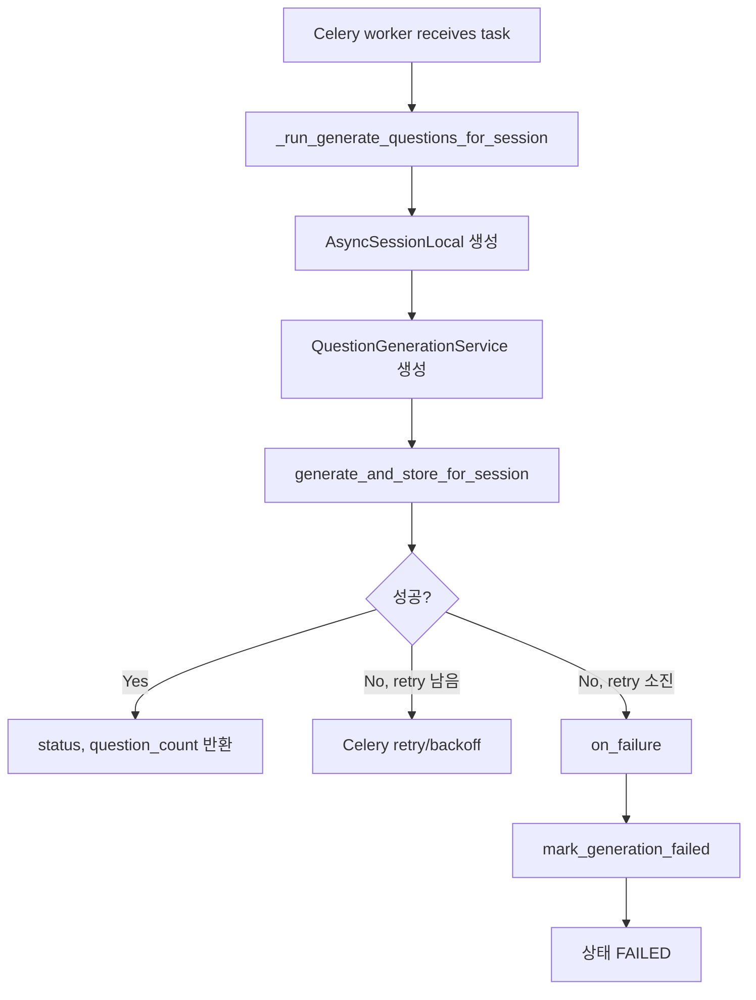
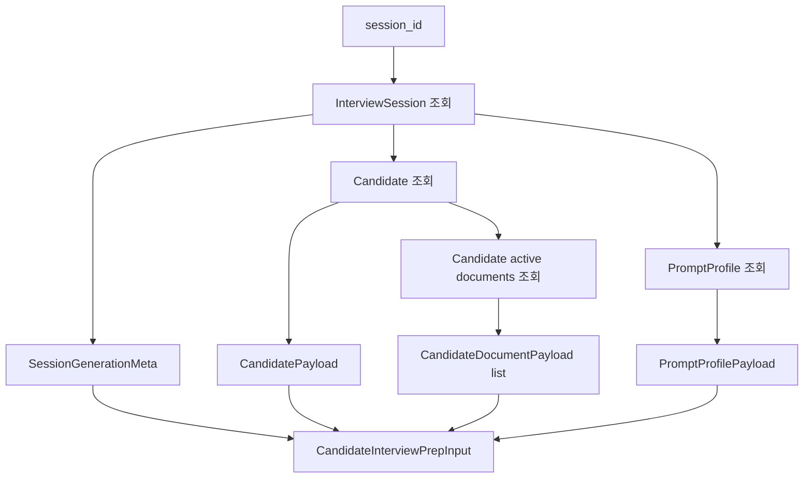
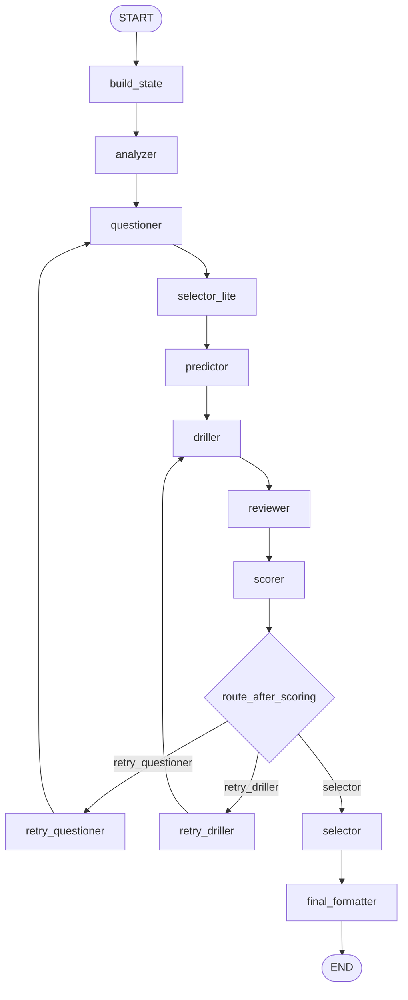
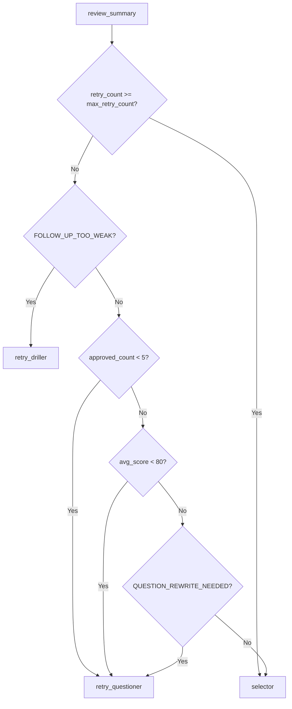
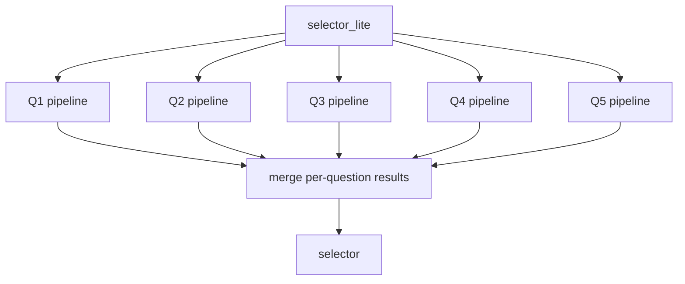
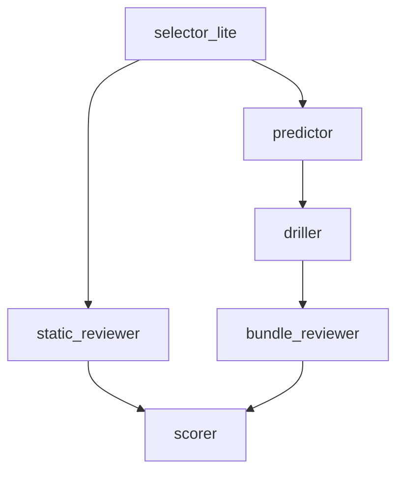

# HR Copilot 질문 생성 최신 처리 플로우

## 요약

현재 질문 생성은 `session_id` 하나, 즉 후보자 한 명 단위로 실행된다. API 서버는 세션을 만들고 상태를 `QUEUED`로 저장한 뒤 Celery task를 enqueue한다. 실제 LangGraph 실행과 OpenAI 호출, 질문 저장은 Celery worker가 처리한다.

현재 병렬성은 두 층으로 나뉜다.

- 후보자/session 단위 병렬성: Celery worker concurrency로 제어
- LangGraph 내부 노드 처리: 품질 보장을 위해 현재는 순차 처리

## API 진입점

관련 파일:

- `backend/api/v1/routers/sessions.py`
- `backend/services/session_service.py`
- `backend/tasks/question_generation_tasks.py`
- `backend/services/question_generation_service.py`
- `backend/services/session_generation_payload_assembler.py`

```mermaid
flowchart TD
    A[Client] --> B[POST /interview-sessions]
    A --> C[POST /interview-sessions/{session_id}/generate-questions]

    B --> D[SessionService.create_session]
    C --> E[SessionService.trigger_question_generation]

    D --> F[InterviewSession 저장]
    E --> G{QUEUED 또는 PROCESSING?}
    G -->|Yes| H[409 Conflict]
    G -->|No| I[상태 QUEUED 저장]
    F --> I

    I --> J[Celery apply_async]
    J --> K[Redis queue]
    K --> L[Celery worker]
    L --> M[QuestionGenerationService.generate_and_store_for_session]
```

### 세션 생성

`sessions.py`의 `create_session()`은 `SessionService.create_session()`을 호출한다. 서비스는 후보자와 프롬프트 프로필을 검증한 뒤 `InterviewSession`을 생성하고 질문 생성 상태를 `QUEUED`로 만든다.

이후 `generate_questions_for_session_task.apply_async()`로 Celery task를 queue에 넣는다.

### 수동 재생성

`sessions.py`의 `generate_questions()`는 `SessionService.trigger_question_generation()`을 호출한다.

중복 실행 방어:

```text
QUEUED 또는 PROCESSING이면 409 Conflict
COMPLETED / PARTIAL_COMPLETED / FAILED이면 재생성 허용
```

## Celery 처리

관련 파일:

- `backend/core/celery_app.py`
- `backend/tasks/question_generation_tasks.py`

Celery task 이름:

```text
question_generation.generate_for_session
```

task 실행 흐름:



Celery retry/backoff 정책:

- `max_retries=3`
- `retry_backoff=True`
- `retry_backoff_max=300`
- `retry_jitter=True`

Celery에서 `generate_and_store_for_session(..., mark_failed_on_error=False)`로 호출한다. 따라서 재시도 중에는 세션 상태를 바로 `FAILED`로 확정하지 않고, 최종 실패 시 `on_failure()`에서 `FAILED`로 업데이트한다.

## CandidateInterviewPrepInput 조립

관련 파일:

- `backend/services/session_generation_payload_assembler.py`
- `backend/schemas/session_generation.py`

`QuestionGenerationService.generate_and_store_for_session()` 안에서 `SessionGenerationPayloadAssembler.build_candidate_interview_prep_input(session_id)`가 호출된다.



최종 payload 구성:

| 필드 | 설명 |
| --- | --- |
| `session` | 세션 ID, 후보자 ID, 대상 직무, 난이도, 프롬프트 프로필 ID |
| `candidate` | 후보자 이름, 연락처, 지원 직무, 지원 상태 |
| `prompt_profile` | 프로필 키, 대상 직무, system prompt, output schema |
| `candidate_documents` | 문서 타입, 제목, 파일 정보, 추출 상태, 추출 텍스트 |

로그에는 `build_candidate_interview_prep_log_payload()`를 사용한다. 문서 전체 원문을 그대로 남기지 않고 문서별 텍스트 길이와 preview만 남긴다.

## QuestionGenerationService 처리

관련 파일:

- `backend/services/question_generation_service.py`

```mermaid
flowchart TD
    A[generate_and_store_for_session] --> B[session 조회]
    B --> C[상태 PROCESSING]
    C --> D[CandidateInterviewPrepInput 조립]
    D --> E[request_candidate_interview_prep(payload)]
    E --> F[run_interview_question_graph]
    F --> G[QuestionGenerationResponse]
    G --> H[기존 질문 soft delete]
    H --> I[새 InterviewQuestion 저장]
    I --> J{result.status}
    J -->|completed| K[COMPLETED]
    J -->|partial_completed| L[PARTIAL_COMPLETED]
    J -->|failed| M[FAILED]
```

`request_candidate_interview_prep()`는 조립된 `CandidateInterviewPrepInput`을 그대로 `run_interview_question_graph()`에 넘긴다.

## LangGraph 현재 다이어그램

관련 파일:

- `backend/ai/interview_graph/runner.py`
- `backend/ai/interview_graph/router.py`
- `backend/ai/interview_graph/nodes.py`
- `backend/ai/interview_graph/state.py`
- `backend/ai/interview_graph/schemas.py`
- `backend/ai/llm_client.py`

현재 그래프는 데이터 의존성을 맞추기 위해 내부 노드를 순차 실행한다.



## 노드별 역할

| 노드 | 역할 | LLM 호출 |
| --- | --- | --- |
| `build_state` | payload를 LangGraph 상태로 변환. 문서 텍스트 병합, 채용 기준 정리 | 없음 |
| `analyzer` | 후보자 문서 기반 강점, 약점, 리스크, 직무 적합도 분석 | 있음 |
| `questioner` | 분석 결과 기반 질문 후보 생성 | 있음 |
| `selector_lite` | 후보 질문 중 5개를 선별해 후속 노드 비용 축소 | 없음 |
| `predictor` | 각 질문에 대한 예상 답변과 근거 생성 | 있음 |
| `driller` | 예상 답변의 빈틈/검증 포인트 기반 꼬리 질문 생성 | 있음 |
| `reviewer` | 질문, 예상 답변, 꼬리 질문을 보고 품질/공정성 리뷰 | 있음 |
| `scorer` | 점수화, 품질 플래그, router 판단용 summary 생성 | 있음 |
| `retry_questioner` | retry count 증가, questioner 재실행용 feedback 생성 | 없음 |
| `retry_driller` | retry count 증가, driller 재실행용 feedback 생성 | 없음 |
| `selector` | 리뷰와 점수 기반 최종 질문 5개 선택 | 없음 |
| `final_formatter` | `QuestionGenerationResponse`로 변환 | 없음 |

## LLM 호출 방식

관련 파일:

- `backend/ai/llm_client.py`
- `backend/ai/interview_graph/nodes.py`

`llm_client.py`는 `AsyncOpenAI` client를 생성한다.

```text
model = settings.OPENAI_MODEL 또는 fallback
timeout = settings.OPENAI_TIMEOUT_SECONDS
```

각 LLM 노드는 `_call_structured_output()`을 통해 OpenAI Responses API의 structured output을 호출한다.

```text
system prompt + user prompt
-> client.responses.parse(...)
-> Pydantic response_model로 파싱
-> 실패 시 최대 2회 시도
```

노드별 output schema는 `schemas.py`의 Pydantic 모델이 담당한다.

## Router 분기

관련 파일:

- `backend/ai/interview_graph/router.py`

`scorer` 이후 `route_after_scoring()`이 호출된다.



분기 기준:

| 조건 | 이동 |
| --- | --- |
| `retry_count >= max_retry_count` | `selector` |
| 꼬리 질문 품질 이슈 | `retry_driller` |
| 승인 질문 5개 미만 | `retry_questioner` |
| 평균 점수 80 미만 | `retry_questioner` |
| 질문 재작성 필요 플래그 | `retry_questioner` |
| 문제 없음 | `selector` |

기본 `max_retry_count`는 `runner.py`의 initial state에서 3으로 설정된다.

## 상태 저장

질문 생성 상태:

```text
QUEUED -> PROCESSING -> COMPLETED
QUEUED -> PROCESSING -> PARTIAL_COMPLETED
QUEUED -> PROCESSING -> FAILED
```

LangGraph node 진행 상태는 `on_node_complete` callback을 통해 `SessionRepository.mark_question_generation_progress_node()`가 업데이트한다.

## 현재 동시성 판단

현재 동시성은 LangGraph 내부가 아니라 Celery worker 단위로 판단한다.

확인 방법:

```bash
uv run celery -A core.celery_app.celery_app inspect active
```

또는 DB에서 `PROCESSING` 상태 개수를 확인한다.

```sql
select count(*)
from interview_sessions
where question_generation_status = 'PROCESSING';
```

`--concurrency=5`로 worker를 실행하면 동시에 처리되는 session task가 최대 5개가 된다. 단, Windows에서 `--pool=solo`를 쓰면 동시성은 사실상 1이다.

Windows에서 동시성 테스트:

```bash
uv run celery -A core.celery_app.celery_app worker --pool=threads --loglevel=info --queues=question-generation --concurrency=5
```

Linux 운영:

```bash
uv run celery -A core.celery_app.celery_app worker --loglevel=info --queues=question-generation --concurrency=5
```

## 현재 순차 처리의 이유

기존에는 `selector_lite` 이후 `predictor`, `driller`, `reviewer`를 병렬 실행하는 구조였다.

하지만 데이터 의존성이 맞지 않았다.

| 노드 | 필요한 입력 |
| --- | --- |
| `predictor` | `questions`, `document_analysis` |
| `driller` | `questions`, `answers`, `document_analysis` |
| `reviewer` | `questions`, `answers`, `follow_ups` |
| `scorer` | `questions`, `answers`, `follow_ups`, `reviews` |

따라서 현재는 아래 순서로 변경했다.

```text
predictor -> driller -> reviewer -> scorer
```

이 구조는 처리 속도보다 질문 품질과 데이터 일관성을 우선한다.

## 품질을 보장하면서 병렬처리하는 방안

현재 순차 구조를 무작정 병렬화하면 `answers`, `follow_ups`가 비어 있는 상태로 리뷰/점수가 실행될 수 있다. 따라서 품질을 유지하려면 병렬화 단위를 바꿔야 한다.

### 방안 1. 후보자 단위 병렬 유지

현재 적용된 방식이다.

```text
후보자 A graph 실행
후보자 B graph 실행
후보자 C graph 실행
...
```

장점:

- 품질 손상 없음
- 구현 단순
- worker concurrency로 OpenAI/DB 부하 제어 가능

단점:

- 후보자 한 명 내부 처리 시간은 순차 노드 합산에 가깝다.

### 방안 2. 질문 단위 map/reduce 병렬화

`selector_lite`로 5개 질문을 고른 뒤, 각 질문을 독립 item으로 나누어 `answer -> follow_up -> review -> score`를 질문별로 병렬 실행한다.



각 질문 pipeline:

```text
predict_answer_for_question
-> drill_follow_up_for_question
-> review_question_bundle
-> score_question_bundle
```

장점:

- 질문별 데이터 의존성은 보존
- 5개 질문을 동시에 처리해 후보자 1명 내부 처리 시간 단축 가능
- 질문별 실패 fallback도 세밀하게 처리 가능

주의점:

- LLM 호출 수가 증가할 수 있음
- OpenAI rate limit 관리 필요
- LangGraph state merge reducer 설계 필요
- 질문 간 중복/균형 평가는 최종 selector/reviewer에서 별도 수행 필요

### 방안 3. 독립 리뷰 축 분리

`reviewer`를 두 개로 나눈다.

```text
question_static_reviewer: 질문 자체의 직무 관련성, 공정성, 문서 근거 검토
answer_followup_reviewer: 예상 답변과 꼬리 질문 연결성 검토
```



장점:

- 질문 자체 검토는 predictor와 병렬 가능
- 최종 품질 검토는 answer/follow-up 이후 수행

단점:

- reviewer 역할과 prompt/schema를 새로 나눠야 함
- 점수화 입력이 복잡해짐

### 방안 4. 현재 구조 + OpenAI 호출 내부 제한

현재 후보자 단위 Celery 병렬은 유지하되, OpenAI rate limit이 문제되면 별도의 semaphore 또는 rate limiter를 둔다.

```text
Celery concurrency 5
OpenAI structured output 동시 호출 limit 5~10
```

장점:

- 운영 안정성 강화
- 현재 구조 변경 최소화

단점:

- 후보자 단위 처리 속도 개선은 제한적

## 추천 방향

현재 MVP에서는 아래 순서가 가장 안전하다.

1. 지금 구조 유지: Celery 후보자 단위 병렬 + LangGraph 내부 순차
2. 실제 처리 시간과 실패율 측정
3. 병목이 후보자 내부 LLM 순차 처리라면 방안 2의 질문 단위 map/reduce 병렬화 도입
4. OpenAI rate limit 문제가 먼저 나오면 worker concurrency 또는 OpenAI rate limiter로 제어

즉, 품질까지 보장하면서 내부 병렬화를 하려면 `predictor`, `driller`, `reviewer`를 같은 상태에서 병렬로 두는 방식이 아니라, 질문별 독립 pipeline을 병렬화하는 방식이 가장 적합하다.
