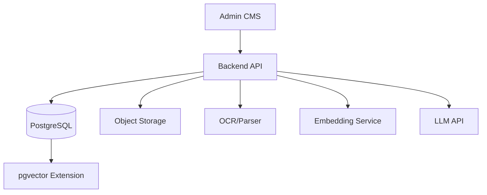

# 📐 HR Copilot BS — 시스템 아키텍처 다이어그램

## 1. 아키텍처 개요 (Architecture Overview)

**HR Copilot BS**는 사용자가 업로드한 **문서(직무 기술서, 이력서, 포트폴리오)**를 AI가 분석하여 **맞춤형 면접 질문을 생성**하는 지능형 HR 지원 시스템입니다.  
본 시스템은 **관리자 권한 관리(CMS)**, **문서 처리(OCR/Parser)**, **프롬프트 엔지니어링**, **LLM 분석 파이프라인**, 그리고 **RAG 확장 구조**로 구성됩니다.

### 🎯 주요 목표
- 문서 기반의 객관적인 면접 질문 생성
- 프롬프트 전략의 유연한 관리
- LLM 호출 비용 및 성능 추적
- 향후 RAG 기반 지식 확장 지원

---

## 2. 논리적 아키텍처 (Logical Architecture)

### 2.1 관리자 및 권한 레이어 (Manager & RBAC)

| 구성 요소 | 설명 | 관련 테이블 |
|-----------|------|-------------|
| Manager | CMS에 접속하는 내부 관리자 | `manager` |
| Manager Group | 관리자 역할 및 권한 그룹 | `manager_group` |
| Manager Menu | 계층형 CMS 메뉴 | `manager_menu` |
| Group Menu Mapping | 그룹별 메뉴 권한 | `manager_group_menu` |

---

### 2.2 문서 처리 레이어 (Document Processing)

| 구성 요소 | 설명 | 관련 테이블 |
|-----------|------|-------------|
| Document | 업로드된 원본 문서 및 메타데이터 | `document` |
| OCR/Parser | 문서에서 텍스트 추출 | `document.extracted_text` |
| Document Chunk | RAG 처리를 위한 텍스트 분할 | `document_chunk` |
| Chunk Embedding | 청크 임베딩 벡터 저장 | `chunk_embedding` |

---

### 2.3 프롬프트 엔지니어링 레이어 (Prompt Engineering)

| 구성 요소 | 설명 | 관련 테이블 |
|-----------|------|-------------|
| Prompt Template | 시스템/사용자/전략 프롬프트 | `prompt_template` |
| Prompt Profile | 분석 전략 정의 | `prompt_profile` |
| Profile-Template Mapping | 프롬프트 조립 순서 | `prompt_profile_template` |

---

### 2.4 LLM 워크플로우 레이어 (LLM Analysis Pipeline)

| 구성 요소 | 설명 | 관련 테이블 |
|-----------|------|-------------|
| Workflow Run | 분석 실행 단위 | `workflow_run` |
| LLM Call Log | API 호출 로그 및 비용 | `llm_call_log` |
| Interview Question Set | 분석 결과 헤더 | `interview_question_set` |
| Interview Question Item | 개별 면접 질문 | `interview_question_item` |
| Question-Chunk Mapping | 질문의 근거 추적 | `question_chunk_mapping` |

---

## 3. 물리적 아키텍처 (Physical Architecture)

| 구성 요소 | 기술 스택 | 설명 |
|-----------|-----------|------|
| **Frontend (Admin CMS)** | React / Vue | 관리자 UI |
| **Backend API** | FastAPI 또는 Spring Boot | 비즈니스 로직 및 API |
| **Database** | PostgreSQL 15+ | 서비스 데이터 저장 |
| **Vector Search** | pgvector | 임베딩 기반 유사도 검색 |
| **Object Storage** | AWS S3 또는 Local Storage | 문서 파일 저장 |
| **OCR/Parser** | 추후결정   | 문서 텍스트 추출 |
| **LLM API** | OpenAI GPT 계열 | 면접 질문 생성 |

---

## 4. 시스템 아키텍처 다이어그램 (Mermaid)

---

## 5. 데이터 흐름도 (Data Flow)

1. **입력 단계**
   - 관리자가 Role Profile, Resume, Portfolio 문서를 업로드
   - `document` 테이블에 메타데이터 저장

2. **전처리 단계 (Async)**
   - OCR/Parser를 통한 텍스트 추출 → `extract_status` 업데이트
   - 문서 청크 분할 → `document_chunk`
   - 임베딩 생성 → `chunk_embedding`

3. **프롬프트 조립 단계**
   - `prompt_profile`에 정의된 전략에 따라 `prompt_template`을 `sort_no` 순으로 조립
   - 최종 프롬프트는 `workflow_run.assembled_prompt`에 저장

4. **추론 단계**
   - LLM API 호출
   - 호출 결과 및 비용은 `llm_call_log`에 기록

5. **결과 저장 단계**
   - 구조화된 응답을 파싱하여
     - `interview_question_set`
     - `interview_question_item`
     - `question_chunk_mapping`
     에 저장

---

## 6. 보안 및 인증 (Security & Authentication)

| 항목 | 설명 |
|------|------|
| Authentication | JWT 기반 관리자 인증 |
| Authorization | RBAC (`manager_group`, `manager_group_menu`) |
| Password Security | BCrypt 해시 저장 |
| Data Encryption | HTTPS/TLS 적용 |
| File Access Control | Presigned URL 또는 접근 제어 |
| Input Validation | 파일 업로드 및 JSON 스키마 검증 |

---

## 7. 모니터링 및 관측 가능성 (Observability)

| 항목 | 설명 | 관련 테이블 |
|------|------|-------------|
| LLM 비용 추적 | 모델별 사용량 및 비용 | `llm_call_log` |
| 실행 상태 모니터링 | 분석 성공/실패 추적 | `workflow_run` |
| 성능 측정 | 응답 지연 시간 | `llm_call_log.latency_ms` |

---

## 8. 설계 핵심 포인트 (Key Design Considerations)

### 8.1 유연한 프롬프트 전략
- 프롬프트를 DB에서 관리하여 코드 수정 없이 전략 변경 가능
- `sort_no` 기반 동적 조립 방식으로 다양한 분석 시나리오 지원

### 8.2 RAG 확장성
- `document_chunk`와 `chunk_embedding`을 통해 대규모 문서 검색 지원
- `question_chunk_mapping`을 통해 질문의 근거를 명확히 제시

### 8.3 투명한 비용 관리
- `llm_call_log`를 활용하여 토큰 사용량 및 비용을 정밀하게 추적
- 운영 비용 최적화 및 예산 관리에 기여

### 8.4 비동기 처리 구조 (Message Queue 미사용)
- MVP 단계에서는 시스템 복잡도를 최소화하기 위해 **Message Queue를 사용하지 않는다.**
- 대신 애플리케이션 레벨의 **Background Task**(예: FastAPI `BackgroundTasks`, Spring `@Async`)를 활용하여 OCR, 임베딩 생성, LLM 호출과 같은 시간이 소요되는 작업을 비동기적으로 처리한다.
- 각 작업의 진행 상태는 `workflow_run.run_status` 및 `document.extract_status` 컬럼을 통해 관리하며, 프론트엔드는 상태 기반 폴링 방식으로 결과를 확인할 수 있다.
- 향후 트래픽 증가 시 Redis, RabbitMQ 등의 Message Queue를 도입할 수 있도록 확장성을 고려한 설계이다.

---

## 9. 트러블슈팅 및 운영 가이드 (Troubleshooting)

| 항목 | 설명 |
|------|------|
| 순환 참조 방지 | `manager_group`의 Audit 컬럼은 FK를 설정하지 않아 초기 데이터 생성 문제 해결 |
| 실행 상태 추적 | `workflow_run.run_status`로 장애 지점 파악 |
| Soft Delete | `is_deleted` 컬럼을 통한 데이터 복구 가능 |
| 재처리 지원 | 실패한 작업은 상태 기반으로 재실행 가능 |

---

## 10. 향후 확장 고려 사항 (Future Enhancements)

| 항목 | 설명 |
|------|------|
| Multi-Tenant | 기업별 데이터 분리 |
| 실시간 협업 | 다수의 HR 담당자 동시 작업 |
| Candidate Feedback | 면접 결과 및 평가 저장 |
| Analytics Dashboard | 채용 데이터 분석 |
| Vector DB 고도화 | pgvector → 전용 Vector DB 확장 |

---

## ✅ 최종 정리

| 구분 | 내용 |
|------|------|
| 아키텍처 유형 | LLM 기반 문서 분석 시스템 |
| 데이터베이스 | PostgreSQL 15+ |
| 확장성 | RAG 및 비동기 처리 지원 |
| 보안 | JWT + RBAC |
| 관측 가능성 | LLM 비용 및 성능 모니터링 |
| 활용 분야 | HR 채용 및 면접 지원 |

---