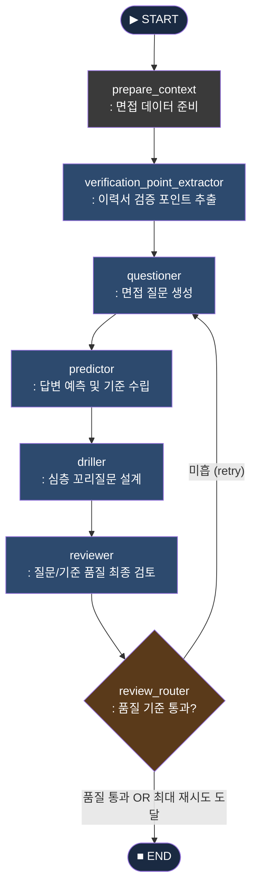
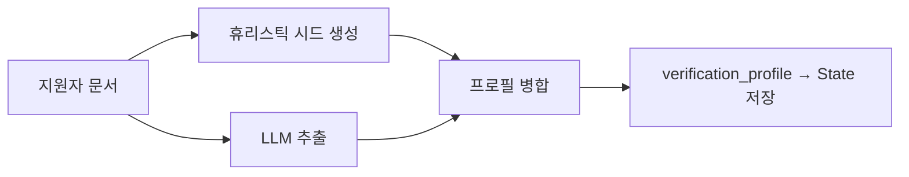
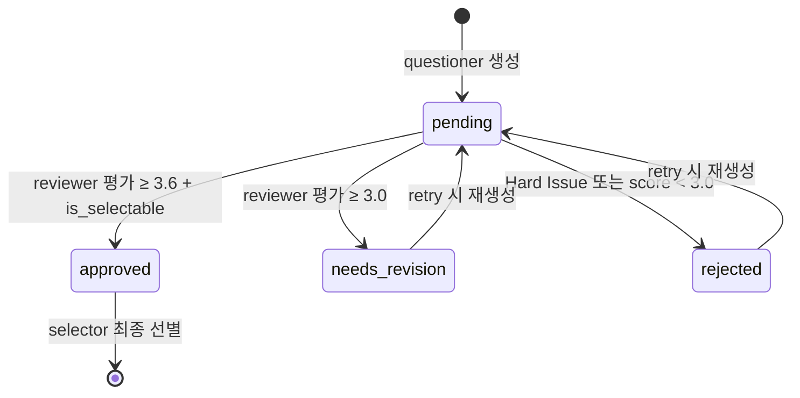

# LangGraph 면접 질문 생성 파이프라인 — 설계 문서

---

## 1. 전체 흐름



---

## 2. 노드별 역할

### 2-1. `prepare_context`

**목적:** 이후 모든 노드가 공통으로 참조할 context 문자열을 조립한다.

| 입력 | 처리 | 출력 |
| --- | --- | --- |
| job_posting, resume, cover_letter, portfolio, prompt_profile | 채용공고 + 프롬프트 프로필 + 지원자 문서를 단일 context 문자열로 병합 | `context`, `candidate_context` |
- 각 필드는 7,000자 단위로 clip 처리 (LLM 컨텍스트 오염 방지)
- retry_count, errors, raw_outputs 초기화도 여기서 담당

---

### 2-2. `verification_point_extractor`

**목적:** 지원자 문서에서 "반드시 확인해야 할 검증 포인트"를 추출한다.

EXP-02에서 추가된 핵심 노드. questioner가 무난한 질문만 생성하는 문제를 해결.



**휴리스틱 시드** — LLM 호출 전에 규칙 기반으로 obvious한 검증 포인트를 미리 생성:

| 감지 패턴 | 생성 포인트 | must_ask |
| --- | --- | --- |
| 임금체불/공백/복귀 키워드 | career_context · return_to_work_readiness | ✅ |
| 직무 전환 키워드 | career_context · career_transition_evidence | ✅ |
| 숫자+성과 키워드 | performance_ownership · metric_ownership | ✅ |
| 부트캠프/강의 (실무 경험 없음) | growth_adaptability · learning_without_strong_artifact | ✅ |
| 협업/갈등/소통 키워드 | collaboration · collaboration_depth | ❌ |

**병합 규칙:** LLM 추출 결과를 base로, 휴리스틱 시드에서 (dimension, signal_type, evidence) 조합이 중복되지 않는 포인트만 추가한다.

**FocusArea 6종:**

```
technical_depth · performance_ownership · career_context
collaboration · culture_fit · growth_adaptability
```

---

### 2-3. `questioner`

**목적:** verification_profile을 참고해 면접 질문 후보를 생성한다.

| 모드 | 생성 수 | 조건 |
| --- | --- | --- |
| `initial` | 14개 | 첫 실행 |
| `retry_candidates` | 7개 | 리뷰 후 품질 미달 |
| `add_question` | N개 | 사용자 추가 요청 |
| `rewrite_selected` | N개 | 사용자 재생성 요청 |
- verification_profile의 must_ask 포인트를 프롬프트에 명시 → questioner가 이를 반드시 다루도록 유도
- 기존 질문 목록(최대 30개)을 함께 전달 → 중복 방지
- 각 질문 후보: `focus_area`, `category`, `document_evidence`, `question_text`, `evaluation_guide` 포함

---

### 2-4. `predictor`

**목적:** 각 질문에 대해 지원자가 할 법한 예상 답변을 생성한다.

- 이미 `predicted_answer`가 있는 질문은 skip (incremental 처리)
- 예상 답변은 지원자 문서만을 근거로 생성 (추측 시 "확인 필요" 명시)
- 최대 260자 clip

---

### 2-5. `driller`

**목적:** 각 질문에 대해 꼬리 질문 2~3개와 그 의도를 생성한다.

- 이미 `follow_up_questions`가 있는 질문은 skip (incremental)
- 꼬리 질문과 intent는 1:1 정렬 (align_intents validator로 보장)

---

### 2-6. `reviewer`

**목적:** 모든 pending 질문을 루브릭으로 평가하고 최종 선별한다.

**평가 루브릭 (10항목, 각 1~5점):**

| 구분 | 항목 | 설명 |
| --- | --- | --- |
| 질문 품질 (5항목) | job_relevance | 채용 직무와의 관련성 |
|  | document_grounding | 지원자 문서에 근거한 질문인가 |
|  | competency_signal | 실제 역량을 드러낼 수 있는 질문인가 |
|  | specificity | 구체성 — 막연한 질문 여부 |
|  | clarity | 문장 명확성 |
| 평가가이드 품질 (5항목) | scoring_clarity | 평가 기준이 명확한가 |
|  | evidence_alignment | 문서 근거와 평가 기준이 정렬되는가 |
|  | answer_discriminability | 상/중/하를 구분할 수 있는가 |
|  | risk_awareness | 과장/회피 답변 탐지 기준 포함 여부 |
|  | interviewer_usability | 비전공 면접관도 쓸 수 있는 실전 가이드인가 |

**최종 점수 산식:**

```
score(1~5) → 100점 환산 = score × 20
```

**Hard Issue (자동 탈락/강등):**

```
unsupported_assumption · off_topic · fairness_risk
personal_sensitive · no_document_anchor
```

---

### 2-7. `review_router` (조건부 엣지)

**목적:** 품질 기준을 통과했는지 판단해 종료 또는 재시도를 결정한다.

```python
# 품질 게이트 조건 (AND)
average_score >= 3.6  # 전체 선별 질문 평균
approved_count >= min(3, requested_count)  # approved 상태 최소 수

# 종료 조건
품질 통과  OR  retry_count >= max_retry_count(2)
```

---

## 3. State 흐름 다이어그램

```mermaid
flowchart LR
    subgraph 입력
        A1[job_posting]
        A2[resume / cover_letter / portfolio]
        A3[human_action]
        A4[feedback]
    end

    subgraph 내부 State
        B1[context]
        B2[candidate_context]
        B3[verification_profile]
        B4["questions: list[QuestionSet]"]
        B5[selected_questions]
        B6[retry_count]
    end

    subgraph 출력
        C1[response: QuestionGenerationResponse]
        C2[status: completed / partial / failed]
        C3[llm_usages]
    end

    입력 --> 내부\\ State --> 출력
```

**QuestionSet 상태 전이:**



---

## 4. 선별 알고리즘 (Selector)

### 4-1. 점수 계산

```python
selection_score = (
    score                          # reviewer 종합 점수 (1~5)
    + 0.35 if approved            # approved 보너스
    + 0.15 if document_evidence   # 문서 근거 보너스
    - 0.50 if multi_track_q       # 복합 질문 페널티 ("혹은", "또는", 질문? 두 개)
    - risk_count  * 1             # 리스크 태그 페널티
    - issue_count * 1             # 이슈 타입 페널티
)
```

### 4-2. 선별 우선순위

```
1. collaboration/culture_fit 1개 보호 (score ≥ 3.6인 경우에만)
2. must_ask 포인트에 매칭되는 질문 보호
3. must_ask focus_area별 최소 1개 보장
4. 일반 ranking (score 순)
5. 부족 시 seen_category 허용
6. 그래도 부족 시 중복 허용
```

### 4-3. Focus Area 캡

| focus_area | 최대 선별 수 (requested=5) |
| --- | --- |
| technical_depth | 2 |
| 나머지 모두 | 1 |

### 4-4. 중복 탐지 (3중 체크)

```
① SequenceMatcher ratio ≥ 0.7 → 중복
② Jaccard(토큰) ≥ 0.6 → 중복
③ 같은 focus_area + document_evidence 겹침 ≥ 0.45 → 중복
   OR 같은 metric anchor (숫자+단위) 공유 → 중복
```

---

## 5. 재시도 메커니즘

```mermaid
sequenceDiagram
    participant Q as questioner
    participant R as reviewer
    participant RR as review_router

    Q->>R: 14개 후보 생성 (initial)
    R->>RR: 평가 완료
    RR-->>Q: retry (품질 미달)
    Q->>R: 7개 추가 후보 (retry #1)
    R->>RR: 재평가
    RR-->>Q: retry (여전히 미달)
    Q->>R: 7개 추가 후보 (retry #2)
    R->>RR: 재평가
    RR->>END: 강제 종료 (max_retry=2 도달)
```

- 재시도 시 기존 질문 pool에 추가 (누적), 최선 5개를 다시 선별
- questioner에게 weak 질문 목록(status, reason, recommended_revision) 전달 → 반복 패턴 회피 유도

---

## 6. 핵심 설계 결정

| 결정 | 이유 |
| --- | --- |
| verification_point_extractor를 questioner 앞에 배치 | questioner가 문서 전체를 보고 무난한 질문만 만드는 문제 해결. 검증 포인트를 먼저 추출해 질문 방향을 고정 |
| 휴리스틱 시드 + LLM 병합 | LLM이 obvious한 포인트를 놓치는 경우 보완. 규칙과 LLM을 상호 보완 |
| reviewer = 평가+선별 일원화 | 기존 "통과/탈락 gate" 방식에서 "점수 기반 ranking" 방식으로 전환. 탈락 처리 없이 최선 선별 |
| must_ask 보호 단위: focus_area → signal_type | focus_area 단위만으로는 protection이 너무 넓어 엉뚱한 질문이 보호됨. signal_type + evidence 토큰 매칭으로 정밀도 향상 |
| 중복 탐지 3중 구조 | 단순 텍스트 유사도만으로는 "같은 성과를 다른 표현으로 물어보는" 케이스를 잡지 못함. metric anchor(숫자+단위) 공유 여부 추가 |
| quality gate 기준: avg 3.6 + approved ≥ 3 | 평균 점수만으로는 극단값에 취약. approved 수를 함께 요구해 "2개 매우 좋고 3개 낮음" 같은 불균형 방지 |

---

## 7. 파일 구조

```
interview_graph_JH/
├── state.py      # AgentState, QuestionSet TypedDict 정의
├── schemas.py    # Pydantic 계약 (VerificationPoint, QuestionCandidate, ReviewResult 등)
├── nodes.py      # 6개 노드 함수 + 선별 알고리즘 (select_top_questions)
├── runner.py     # StateGraph 빌드 · 실행 · LLM 사용 로그 저장
├── prompts.py    # 각 노드 시스템/유저 프롬프트
└── llm_usage.py  # LLM 호출 래퍼 + 사용량 추적
```

---

## 8. 개선 이력

| 버전 | 변경 | 효과 |
| --- | --- | --- |
| EXP-01 | questioner State 초기화 버그 수정 (피드백 반영 후 feedback field 초기화로 driller가 이전 State 참조) | driller 꼬리 질문 패턴 정상화 |
| EXP-02 | verification_point_extractor 노드 추가 + must_ask 보호 로직 + 중복 탐지 강화 | 품질 점수 78.6 → 91.8 (+13.2점) |