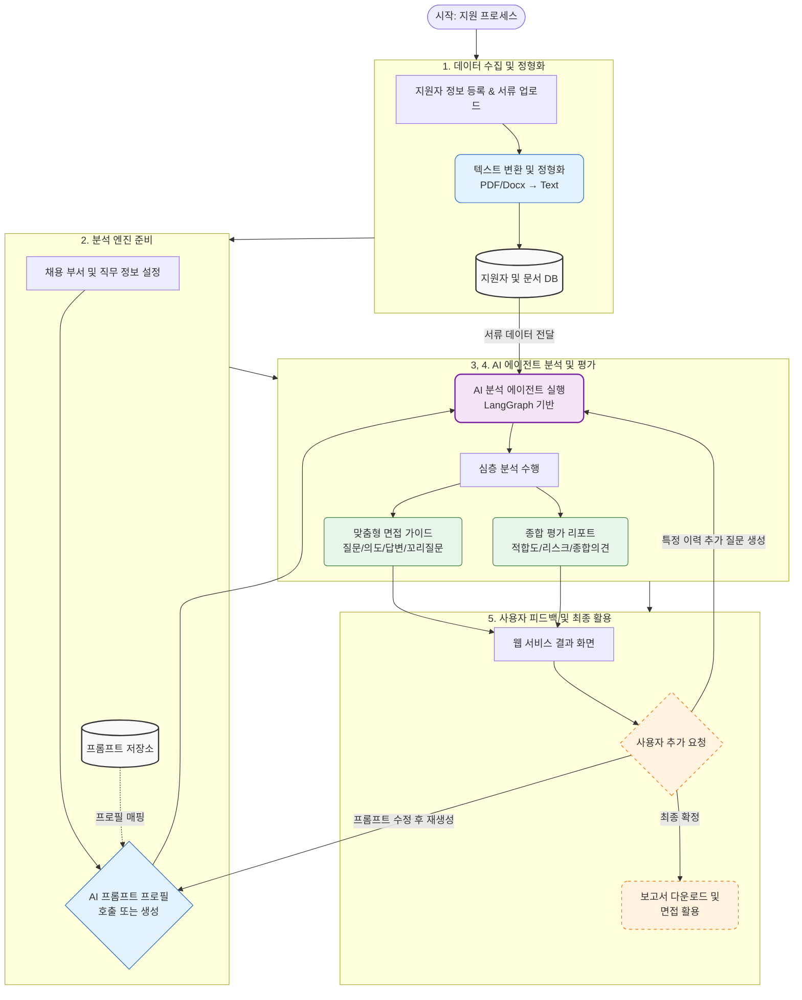

---

# [Project] HR Copilot BS

> **채용 인재상과 지원서류 데이터를 다각도로 분석하여,  근거 중심의 맞춤형 면접 가이드와 질문을 생성하는 HR 맞춤 전문 AI Agent 플랫폼**
> 

# 1. Overview.

- **기간:** 2026. 04. 10 ~ 2026. 05. 19
- **팀 구성:** BAMTI95 (개발 4명)
- **핵심 가치:** 지원자의 서류(이력서/포트폴리오)를 분석하여 단순 질문 생성이 아닌 **'성과 및 역량 검증'** 중심의 가이드 제공
- **주요 타겟:** 효율적인 기술 면접 준비가 필요한 HR 담당자 및 면접관

---

# 2. Tech Stack

| 구분 | 기술 스택 | 비고 |
| --- | --- | --- |
| **Front-End** | React 19, Zustand, TailwindCSS | 고성능 상태 관리 및 UI 구현 |
| **Back-End** | Python 3.12, FastAPI | Async/Await 기반 비동기 처리 |
| **Database** | PostgreSQL **+** pgvector, SQLAlchemy, Alembic | RAG를 위한 벡터 저장 및 관계형 데이터 관리 |
| **AI / RAG** | LangGraph, OpenAI API, Prompt Engineering | 에이전트 워크플로우 제어 및 전략 분기 |
| **Infra/DevOps** | AWS, Docker | 클라우드 인프라 및 컨테이너 |

---

# 3. 핵심 기능

### 지원자 및 문서 관리

- **지원자 상태 관리:** 등록부터 면접 가이드 생성까지의 과정(지원 완료, 분석 중, 준비 완료)을 실시간으로 추적
- **지능형 문서 추출:** OCR 및 텍스트 추출 기술을 통해 읽기 어려운 파일(PDF/Docx) 속 정보를 정형 데이터로 변환
- **지원 현황 관리:** 면접 단계별 대상자 파악 및 서류 검토 누락 방지 등 전체 채용 프로세스를 웹 서비스상에서 직관적으로 관리 가능

### 전략 기반 AI 에이전트

- **프롬프트 프로파일링:** 채용 목적에 맞는 분석 전략을 선택하여 AI 답변의 정확도와 품질 향상
- **에이전트 워크플로우:** 문서 해석 → 전략 적용 → 질문 생성 → 검증 단계로 이어지는 전체 과정을 자동화 (LangGraph 활용)

### 핵심 분석 전략

- **근거 중심 내용 검증:** 자기소개서 및 경력기술서에 기재된 내용이 논리적으로 타당한지, 구체적인 근거를 바탕으로 작성되었는지 심층 분석
- **맞춤형 면접 에이전트:** 부서별 인재상 부합 여부와 기술력·인성·경력 등을 정밀 판별할 수 있는 면접 질문 및 상세 평가 가이드 생성 (심층 검증을 위한 꼬리 질문 포함)

### 서비스 운영 및 모니터링 (LLM 로그 관리)

- **모델 정보 기록:** 호출된 LLM의 버전 및 상세 정보 기록
- **자원 추적:** 토큰 사용량 실시간 추적 및 모델별 단가를 적용한 자동 비용 계산
- **상태 모니터링:** API 호출의 성공/실패 상태를 관리하고 오류 발생 시 트러블슈팅 데이터 확보

---

# **4. 데이터 흐름 (Data Flow)**

- **데이터 수집 및 정형화**: 지원자 정보 등록과 동시에 입사지원 서류(이력서/포트폴리오)를 텍스트로 파싱하여 데이터베이스에 저장
- **분석 엔진 준비**: 채용 부서 및 세부 직무 특성에 최적화된 AI 프롬프트 프로필(지침서)을 호출하거나 목적에 맞게 즉석 생성
- **분석 요청 및 처리**: 등록된 지원자 그룹을 지정된 프롬프트 프로필에 할당하여, 저장된 텍스트 데이터를 기반으로 개별 심층 분석 수행
- **맞춤형 분석 결과 도출**:
    - **면접 가이드 패키지**: 직무 적합도, 질문 의도, 평가 기준, 예상 답변, 꼬리 질문 세트 생성
    - **종합 평가 리포트**: 지원서 기반의 적합성 판단, 면접 시 주의 깊게 살펴야 할 리스크, 보완이 필요한 역량 등에 대한 종합 의견 제시
- **사용자 인터랙션 및 활용**:
    - **질문 고도화**: 특정 이력 항목을 지정하여 추가 질문 생성 요청
    - **최적화**: 프롬프트를 보강하여 분석 결과 전체 재생성
    - **산출물 활용**: 최종 확정된 면접 가이드를 문서 형태로 다운로드하여 실제 면접 전형에 투입

---

# 5. 에이전트 기획 및 분석 전략

[AI agent 기획](https://www.notion.so/AI-agent-3451480769ac80a9802bc9de6dfb43c1?pvs=21)

[AI 분석 전략](https://www.notion.so/AI-3451480769ac806fac7ce6a4839bea0b?pvs=21)

## 6. 개발 프로토콜

### 커밋 메시지 규칙

| 태그 | 설명 | 태그 | 설명 |
| --- | --- | --- | --- |
| `feat` | 새로운 기능 추가 | `fix` | 사소한 수정 (버그 아님) |
| `bugfix` | 버그 수정 | `refactor` | 코드 개선 (기능 변화 없음) |
| `docs` | 문서 수정 (README 등) | `chore` | 설정 및 라이브러리 수정 |
| `rename` | 파일/변수명 변경 | `remove` | 기능 또는 파일 삭제 |
| `comment` | 주석 추가 및 수정 | `hotfix` | 긴급 버그 수정 |

### 프로젝트 핵심 철학

1. **데이터 중심 설계:** 지원자와 문서 데이터를 중심으로 모든 로직이 유기적으로 연결됨
2. **전략적 AI 활용:** 단순한 답변 생성을 넘어, 설정된 전략에 따라 심도 있는 분석 수행
3. **검증 중심 서비스:** 면접관이 서류만으로 파악하기 힘든 '실제 역량'을 확인하는 것에 집중

## [팀 프로젝트 협업 및 코드 작성 규칙]

팀원 간의 원활한 소통과 코드 품질 유지를 위해 다음 규칙을 준수하며 개발을 진행합니다.

---

### 1. 코드 주석 및 가독성 정리

- 가독성: 코드 흐름을 파악하기 쉽게 작성합니다.
- **설계 의도 설명**: 함수의 역할, 설계의도등 코드가 존재하는 이유와 설계 의도를 포함합니다.
- **깔끔한 정리**: 다른 팀원이 코드를 읽을 때 막힘이 없도록 실무적인 용어를 사용하되,이해할 수 있는 수준으로 자세히 작성합니다. (줄임말금지)

### 2. API 문서 최적화 (Router 설정)

- **Summary/Description 입력**: 라우터 설정 시 해당 기능이 무엇인지(Summary)와 상세 동작 방식(Description)을 반드시 입력합니다.
- **직관성 유지**: 서버 Docs(Swagger 등)를 확인하는 팀원이 별도의 질문 없이도 API의 목적과 사용법을 즉시 이해할 수 있도록 합니다.

### 3. 기능 테스트 (Feature Test)

기능 구현 후 `main` 브랜치에 합치기 전, 다음 항목을 반드시 자체 검증합니다.

- **DB 반영 확인**: 데이터 생성(Create), 수정(Update), 삭제(Delete) 시 실제 데이터베이스에 정확히 반영되는가?
- **입력값 검증**: 필수 파라미터가 누락되거나 잘못된 데이터 형식(예: 숫자가 필요한 곳에 문자 입력)이 들어왔을 때 적절한 에러를 반환하는가?
- **응답 규격**: 정의된 JSON 구조와 필드명이 기획서 및 API 명세와 일치하는가?

### 4. 풀 리퀘스트(Pull Request, PR) 및 코드 리뷰

로컬 환경에서 테스트를 마친 코드는 GitHub에 Push 후 아래 절차를 따릅니다.

- **PR 제목**: 작업 내용을 한눈에 알 수 있도록 명확하게 작성합니다.
- **PR 본문 작성**:
    - **What**: 어떤 기능을 구현했는지 상세히 적습니다.
    - **Why**: 이 작업이 사용자에게 어떤 가치를 주는지, 왜 필요한지 작성합니다.
    - **How**: 핵심 로직이나 해결 방법(설계 의도)을 요약합니다.
- **리뷰 요청**: 작업 완료 후 관련 팀원을 리뷰어로 지정하여 코드 검토 및 승인을 받은 뒤 `main` 브랜치에 병합합니다.